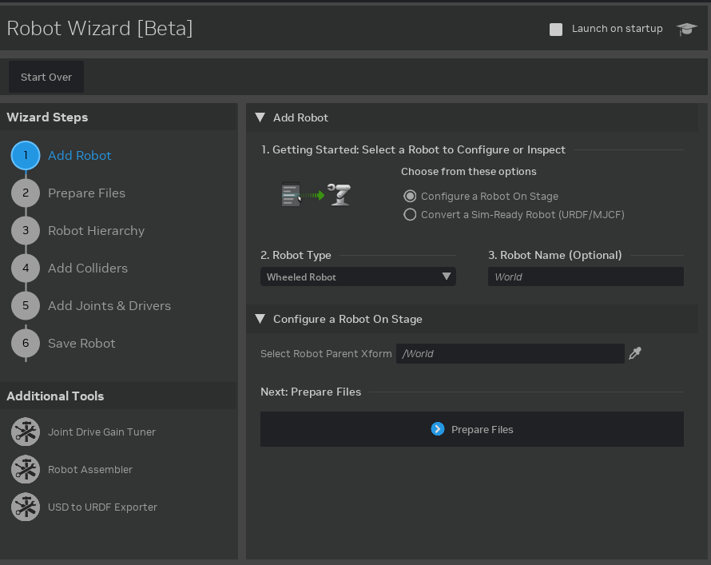

..
    This file was auto-generated by the 'repo_extension_docs' tool.
    Run 'repo extension_docs --help' for more details.

..
    [begin reference autogenerated]

.. _ext_isaacsim_robot_setup_wizard:

..
    [end reference autogenerated]

..
    [begin title autogenerated]

[isaacsim.robot_setup.wizard] Isaac Sim Robot Wizard [Beta]
###########################################################

..
    [end title autogenerated]

..
    [begin deprecation autogenerated]
..
    [end deprecation autogenerated]

..
    [begin version autogenerated]

**Version**: :guilabel:`0.0.8`

..
    [end version autogenerated]

..
    [begin description autogenerated]

Wizard to guide through robot import and configuration

..
    [end description autogenerated]

..
    [begin preview autogenerated]

..
    [end preview autogenerated]

..
    [begin enable-extension autogenerated]

Enable Extension
================

The extension can be enabled (if not already) in one of the following ways:

.. tab-set::
    .. tab-item:: Command-line interface
        :sync: tab_cli

        Define the next entry as an application argument from a terminal.

        .. code-block:: bash

            APP_SCRIPT.(sh|bat) --enable isaacsim.robot_setup.wizard

    .. tab-item:: Experience/extension configuration
        :sync: tab_toml

        Define the next entry under ``[dependencies]`` in an experience (``.kit``) file or an extension configuration (``extension.toml``) file.

        .. code-block:: ini

            [dependencies]
            "isaacsim.robot_setup.wizard" = {}

    .. tab-item:: Extension Manager UI
        :sync: tab_gui

        Open the *Window > Extensions* menu in a running application instance and search for ``isaacsim.robot_setup.wizard``.
        Then, toggle the enable control button if it is not already active.

..
    [end enable-extension autogenerated]

..
    [begin usage autogenerated]
..
    [end usage autogenerated]

..
    [begin api autogenerated]
..
    [end api autogenerated]

..
    [begin actions autogenerated]
..
    [end actions autogenerated]

..
    [begin ogn autogenerated]
..
    [end ogn autogenerated]

..
    [begin settings autogenerated]

Settings
========

Extension Settings
------------------

The table list the extension-specific settings.

.. list-table::
    :header-rows: 1

    * - Setting name
      - Description
      - Type
      - Default value
    * - ``timeout``
      - time out for resolving the robot wizard settings

      - ``int``
      - ``5``

The extension-specific settings can be either specified (set) or retrieved (get) in one of the following ways:

.. tab-set::
    .. tab-item:: Set setting

        .. tab-set::
            .. tab-item:: Command-line interface
                :sync: tab_cli

                Define the key and value of the setting as an application argument from a terminal.

                .. code-block:: bash

                    APP_SCRIPT.(sh|bat) --/exts/isaacsim.robot_setup.wizard/SETTING_NAME=SETTING_VALUE

            .. tab-item:: Experience/extension configuration
                :sync: tab_toml

                Define the key and value of the setting under ``[settings]`` in an experience (``.kit``) file or an extension configuration (``extension.toml``) file.

                .. code-block:: ini

                    [settings]
                    exts."isaacsim.robot_setup.wizard".SETTING_NAME = SETTING_VALUE

            .. tab-item:: By programming
                :sync: tab_carb

                Define the key and value of the setting using the carb framework (in Python).

                .. code-block:: python

                    import carb

                    settings = carb.settings.get_settings()
                    settings.set("/exts/isaacsim.robot_setup.wizard/SETTING_NAME", SETTING_VALUE)

    .. tab-item:: Get setting

        .. tab-set::
            .. tab-item:: By programming
                :sync: tab_carb

                Define the key to query the value of the setting using the carb framework (in Python).

                .. code-block:: python

                    import carb

                    settings = carb.settings.get_settings()
                    value = settings.get("/exts/isaacsim.robot_setup.wizard/SETTING_NAME")

Other Settings
--------------

The extension changes some settings of the application or other extensions, which are listed in the table below.

.. list-table::
    :header-rows: 1

    * - Application/extension setting
      - Description
      - Value
    * - ``persistent.exts."isaacsim.robot_setup.wizard".launch_on_startup``
      - launch on startup

      - ``False``

..
    [end settings autogenerated]
