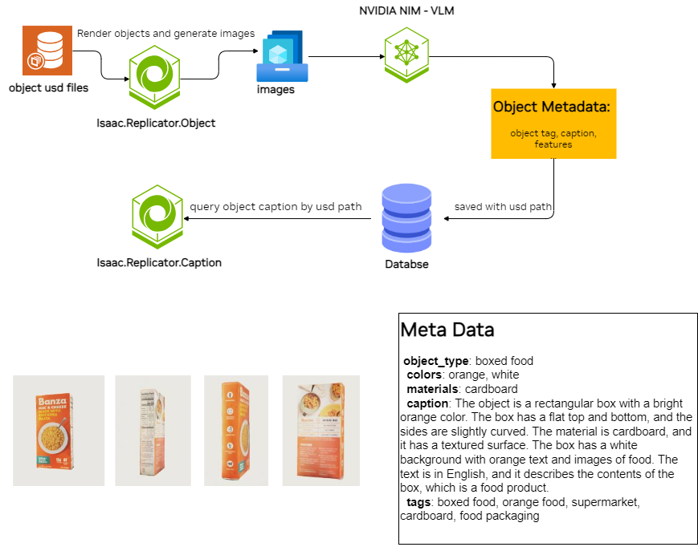

# End-to-End USD Asset Caption by ORO

This application leverages the rendering and iteration functionality of `Omni.replicator.object`, enabling end-to-end USD asset caption assignment. Once the object metadata is generated and saved to the database, it can be queried and pulled from database when needed in `Omni.replicator.caption`

The system run as below:


The object caption is generated by VLM. Right now only ChatGPT-4o is supported. `NIM-VILA` is expected to be supported by the end of Nov, 2024.

## Resources

To make it run, you need:
1. MongoDB database access
2. `OPENAI` API KEY

If you don't have above resources, please email alicli@nvidia.com for information.

After that, you'll need to save following environment variables before launching ORO for object caption
```
export OPENAI_API_KEY=<openai api key>
export MONGODB_URI=<The mongodb uri with usrname and password>
```


## Method

An example configuration file is at [object_caption_example.yaml](../configs/object_caption_example.yaml)

By adding following fields, the `object_caption` will run after image generation
```
  object_caption:
    enabled: true
    model_name: gpt-4o
```

Notice that:
1. Do not assign custom `output_name` as the image paths needs to be default
2. Do not modify `camera` object names as they are hard-coded.


