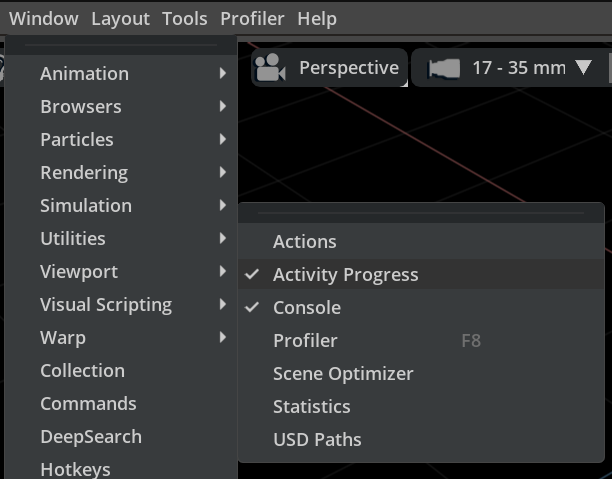
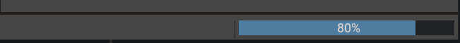
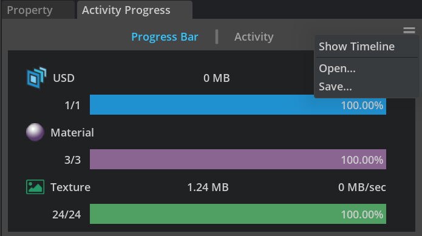
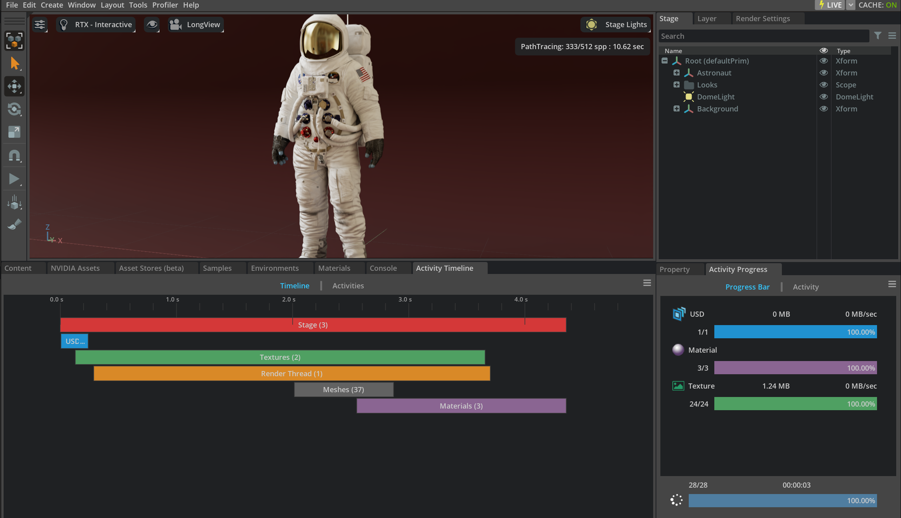
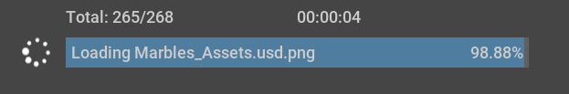
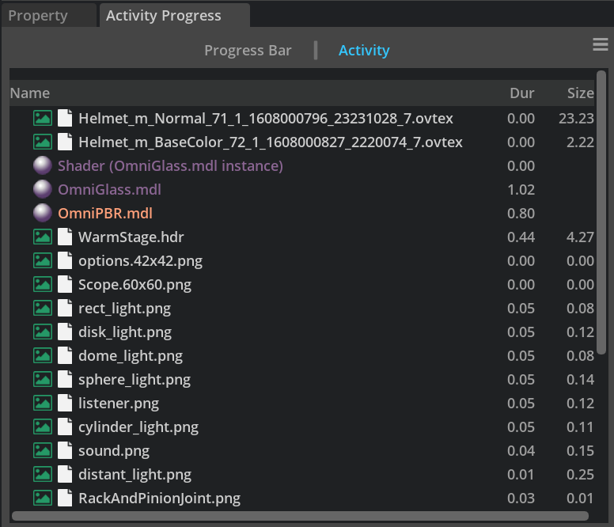
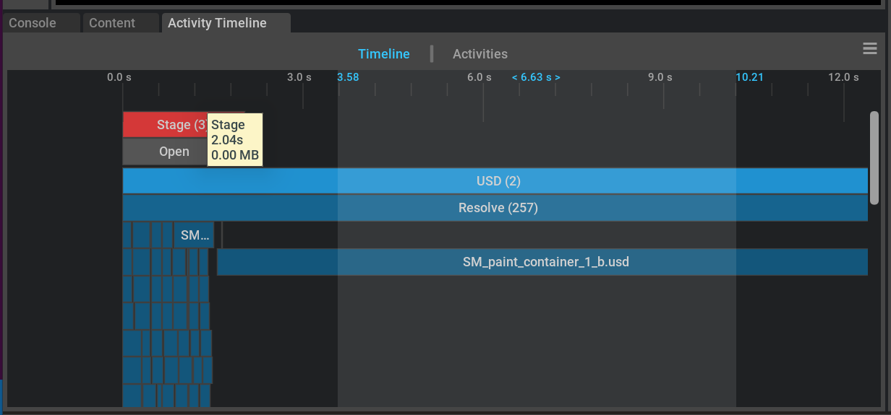

```{csv-table}
**Extension**: {{ extension_version }},**Documentation Generated**: {sub-ref}`today`
```

# Overview

omni.activity.ui is an extension created to display progress and activities. This is the new generation of the activity monitor which replaces the old version of omni.kit.activity.widget.monitor extension since the old activity monitor has limited information on activities and doesn't always provide accurate information about the progress.

Current work of omni.activity.ui focuses on loading activities but the solution is in general and will be extended to unload and frame activities in the future. 

There are currently two visual presentations for the activities. The main one is the Activity Progress window which can be manually enabled from menu: Window->Utilities->Activity Progress: 



It can also be shown when user clicks the status bar's progress area at the bottom right of the app. The Activity Progress window will be docked and on focus as a standard window.



The other window: Activity Timeline window can be enabled through the drop-down menu: Show Timeline, by clicking the hamburger button on the top right corner from Activity Progress window. 



Here is an example showing the Activity Progress window on the bottom right and Activity Timeline window on the bottom left.



Closing any window shouldn't affect the activities. When the window is re-enabled, the data will pick up from the model to show the current progress. 

## Activity Progress Window
The Activity Progress window shows a simplified user interface about activity information that can be easily understood and displayed. There are two tabs in the Activity Progress window: Progress Bar and Activity. They share the same data model and present the data in two ways.  

The Activity Progress window shows the total loading file number and total time at the bottom. The rotating spinner indicates the loading is in progress or not. The total progress bar shows the current loading activity and the overall progress of the loading. The overall progress is linked to the progress of the status bar.



### Progress Bar Tab
The Progress Bar Tab focuses on the overall progress on the loading of USD, Material and Texture which are normally the top time-consuming activities. We display the total loading size and speed to each category. The user can easily see how many of the files have been loaded vs the total numbers we've traced. All these numbers are dynamically updated when the data model changes. 

### Activity Tab
The activity tab displays loading activities in the order of the most recent update. It is essentially a flattened treeview. It details the file name, loading duration and file size if relevant. When the user hover over onto each tree item, you will see more detailed information about the file path, duration and size.



## Activity Timeline Window
The Activity Timeline window gives advanced users (mostly developers) more details to explore. It currently shows 6 threads: Stage, USD, Textures, Render Thread, Meshes and Materials. It also contains two tabs: Timeline and Activities. They share the same data model but have two different data presentations which help users to understand the information from different perspectives. 

### Timeline Tab
In the Timeline Tab, each thread is shown as a growing rectangle bar on their own lane, but the SubActivities for those are "bin packed" to use as few lanes as possible even when they are on many threads. Each timeline block represents an activity, whose width shows the duration of the activity. Different activities are color coded to provide better visual results to help users understand the data more intuitively. When users hover onto each item, it will give more detailed information about the path, duration and size.

Users can double click to see what's happening in each activity, double click with shift will expand/collapse all.

Right mouse move can pan the timeline view vertically and horizontally.
Middle mouse scrolling can zoom in/out the timeline ranges. Users can also use middle mouse click (twice) to select a time range, which will zoom to fit the Timeline window. This will filter the activities treeview under the Activities Tab to only show the items which are within the selected time range.

Here is an image showing a time range selection:



### Activities Tab
The data is presented in a regular treeview with the root item as the 6 threads. Each thread activity shows its direct subActivities. Users can also see the duration, start time, end time and size information about each activity. When users hover onto each item, it will give more detailed information.  

The expansion and selection status are synced between the Timeline Tab and Activities Tab.

## Save and Load Activity Log
Both Activity Progress Window and Activity Timeline Window have a hamburger button on the top right corner where you can save or choose to open an .activity or .json log file. The saved log file has the same data from both windows and it records all the activities happening for a certain stage. When you open the same .activity file from different windows, you get a different visual representation of the data.

A typical activity entry looks like this:
```python
{
    "children": [],
    "events": [
        {
            "size": 2184029,
            "time": 133129969539325474,
            "type": "BEGAN"
        },
        {
            "size": 2184029,
            "time": 133129969540887869,
            "type": "ENDED"
        }
    ],
    "name": "omniverse://ov-content/NVIDIA/Samples/Marbles/assets/standalone/SM_board_4/SM_board_4.usd"
},
```

This is really useful to send to people for debug purposes, e.g find the performance bottleneck of the stage loading or spot problematic texture and so on.

## Dependencies
This extension depends on two core activity extensions omni.activity.core and omni.activity.pump. omni.activity.core is the core activity progress processor which defines the activity and event structure and provides APIs to subscribe to the events dispatching on the stream. omni.activity.pump makes sure the activity and the progress gets pumped every frame.
