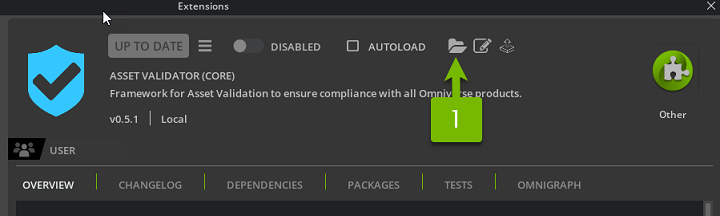

# Command Line Interface

See [Command Line Interface](../../../../python/docs/cli.rst)

## Logging

During execution of the CLI, the output generated will be sent to logging (channel `omni_asset_validator`).
The information generated depends on the log level, an overview is given here:

```{eval-rst}
.. list-table::
   :widths: 20 80
   :header-rows: 1

   * - Log level
     - Information reported
   * - FATAL
     - Exceptions raised during execution, including (but not limited to):

        - Import errors, i.e. misconfiguration.
        - Wrong arguments.
        - Issues with severity `ERROR <../api.html#omni.asset_validator.core.IssueSeverity.ERROR>`_.
   * - ERROR
     - Issues with severity `FAILURE <../api.html#omni.asset_validator.core.IssueSeverity.FAILURE>`_.
   * - WARN
     - Issues with severity `WARNING <../api.html#omni.asset_validator.core.IssueSeverity.WARNING>`_.
   * - INFO
     - Normal execution output, including:

        - Progress (in percent) per each asset.
        - Failures/Errors/Warnings per Rule.
        - Total number of Failures/Errors/Warnings.
   * - VERBOSE
     - Debugger execution output, including:

        - Aggregated time spent per rule.
```

Example:

```text
[Info] [omni_asset_validator] --------------------------------------------------------------------------------------------------------------------------------
[Info] [omni_asset_validator] Summary per Rule:
[Info] [omni_asset_validator] UsdLuxSchemaChecker: 3 Failures / 0 Warnings / 0 Errors
[Info] [omni_asset_validator] IndexedPrimvarChecker: 0 Failures / 4 Warnings / 0 Errors
[Info] [omni_asset_validator] --------------------------------------------------------------------------------------------------------------------------------
[Info] [omni_asset_validator] Summary per Severity:
[Info] [omni_asset_validator] Failures: 9
[Info] [omni_asset_validator] Warnings: 4
[Info] [omni_asset_validator] Errors: 0
[Info] [omni_asset_validator] --------------------------------------------------------------------------------------------------------------------------------
[Verbose] [omni_asset_validator] Time per Rule:
[Verbose] [omni_asset_validator] IndexedPrimvarChecker: 0.001 s.
[Verbose] [omni_asset_validator] UsdLuxSchemaChecker: 0.001 s.
[Verbose] [omni_asset_validator] Total time: 0.002 s.
[Verbose] [omni_asset_validator] --------------------------------------------------------------------------------------------------------------------------------
```

Make sure to configure the appropriate level and handler to visualize that desired output. In the example section
you can find quick ways to visualize `INFO` and `VERBOSE`.

# Command Line Interface in Omniverse Kit extension

Open the Extension manager. In `Windows / Extensions`, select `omni.asset_validator.core` extension.
On the extension information click on the path icon.



In the extension folder would look like the following:
```shell
> ls
PACKAGE-LICENSES/  config  data  docs  omni/  pip_prebundle  scripts
```
If we go into `scripts` we can find the command line interface.

In Windows:
```bash
.\validation.bat --help
```

In Linux:
```shell
./validation.sh --help
```

## Examples

### Calling the help command

Windows:
```bash
.\validation.bat --help
```

Linux:
```shell
./validation.sh --help
```

### Validating a file

Windows:
```bash
.\validation.bat asset.usda
```

Linux:
```shell
./validation.sh asset.usda
```

### Validating a directory, recursively

Windows:
```bash
.\validation.bat directory
```

Linux:
```shell
./validation.sh directory
```

### Apply fixes on file

Windows:
```bash
.\validation.bat --fix asset.usda
```

Linux:
```shell
./validation.sh --fix asset.usda
```

### Apply fixes on a directory, specific category

Windows:
```bash
.\validation.bat --fix --category Usd:Schema directory
```

Linux:
```shell
./validation.sh --fix --category Usd:Schema directory
```

### Apply fixes on a directory, multiple categories

Windows:
```bash
.\validation.bat --fix --category Usd:Schema --category Basic directory
```

Linux:
```shell
./validation.sh --fix --category Usd:Schema --category Basic directory
```

### Apply predicates, single file

Windows:
```bash
.\validation.bat --predicate HasRootLayer asset.usda"
```

Linux:
```shell
./validation.sh --predicate HasRootLayer asset.usda"
```

### Disable variants

Windows:
```bash
.\validation.bat  --no-variants asset.usda"
```

Linux:
```shell
./validation.sh  --no-variants asset.usda"
```

### Displaying INFO level in STDOUT

Windows:
```bash
.\validation.bat -v asset.usda"
```

Linux:
```shell
./validation.sh -v  asset.usda"
```

### Displaying VERBOSE level in STDOUT

Windows:
```bash
.\validation.bat -vv  asset.usda"
```

Linux:
```shell
./validation.sh -vv  asset.usda"
```
