# Enabling the Asset Validator Extension

 ```{eval-rst}
.. Caution:: As of Kit 106.0.1, the extension is enabled by default with the `USD Composer app template <https://github.com/NVIDIA-Omniverse/kit-app-template/blob/main/templates/apps/usd_composer>`__. If you are creating your own application, for example based on the `kit base editor app template <https://github.com/NVIDIA-Omniverse/kit-app-template/tree/main/templates/apps/kit_base_editor>`__, the Asset Validator extension dependencies will need to be added in the ``.kit`` file. More information can be found in `Kit App Template <https://github.com/NVIDIA-Omniverse/kit-app-template>`__.
```

The extension can be enabled/disabled via the **Window -> Extensions** window if applicable, otherwise the dependencies need to be added/removed from your Kit application `<my_app_name>.kit` file.

```{eval-rst}
.. code-block:: python

   [dependencies]
   "omni.asset_validator.core" = {}
   "omni.asset_validator.ui" = {}

.. Note:: Any changes to `.kit` files will require the application to be rebuilt for changes to take effect.
```

# Launching the Asset Validator Window

The Asset Validator panel can be opened via the *Window > Utilities > Asset Validator* submenu. Click this menu item to open or close the _Asset Validator Window_. For other ways to launch the _Asset Validator Window_, see [Launching from other Windows](#launching-from-other-windows).

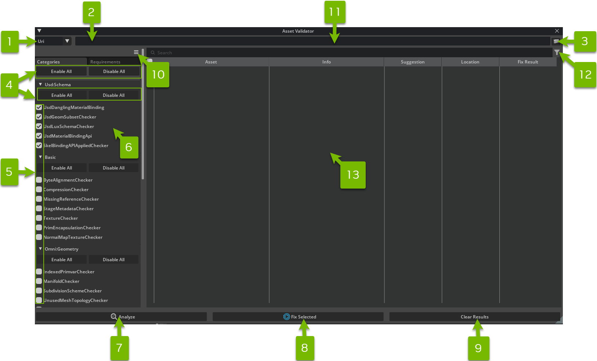

| #  | Option                          | Description                                                                                                                      |
|----|---------------------------------|----------------------------------------------------------------------------------------------------------------------------------|
| 1  | Asset Mode Selector             | Switches between **URI Mode** and **Stage Mode**. See [Choosing your Asset Mode](#choosing-the-asset-mode) for more details.     |
| 2  | Asset Description               | Describes the selected Asset. In URI Mode this should be the fully qualified URI. In Stage Mode it will be an automated message. |
| 3  | Asset URI Browser Button        | Click the button to launch a _File Picker_  and select any USD layer or folder. Only available in **URI Mode**.                  |
| 4  | Enable/Disable Buttons          | These buttons toggle all options within each category.                                                                           |
| 5  | Checkboxes                      | These checkboxes will enable/disable individual Rules or Requirements.                                                           |
| 6  | Labels                          | Hover on the labels to reveal a tooltip description for each Rule or Requirement.                                                |
| 7  | Analyze Asset Validation Button | Click this to analyze the current asset with the enabled Rules or Requirements.                                                  |
| 8  | Fix Selected                    | Click this to run the validation using the current Asset & enabled Rules or Requirements.                                        |
| 9  | Clear Results                   | Clears out the information produced when analyzing or fixing errors.                                                             |
| 10 | Options Menu                    | Options for executing the Asset Validator.                                                                                       |
| 11 | Search field                    | Search for a specific rule or requirement.                                                                                       |
| 12 | Search filters                  | Filters the rules and requirements based on the search query.                                                                    |
| 13 | Results panel                   | Displays the results of the validation.                                                                                          |

# Choosing the Asset Mode

The _Asset Validator Window_ operates in two different contexts called **Asset Modes**:

-  **Stage Mode** operates on a live / in-memory ``Usd.Stage``. The currently loaded stage in memory within the application.
-  **URI Mode** operates on an Omniverse URI, including files and folders on your local disk, networked drives, or any other protocol supported by Omniverse (i.e. https).

Switch between these modes using the dropdown menu at the top left corner. The asset and rule selections will be preserved when modes are switched.

By default the window opens in **Stage Mode** (1), which is preset to validate the default/current stage of the application (2):

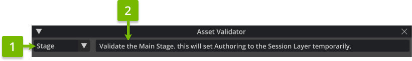

```{eval-rst}
.. caution::
    Using **Stage Mode** runs on the current composed stage.
```

**URI Mode** (1):

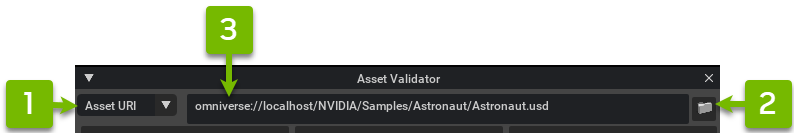

To locate an Asset URI, use the _Asset URI Browser Button_ (2) or paste a link into the _Asset Description_ (3). In this mode, the description must be the fully qualified URI of the Asset (i.e. ``omniverse://localhost/NVIDIA/Samples/Astronaut/Astronaut.usd``).

# Validating the Selected Asset

Regardless of active **Asset Mode**, a list of categorized **validation rules** are available to validate content. To customize these validation rules, see [Configuring Rules with Carbonite Settings](#configuring-rules-with-carbonite-settings).

## Enabling and Disabling

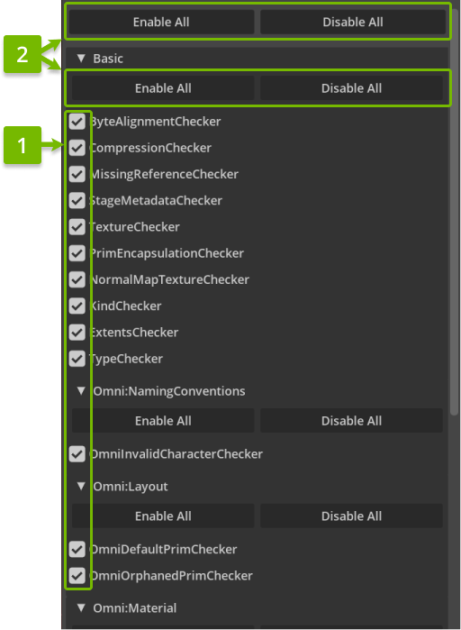

Rules or requirements can be enabled or disabled individually by using the checkboxes (1), or by clicking ``Enable All/Disable All`` Buttons (2) to do this for all rules or per category filtering.

```{eval-rst}
.. tip::
    Tooltips will explain the logic behind each rule.
        .. image:: ../data/docs/asset-validator-ruleDescription.png
```

## Running the Validator

Click the **Analyze Asset Validation** button at the bottom of the window to run the enabled validation rules (1):


```{eval-rst}
.. caution::
    There may be a brief pause while the system contacts the appropriate server for URI Mode, particularly if the file or folder hasn't been accessed previously.
```

The _Asset Validator Window_ will now advance to an in-progress results listing of individual assets. This may initially be a blank page, but as each asset is located by the Omni Client Library, a new loading bar will appear:

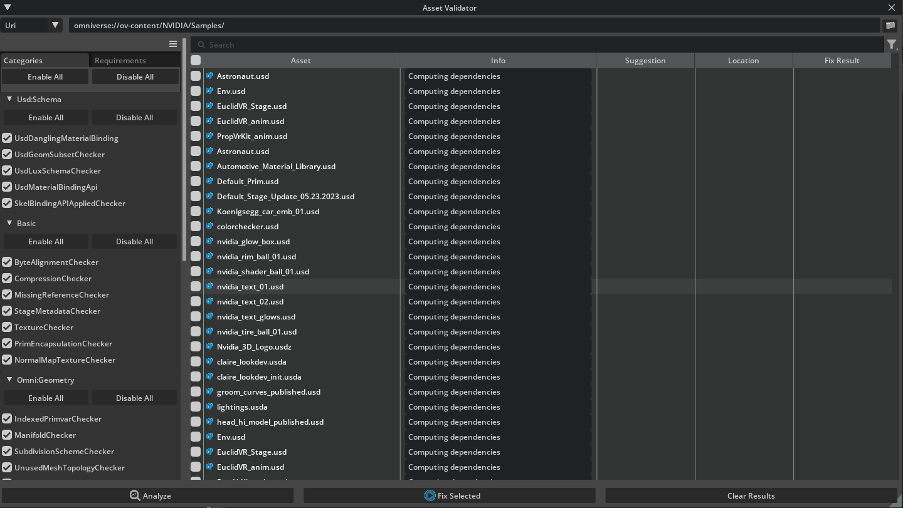

```{eval-rst}
.. tip::
    These sections are expandable to show more details about results.
        .. image:: ../data/docs/asset-validator-waiting-details.png
```

## Reviewing Results

When validation completes, the relevant section will update to one of the following statuses:

- **Valid**: Assets that pass all rules without issue will be blue with a checkmark icon.
- **Failure**: Assets that failed or errored on _any_ of the validation rules will be marked in red.
- **Warning**: Assets that generated no failures may have still generated warnings and will be marked in yellow.

Hovering on the section header will provide a quick summary total (1):

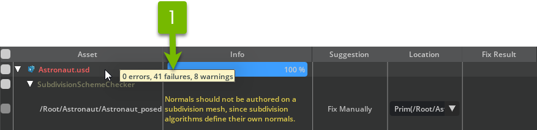

Click through the section headers for detailed reports of each issue (1). There may be *many* issues, as some rules run per prim and per-variant:

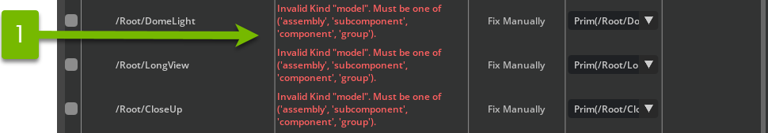

### Copying/Saving Issues

Select the issues or assets and right click on them to copy the issues with the (1) `Copy Selected Issue Items` button. This will put in your clipboard the contents of the selected issues in a human-readable format. The selected issues can be saved by selecting (2) `Save Selected Issue Items` to a .csv file.

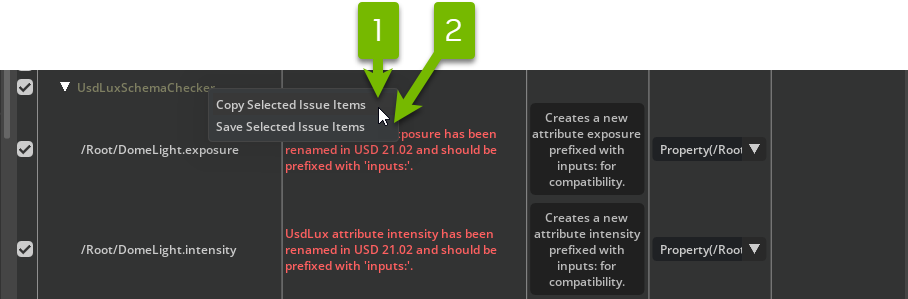

### Fixing Issues

Issues that have fix suggestions can make use of `Fix Selected`. Select issues that need fixing and use `Fix Selected` to perform the fix. Saving the changes will apply the fixes to the current stage or targeted files.

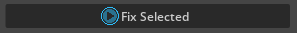

The `Save fixes` option allows files to be auto saved when fixes are applied. This can be useful for reference layers or when dealing with multiple issues and/or files.

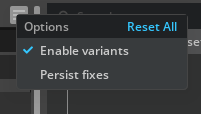

Some issues may have multiple locations to fix (1). Asset validation offers a default option, but one can be specified if applicable.

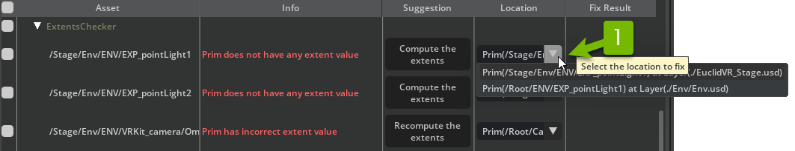

Clicking on the ``Suggestion`` (in the example above ``Compute the extents``) will fix a single issue. The fix will persist if the option ``Save fixes`` is enabled.

```{eval-rst}
.. note::
    Repeated validation of the same asset will be substantially quicker. Any interaction with servers should be cached and the stage itself may still be in-memory.
```

# Launching From Other Windows

## Using the Content Browser

To run the asset validation on files from the _Content Browser_, right click on a USD file and select ``Validate USD`` from the context menu (1):

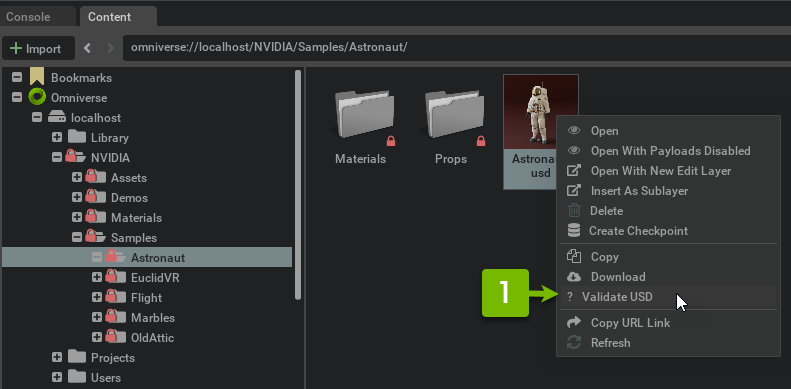

To validate a specified folder, right click and a context menu entry called ``Search for USD files and Validate`` will be available (1):

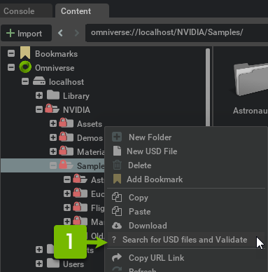

These actions will launch the _Asset Validator Window_ set to **URI Mode** and pointing to the file or folder specified in the _Content Browser_.

## Using the Layer Window

To validate layers that are currently open, in the _Layer Window_ right click on any layer (except session layers) to see the following related context menus (1,2).
This will launch the _Asset Validator Window_ preset to either **URI Mode** or **Stage Mode** and load to the requested assets to validate:

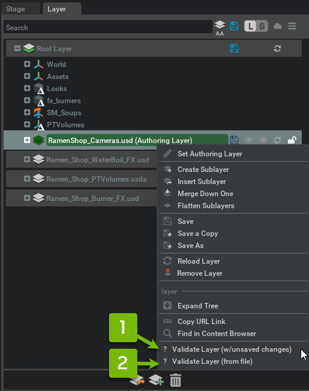

Layers will provide either ``Validate Layer (w/unsaved changes)`` (1) or ``Validate Layer (from file)`` (2) entires, depending if there are currently unsaved changes to the layer. Both of these "live" options will operate in **Stage Mode**, on a bespoke stage containing only that layer and its sublayers:

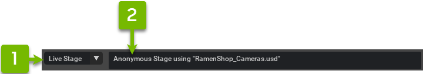

```{eval-rst}
.. important::
    Any edits will occur on a session sublayer, so neither option will save or alter the selected layer. No need to lock the layer first.
```

Layers that are associated with a file (i.e are not anonymous) will also provide an entry called ``Validate Layer (from file)``. Use this entry to operate in **URI Mode** on the file, ignoring any changes made in the application:

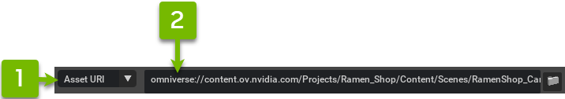

## Using the Stage Window

To validate the current stage (i.e. the entire layer stack), right click on the empty space (with no prims selected) in the *Stage Window* and a context menu ``Validate Stage`` will be available (1):

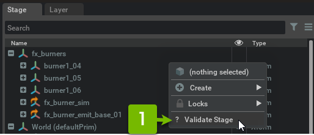

This will launch the _Asset Validator Window_, preset to **Stage Mode** and pointing to the current stage:


```{eval-rst}
.. caution::
    This is a live operation that will alter the main stage. Any edits will create a session sublayer, which requires switching the authoring layer temporarily. This will not alter layers, so no need to save or lock the layers first. The authoring layer will be restored when validation completes.
```

# Configuring Rules with Carbonite Settings

The *Asset Validator Window* is configurable at runtime using Carbonite settings. These *Asset Validator Window* settings work with the ``omni.asset_validator.core`` settings to hide any rules in a Kit application.
```{eval-rst}
.. Note:: Any rules hidden from the UI via these settings **will not be used during validation** runs initiated from the *Asset Validator Window* or the ``omni.asset_validator.ui`` Python API.
```

## Settings

- `hideDisabledCategories` can be used to exclude rules in the UI based on the `enabledCategories`/`disabledCategories` settings in `omni.asset_validator.core`.
- `hideDisabledRules` can be used to exclude rules in the UI based on the `enabledRules`/`disabledRules` settings in `omni.asset_validator.core`.
- `selectedCategories` can be used to select rules in the UI. While the above settings allow to show/hide rules/categories in the UI, this setting will default check them.

# API and Changelog

A public Python API is provided for controlling the _Asset Validation Window_. Client code is able to:
- Show and hide the window.
- Change **Asset Mode** and set the selected **URI** or **Stage** (including bespoke in-memory stages authored at runtime by the client).
- Enable and disable individual rules (i.e. click the checkboxes).
- Initiate validation runs (i.e. click the run button) and await the results.
    - Results will be both displayed in the UI and returned by the coroutine.
- Reset the window back to the selection page (i.e. click the back button) or reset to the default state.

```{eval-rst}
.. toctree::
    :maxdepth: 1

    Python API <api>
    CHANGELOG.md
```
