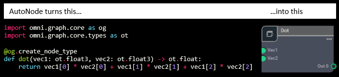

.. _omnigraph_autonode_runtime:

AutoNode
########

|autonode| is the terminology used for the general process of generating Python node type definitions directly without
requiring the use of a .ogn or .py implementation file, and without explicit scripting required to construct the node
type definition directly. It creates Python node types with minimal effort.

.. _decorator:

:fa:`at` Node Type via Function
===============================

The main method of creating a node type is to apply the `@omni.graph.core.create_node_type` decorator to a
simple Python function that operates on the data types used by OmniGraph attributes. You can run this decorated
function from anywhere - sourcing a file, entering it directly in the script editor, or as part of your extension's
script modules.

It is important to understand the distinction here between *node* and *node type*. A *node* is a concrete object that
lives in an OmniGraph in a USD scene. A *node type* is the pattern that can be used to create multiple *node*s that
share the same attributes and compute function. |autonode| is creating a *node type*. You will still need to create
a specific *node* instance for it to appear in your graph.

:fa:`graduation-cap` Learn From Examples
----------------------------------------

We recommend starting with the :ref:`autonode_walkthroughs`. They will take you from the beginning where you define your
Python function and attach the decorator to it, to finding it in the graph editor and wiring it up to make a
fully functional operation. There is also a separate path that shows you how to construct the graph using
a scripted approach rather than using the graph editor.

.. button-ref:: walkthroughs/walkthroughs
    :ref-type: doc
    :color: secondary
    :align: center
    :outline:

    Guided Walkthroughs

Once you have a feel for how to set things up you can move into more complicated node type definition by exploring
the :ref:`configuration<autonode_examples_decoration>` details and the full set of supported :ref:`omnigraph_data_types`.

:fa:`database` Explore All of the Data Types
--------------------------------------------

The simple example :ref:`above<decorator>` uses two of the common data types, 32-bit floating point value and 3-tuple
of 32-bit floating point values. There are over 100 supported types, corresponding to the data types supported by
OmniGraph attributes. You can look through the :ref:`entire catalog of supported types<omnigraph_data_types>`, which
contains links to examples of |autonode| definitions that use each type.

As a complement to the comprehensive list of all supported data types there is a similarly exhaustive list of
:ref:`examples that use each of the available data types<autonode_data_type_examples>`. There are also examples of
other uses, including how to return more than one output and using the decorator parameters.

.. button-ref:: examples/examples
    :ref-type: doc
    :color: secondary
    :align: center
    :outline:

    See Examples

:fa:`gear` Advanced Configuration
---------------------------------

In addition to the simple information that can be extracted directly from the function signature and docstring, you
can also add extra metadata as decorator arguments. This extra information allows you to customize some of the
otherwise automatically generated information such as the node type name as it will appear in the UI. Explore the
:ref:`full list of configuration parameters<autonode_examples_decoration>` to see how they affect the
generated node types.

:fa:`puzzle-piece` Missing Pieces
---------------------------------

The decorated function approach specifies the critical information required to implement a basic node type definition,
however being restricted to Python annotation information there are several features it is
:doc:`unable to handle<missing-pieces>` that are present in the more descriptive .ogn file definition.

:fa:`wrench` How It Works
-------------------------

If you are a developer who is curious to see exactly how this decorator functionality was implemented have a look
:doc:`under the hood<how-it-works>` for more details. While you do not need to know any of this to work with
|autonode| it can be informative if you are having any trouble with getting a properly configured function definition.

.. toctree::
    :hidden:
    :maxdepth: 1

    walkthroughs/walkthroughs
    examples/examples
    missing-pieces
    how-it-works
