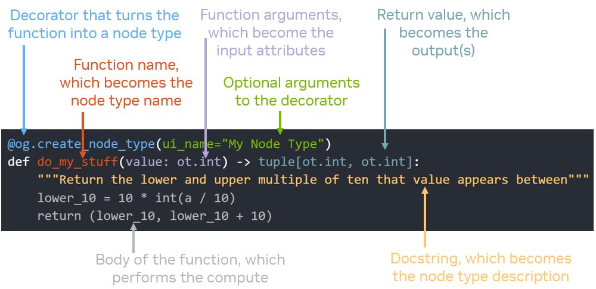

.. _autonode_internals:

:fa:`wrench` How It Works
=========================

The main |autonode| decorator, `@og.create_node_type` wraps a Python function by creating a node type definition that
allows that function to act as a node type's `compute()` function. The logistics involve three phases -
:ref:`autonode_internals_analysis`, which analyzes the function signature to define the input and output attributes that will be
part of the node type definition as well as the node type's critical definition information,
:ref:`autonode_internals_compute`, which wraps the decorated function in some code that
interfaces with the OmniGraph `NodeType` ABI, and :ref:`autonode_internals_registration`, which manages the
lifetime of the node types the decorator creates.

.. _autonode_internals_analysis:

Analysis
--------

The analysis of the decorated function is triggered by import of the decorator `@og.create_node_type`. When it is
encountered it uses both the :ref:`parameters passed to the decorator itself<autonode_examples_decoration>`
and the signature of the function it is decorating to extract the information necessary to define an OmniGraph
node type.

|autonode| generates node signatures by extracting type annotations stored in function signatures. In order for node
types to be generated, `type annotations <https://docs.python.org/3/library/typing.html>`_ are used in order to relate
Python arguments to their OmniGraph attribute type equivalents.

The OmniGraph type annotations are imported from the module `omni.graph.core.types`. They encompass all of the
legal attribute data type definitions, and are used as build-time identifiers for the data types being used in
|autonode| definitions. To see the full list of data types available for use see :ref:`omnigraph_data_types`.

Under the hood, annotation extraction is done with the python ``__annotations__``
(`PEP 3107 <https://www.python.org/dev/peps/pep-3107/>`_) dictionary in every class. In particular, it makes use of
the **inspect** module's function *inspect.get_annotations()* to retrieve and parse that information.

The annotations used have a table of correspondence between them and their .ogn attribute type names. The table
is found in the build file *exts/omni.graph.tools/ogn/DataTypeNameConversions.json*. It contains the type name
conversions between various representations, such as USD, SDF, Python annotations, and .ogn file text.

The decorator uses this table plus the extracted function signature to map the inputs and outputs to equivalent
attribute definitions. (This mapping has some :ref:`shortcomings <autonode_missing_pieces>`, some of which can be
worked around.)

Here is a map describing the various pieces of a simple decorator and what they are used for:

There is one more piece of information that will be extracted from the definition and used if possible and that is
the name of the extension in which the node type was defined. For definitions executed through an extension-neutral
location such as the script editor a special internal name will be applied in lieu of the extension name.

The extension name is discovered using inspection of the Python module top which the decorated function belongs and
a lookup of extensions by module provided by the Kit extension manager. This extension information might be used
in the :ref:`registration/deregistration management<autonode_internals_registration>`.

.. _autonode_internals_compute:

compute() Definition
--------------------

As you can see from the decorator example above there is no requirement for the Python function being decorated
to look anything like a regular OmniGraph `compute()` function, however there must be such a function in order for
the node type to successfully integrate into OmniGraph.

The |autonode| implementation makes use of the internal runtime node type definition utility, which will create a
new node type definition when given a few of the standard parameters. These include the attributes, which |autonode|
parses from the function signature, any node type metadata, gleaned from the docstring and optional decorator
arguments, and implementations for functions required for the node type to operate. The minimal set of such functions
is the `compute()` function, and that is what |autonode| generates.

The function is a standalone function so there is not problem with trying to hook it into an existing object.
The standard `compute()` function takes two parameters and returns a boolean indicating success:

.. code-block:: python

    def compute(node: og.Node, context: og.GraphContext) -> bool:
        return True

Note that this is also the magic that enables the :ref:`inspection trick<autonode_access_node>`
to find the node and context from within the decorated function.

A local function with this signature is instantiated by the decorator, with the interior of the function filled in
with a very simple algorithm:

- Walk the list of input attributes extracted by the analysis and use `node.get_attribute(NAME).get()` to get its current value
- Call the decorated function with the retrieved values as parameters, in the order the function expects them
- Walk the list of output attributes extracted by the analysis and use `node.get_attribute(NAME).set()` to set each
  of the values using the tuple or single value returned from the function call
- Surround the function call with a try/except that will log an error and return False if an *og.OmniGraphError* is raised

.. _autonode_internals_registration:

Runtime Registration/Deregistration
-----------------------------------

The last detail to be handled is the registration and deregistration of the node types, which can also be thought of
as the node type life cycle management.

For convenience the node type will always be registered by the decorator so the start of the life cycle is well
defined. Once a node type has been created and registered these are the events and reactions that will manage the
end of the node type's life cycle. It roughly follows the cycle of any Python object defined where it was defined.

**User executes the same decorated function, or another with the same unique name** The existing node type with that
name is deregistered and the new one is registered in its place. This enables the workflow of iterating on a node
type definition in the script editor.

**User uses the og.deregister_node_type() API to manually deregister the node type** The internal database is watching
those events and updates itself so that it knows the node type is no longer registered.

**The omni.graph extension unloads** While there is firewall code that deregisters any existing node types when the
extension is disabled it also expects that through the extension dependencies that list should already be empty.
That expectation is no longer valid and any still-active |autonode| node type definitions must be deregistered with
any internal registries and callbacks being removed at that time as well.
