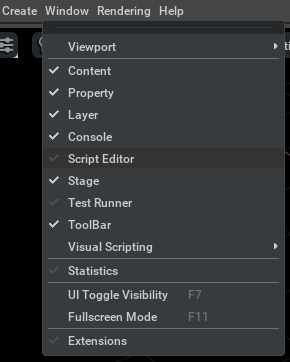
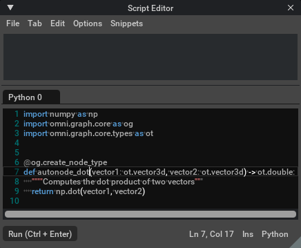
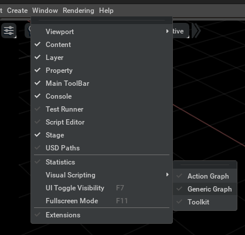
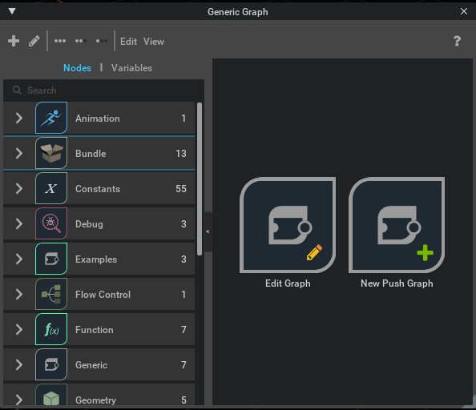
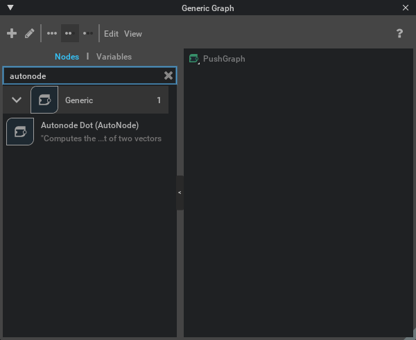
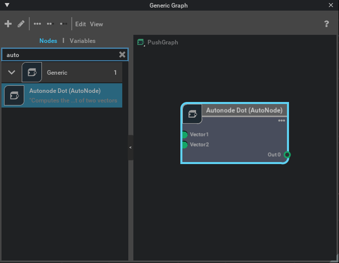
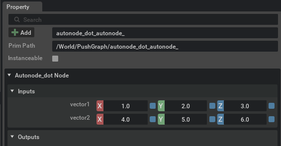
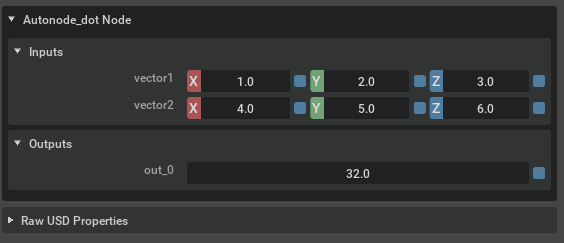

.. _autonode_walkthrough_editors:

Walkthrough - Script and Graph Editor
=====================================

This file contains an example walkthrough for creating a node type definition using an |autonode| definition in the
**Script Editor** and then constructing a graph containing a node of that type using the visual scripting **Graph Editor**.
For other walkthrough tutorials see :ref:`autonode_walkthroughs`.

This walkthrough will assume that the following extensions have been installed and are enabled in your application:

- `omni.graph` for the core |autonode| functionality
- `omni.graph.ui` for the OmniGraph fields in the **Property Panel**
- `omni.graph.window.generic` for the visual scripting **Graph Editor**
- `omni.kit.window.script_editor` for the Python **Script Editor**

Step 1: Open The Script Editor
------------------------------

Even though you will be creating nodes through the GUI you still need to program your node type definition. The easiest
way to do this is directly through the script editor, which you can access through the Window menu.

Step 2: Write The Script
------------------------

To start with you'll need these basic imports to access the key |autonode| functionality, as well as *numpy* for
the computation function.

.. literalinclude:: ../../../../../../source/extensions/omni.graph/docs/autonode_helper.py
    :language: python
    :lines: 5-7

Then you can create your |autonode| definition, in this case to compute the dot product of two vectors:

.. literalinclude:: ../../../../../../source/extensions/omni.graph/docs/autonode_helper.py
    :language: python
    :lines: 15-18
    :dedent: 4

You can type directly or copy-paste into the script editor. When you're done it should look like this:

Hitting **CTL-ENTER** will execute the code and define your node type.

Step 3: Create A Graph
----------------------

Now we will create a node of the new type by opening up the graph editor. For this example a simple push graph will
do. Open up the *Generic Graph* editor first:

Then in the editor hit the **New Push Graph** option to create a graph.

Step 4: Instantiate New Node Type
---------------------------------

Now that you have a graph you can use the search bar for node types on the left to look for your newly created type.
Use the search text *"autonode"* to zero in on the node type of interest.

Now you can drag the node type definition onto the graph pane to instantiate a node of your new type. Notice that the
names of the inputs correspond to the function arguments and the outputs are numbered, as per the description of the
:ref:`AutoNode function definition<autonode_examples_multiple_output>`.

Step 5: Set Input Values
------------------------

When you click on the node the property panel will open up to that node's information. In particular you will have
access to the *inputs:vector1* and *inputs:vector2* inputs, where you can type in some numbers. Enter the values
*1.0, 2.0, 3.0* into *inputs:vector1* and the values *4.0, 5.0, 6.0* into *inputs:vector2*.

Step 6: Check The Output
------------------------

Below the inputs in the property panel you can see the output, where you'll notice now contains the result of the
dot product calculation. Everything works as with standard node type definitions and you are free to continue using
this node type in your scene!

.. warning::

    Although you can instantiate this node type any number of times in your scene you should be aware that saving
    a file with such node types will not work across sessions. In a normal workflow the extension will automatically
    register the node types it contains but that is not true with |autonode| definitions. To use them in a
    scene you have loaded you must import and execute the script that defines the node type.
