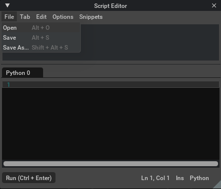
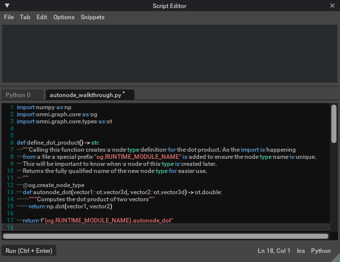
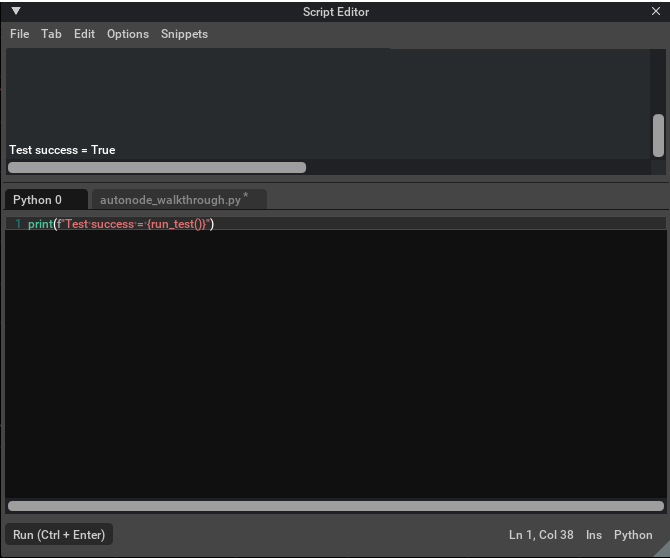

.. _autonode_walkthrough_scripts:

Walkthrough - External Python Scripting
=======================================

This file contains an example walkthrough for creating a node type definition using an |autonode| definition found in
an extension script file and then constructing a graph containing a node of that type using the OmniGraph Python API.
For other walkthrough tutorials see :ref:`autonode_walkthroughs`.

This example will create an |autonode| node type definition that takes two vectors as inputs and returns a single
output that is the dot product.

The script we will produce here contains the steps necessary to define that node type, construct a graph that
contains it, and run a simple test to confirm that it operates as expected.

This walkthrough will assume that the following extensions have been installed and are enabled in your application:

- `omni.graph` for the core |autonode| functionality
- `omni.kit.window.script_editor` for the Python **Script Editor**

.. _step1_walkthrough_scripts:

Step 1: Create The Definition
-----------------------------

The first part of the script will contain the |autonode| definition of the node type. The definition is enclosed
in a function so that it does not activate immediately on import. Instead, creation of the node type will happen when
the function is called.

.. literalinclude:: ../../../../../../source/extensions/omni.graph/docs/autonode_helper.py
    :caption: C:/Samples/autonode_walkthrough.py
    :language: python
    :start-after: begin-step1
    :end-before: end-step1
    :linenos:

.. _step2_walkthrough_scripts:

Step 2: Construct The Graph
---------------------------

The OmniGraph *Controller* class is the standard method for OmniGraph creation so we will use that. As mentioned
:ref:`above<step1_walkthrough_scripts>` the node type name was made unique be including a special prefix so that
must be included when creating nodes of that type.

For the :ref:`test we will write<step3_walkthrough_scripts>` some constant input nodes are required to those are
created here as well.

.. literalinclude:: ../../../../../../source/extensions/omni.graph/docs/autonode_helper.py
    :caption: C:/Samples/autonode_walkthrough.py
    :language: python
    :start-after: begin-step2
    :end-before: end-step2
    :linenos:
    :lineno-start: 19

.. _step3_walkthrough_scripts:

Step 3: Add A Simple Test
-------------------------

The test will just set some input values, evaluate the graph, and then confirm that the result is what we
would expect from the computation.

.. literalinclude:: ../../../../../../source/extensions/omni.graph/docs/autonode_helper.py
    :caption: C:/Samples/autonode_walkthrough.py
    :language: python
    :start-after: begin-step3
    :end-before: end-step3
    :linenos:
    :lineno-start: 27

.. note::

    Once the test completes the deregister_node_type() call will ensure that the definition does not persist
    beyond the test. In normal operation you would leave it active for as long as you need it, or simply rely on
    the application exit to remove them all for you.

.. _step4_walkthrough_scripts:

Step 4: Import The File Through The Script Editor
-------------------------------------------------

Now that the file contains everything you need in order to create your node type and run a test you can run it by
importing it through the script editor.

.. image:: ../images/OpenScriptEditor.png
   :scale: 100 %
   :alt: Menu option to open the script editor

The script editor *File* menu has an option to open a script file so use that and navigate to the file you
have saved your script in.

Once the file has been read its contents are pasted into the script editor in a new tab but not yet executed.
Hit **CTL-ENTER** in that new tab to run the script. At this point all of the functions are defined but the node
type definition has not yet been created.

Now switch to an empty tab to run the *run_test()* function. It returns a boolean to indicate test success so report
that for confirmation.

That's all there is to it for scripting with |autonode|!

.. warning::

    Although you can instantiate this node type any number of times in your scene you should be aware that saving
    a file with such node types will not work across sessions. In a normal workflow the extension will automatically
    register the node types it contains but that is not true with |autonode| definitions. To use them in a
    scene you have loaded you must import and execute the script that defines the node type.
