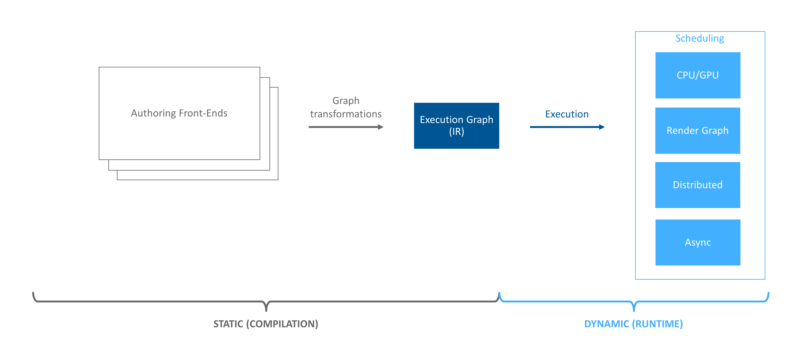
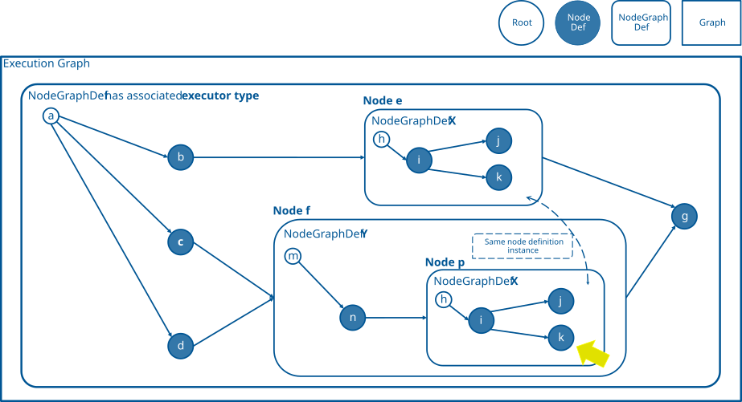

.. include:: Helpers.rst

.. _ef_execution_concepts:

Execution Concepts
------------------

*This article covers core execution concepts.  Readers are encouraged to review the* :ref:`ef_framework`,
:ref:`ef_graph_concepts`, *and* :ref:`ef_pass_concepts` *before diving into this article.*

    The Execution Framework pipeline.  This article covers graph execution concepts.

Execution Framework (i.e. EF) contains many classes with an ``execute()`` method. |IExecutionContext|, |IExecutor|,
|ExecutionTask|, |INodeDef|, and |INodeGraphDef| are a subset of the classes with said method. With so many classes,
understanding how execution works can be daunting. The purpose of this article is to step through how execution works in
EF and illustrate some of its abilities.

We start with introducing the concepts involved in execution. Once complete, we'll dive into the details on how they are
used together to perform execution.

Nodes
~~~~~~~~~~~~~~~~~~~~~~~~~~~~~~~~~

|INode| is the main structural component used to build the graph's |topology|.  |INode| stores |edges| to *parents* (i.e.
predecessors) and *children* (i.e. successors).  These edges set an ordering between nodes.

In addition to defining the execution graph's topology, |INode| stores one of two |definitions|: |INodeDef| or
|INodeGraphDef|. These definitions define the actual computation to be performed when the node is executed.

See :ref:`ef_graph_concepts` for more details on nodes and how they fit into the EF picture.

Opaque Definitions
~~~~~~~~~~~~~~~~~~~~~~~~~~~~~~~~~~~~

|INodeDef| is one of the two |definition| classes that can be attached to an |INode| (note the difference in the
spelling of |INodeDef| and |INode|). Definitions contain the logic of the computation to be performed when the |INode|
is executed. |INodeDef| defines an *opaque* computation. An *opaque* computation is logic contained within the
definition that EF is unable to examine and optimize.

Graph Definitions
~~~~~~~~~~~~~~~~~~~~~~~~~~~~~~~~~~~~~~~~~

|INodeGraphDef| is one of the two |definition| classes that can be attached to an |INode|. |INodeGraphDef| should not be
confused with |IGraph|, which is the top-level container that stores the entire structure of the graph (i.e. the
|execution graph|).

Definitions contain the logic of the computation to be performed when the |INode| is executed. Unlike |INodeDef|, which
defines opaque computational logic that EF cannot examine (and thereby optimize), |INodeGraphDef| defines its
computation by embedding a subgraph. This subgraph contains |INode| objects to define the subgraph's structure (like any
other EF graph). Each of these nodes can point to either a |INodeDef| or yet another |INodeGraphDef| (again, like any
other EF graph). The ability to define a |INodeGraphDef| which contains nodes that point to additional |INodeGraphDef|
objects is where EF gets its **composibility** power. This is why it is said that EF is a "graph of graphs".

Adding new implementations of |INodeGraphDef| is common when extending EF with new graph types.  See
:ref:`ef_definition_creation` for details.

.. _ef_executor:

Executors and Schedulers
~~~~~~~~~~~~~~~~~~~~~~~~~~~~~~~~~~~~~

Executors |traverse| a |graph definition|, generating tasks for each node *visited*. One of the core concepts of EF is
that *each graph definition can specify the executor that should be used to execute the subgraph it defines*. This
allows each graph definition to control a host of strategies for how its subgraph is executed:

- If a node should be scheduled

- How a node should be scheduled (e.g. parallel, deferred, serially, isolated, etc.)

- Where nodes are scheduled (e.g. GPU, CPU core, machine)

- The amount of work to be scheduled (i.e. how many tasks should be generated)

Executors and schedulers work together to produce, schedule, and execute tasks on behalf of the node.
Executors determine which nodes should be visited and generate appropriate work (i.e. tasks).  Said
differently, executor objects "interpret" the graph based on the behavioral logic encapsulated in the executor.
Schedulers collect tasks, possibly concurrently from many executor objects, and map the tasks to hardware resources
for execution.

Executors are described by the |IExecutor| interface.  Most users defining their own executor will inherit from the
|Executor| template, which is an implementation of |IExecutor|.  |Executor| is a powerful template allowing users to
easily control the strategies above.  See |Executor|'s documentation for a more in-depth explanation of what's possible
with EF's executors.

ExecutionPaths
~~~~~~~~~~~~~~~~~~~~~~~~~~~~~~~~~~~~~~~~~~

The |ExecutionPath| class is an efficient utility class used to store the *execution path* of an |INode|. Since a graph
definition may be pointed to/shared by multiple nodes, nodes within a graph definition can be at multiple "paths".
Consider node *k* below:

    A flattened execution graph.  Graph definitions can be shared amongst multiple nodes (e.g. *X*).  As a result, nodes
    must be identified with a path rather than their pointer value. Executions paths provide context as to what
    "instance" of a node is being executed.  Above, the yellow arrow is pointing to */f/p/k*.  However, since *X* is a
    shared definition, another valid path for *k* is */e/k*.

Above, the graph definition *X* is shared by nodes *e* and *p*.  The execution path for *k* is either */f/p/k* (the
yellow arrow) or */e/k*.

:numref:`ef_fig_execution_path_point_k` demonstrates that when associating data with a node, do not use the node's
pointer value.  Rather use an |ExecutionPath|.  The same holds true for definitions.

Execution Contexts / Execution State
~~~~~~~~~~~~~~~~~~~~~~~~~~~~~~~~~~~~~~~~~~~~~

|INodeDef| and |INodeGraphDef| are stateless entities in EF. Likewise, other than connectivity information, |INode| is
also stateless. That begs to question, "If my computation needs state, where is it stored?"  The answer is in the
|IExecutionContext|. |IExecutionContext| is a limited key/value store where each key is an |ExecutionPath| and the value
is an application defined subclass of the |IExecutionStateInfo| interface.

|IExecutionContext| allows the the graph structure to be decoupled from the computational state. As a consequence, the
execution graph can be executed in parallel, each execution with its own |IExecutionContext|. In fact,
|ExecutionContext::execute()| is the launching point of all computation (more on this below).

|IExecutionContext| is meant to store data that lives across multiple executions of the |execution graph|.  This is in
contrast to the state data |traversals| and |executors| store, which are transient in nature.

|IExecutionContext| is implemented by EF's |ExecutionContext| template.

|IExecutionContext| is an important entity during execution, as it serves as the data store for EF's stateless *graph of
graphs*.  This article only touches on execution contexts.  Readers should consult |IExecutionContext|'s documentation
for a better understanding on how to use |IExecutionContext|.

Execution Tasks
~~~~~~~~~~~~~~~~~~~~~~~~~~~~~~~~~~~~~~~~~~

|ExecutionTask| is a utility class that describes a task to be potentially executed on behalf of a |INode| in a given
|IExecutionContext|. |ExecutionTask| stores three key pieces of information: the node to be executed, the path to the
node, and the execution context.

Execution in Practice
~~~~~~~~~~~~~~~~~~~~~~~

With the overview of the different pieces in EF execution out of the way, we can now focus on how the pieces fit
together.

As mentioned above, EF utilizes a *graph of graphs* to define computation and execution order. The structure of these
graphs is constructed with |INode| objects while the computational logic each |INode| encapsulates is delegated to
either |INodeDef| or |INodeGraphDef|.

The top-level structure that contains the entire graph is the |IGraph| object (e.g. |execution graph|). The |IGraph|
object simply contains a single |INodeGraphDef| object. It is this top-level |INodeGraphDef| that defines the *graph of
graphs*.

After a concrete implementation of |IGraph| has been constructed and populated, computation starts by constructing a
concrete subclass of |IExecutionContext| and calling |IExecutionContext::execute()|:

.. code-block:: c++
   :name: ef_listing_graph_context_execute
   :caption: Pattern seen in most uses of EF to execute the execution graph.  Create the graph, populate the graph, execute the graph with a context.

    auto graph{ Graph::create("myGraph") };

    // populate graph <not shown>

    MyExecutionState state;
    auto context{ MyExecutionContext::create(graph, state) };
    Status result = context->execute();

|IExecutionContext::execute()| will initialize the context (if needed) and then pass itself and the |IGraph| to
|IExecutionCurrentThread::executeGraph()|, which is in charge of creating an |ExecutionTask| to execute the |IGraph|'s
top-level definition. |IExecutionCurrentThread| additionally keeps track of which
|ExecutionTask|/|IGraph|/|INode|/|IExecutionContext|/|IExecutor| is running on the current thread (see
|getCurrentTask()| and |getCurrentExecutor()|).

|IExecutionCurrentThread::executeGraph()| is special in that it accounts for the odd nature of the top-level
|INodeGraphDef|. The top-level |INodeGraphDef| is the only such |INodeGraphDef| that isn't pointed to by a node and as
such special logic must be written to handle this edge case.

Executing a Node
~~~~~~~~~~~~~~~~

For all other definitions (and what the remainder of this article covers), execution starts with
|ExecutionTask::execute()| which calls |IExecutionCurrentThread::execute()|:

.. literalinclude:: ../plugins/ExecutionCurrentThread.cpp
   :language: c++
   :dedent:
   :start-after: ef-docs execution-current-thread-execute-begin
   :end-before: ef-docs execution-current-thread-execute-end
   :name: ef_listing_execution_current_thread-execute
   :caption: Signature of the method used for initiating node execution.

Here, the given ``task``'s |ExecutionTask::getNode()| points to the node whose definition we wish to execute.  The given
``executor`` is the executor of the |INodeGraphDef| who owns the node we wish to execute and has created the
|ExecutionTask| (i.e. ``task``) to execute the node.

There are three cases |IExecutionCurrentThread::execute()| must handle:

#. If the node points to an |opaque definition|

#. If the node does not point to a definition

#. If the node points to a |graph definition|

Executing an Opaque Definition
##############################

The first case, opaque definition, is handled as follows:

.. literalinclude:: ../plugins/ExecutionCurrentThread.cpp
   :language: c++
   :dedent:
   :start-after: ef-docs execution-current-thread-nodedef-begin
   :end-before: ef-docs execution-current-thread-nodedef-end
   :name: ef_listing_execution_current_thread_nodedef
   :caption: How nodes with an opaque definition are executed.

The listing above is straight forward, call |INodeDef::execute()| followed by |IExecutor::continueExecute()|.

Executing an Empty Definition
##############################

The second case is also straight-forward:

.. literalinclude:: ../plugins/ExecutionCurrentThread.cpp
   :language: c++
   :dedent:
   :start-after: ef-docs execution-current-thread-empty-begin
   :end-before: ef-docs execution-current-thread-empty-end
   :name: ef_listing_execution_current_thread_empty
   :caption: How nodes without a definition are executed.

Above, we see that a node is not required to have a definition.  Such a node can be used as a synchronization point for
multiple parent tasks to complete before continuing execution (i.e. a fan-in/join).

.. _executing_a_graph_definition:

Executing a Graph Definition
##############################

The third case, graph definitions, is a bit more complex:

.. literalinclude:: ../plugins/ExecutionCurrentThread.cpp
   :language: c++
   :dedent:
   :start-after: ef-docs execution-current-thread-nodegraphdef-begin
   :end-before: ef-docs execution-current-thread-nodegraphdef-end
   :name: ef_listing_execution_current_thread_nodegraphdef
   :caption: How nodes without a graph definition are executed.

To execute the node's graph definition, we start by creating a new task that will execute the graph definition's root
node (i.e. ``rootTask``).  This task is given to the graph definition's |INodeGraphDef::preExecute()|,
|INodeGraphDef::execute()|, and |INodeGraphDef::postExecute()|.

The meanings of pre- and post-execute are up to the user.

Creating the Graph Definition's Executor
========================================

|INodeGraphDef::execute()|'s job is clear: *execute the node*.  |INodeGraphDef| implementations based on EF's
|NodeGraphDef| class handle execution by instantiating the graph definition's executor and telling it to execute the
given node (i.e. ``info->getNode()`` below):

.. literalinclude:: ../../../../include/omni/graph/exec/unstable/NodeGraphDef.h
   :language: c++
   :dedent:
   :start-after: ef-docs nodegraphdef-execute-begin
   :end-before: ef-docs nodegraphdef-execute-end
   :name: ef_listing_nodegraphdef_execute
   :caption: |INodeGraphDef::execute()|'s implementation instantiates the graph definition's preferred executor and executes the given node.

Starting Execution
========================================

In :numref:`ef_listing_execution_current_thread_nodegraphdef`, we saw the node to execute was the node's root.  The root
node does not have an associated definition, though some executors may assign special meaning when executing it.

How |IExecutor::execute()| performs execution is up to the executor.  As an example of what's possible, let's look at
the |Executor| template's execute method:

.. literalinclude:: ../../../../include/omni/graph/exec/unstable/Executor.h
   :language: c++
   :dedent:
   :start-after: ef-docs executor-execute-begin
   :end-before: ef-docs executor-execute-end
   :name: ef_listing_executor_execute
   :caption: The |Executor| template's execute method.

The |Executor| template ignores the root node and calls |IExecutor::continueExecute()|. |IExecutor::continueExecute()|'s
job is to continue execution.  What it means to "continue execution" is up to the executor.

After the call to |Executor::continueExecute()| the scheduler's ``getStatus()`` is called.  This is a blocking call that
will wait for any work generated during |Executor::continueExecute()| to report a status (e.g. |eSuccess|, |eDeferred|,
etc).

Visiting Nodes and Generating Work
========================================

Let us assume we're using the |ExecutorFallback| executor. In :numref:`ef_fig_execution_path_point_k`, if node */f/n* is
the node that just executed, calling |IExecutor::continueExecute()| will visit */f/p* (via |ExecutionVisit|), notice
that */f/p*'s parents have all executed, create a task to execute */f/p*, and given the task to the scheduler. This
behavior of |ExecutorFallback| can be seen in the following listing:

.. literalinclude:: ../../../../include/omni/graph/exec/unstable/Executor.h
   :language: c++
   :dedent:
   :start-after: ef-docs execution-visit-begin
   :end-before: ef-docs execution-visit-end
   :name: ef_listing_execution_visit
   :caption: The |ExecutorFallback|'s strategy for visiting nodes in |IExecutor::continueExecute()|.

The scheduler uses the |SchedulingStrategy| given to the executor to determine how to schedule the task.  The strategy
may decide to skip scheduling and execute the task immediately.  Likewise, the strategy may tell the scheduler to run
the task in parallel with other tasks (see |SchedulingInfo| for details).  We can see an example of this decision making
in the listing below:

.. literalinclude:: ../../../../include/omni/graph/exec/unstable/Executor.h
   :language: c++
   :dedent:
   :start-after: ef-docs executor-schedule-internal-begin
   :end-before: ef-docs executor-schedule-internal-end
   :name: ef_listing_execution_schedule_internal
   :caption: Example of an executor that uses a scheduler to actually dispatch work. Note a lambda is given to the scheduler which simply calls |ExecutionTask::execute()|.

Regardless of the scheduling strategy for the task, |ExecutionTask::execute()| will be called.

We've come full circle.  As we saw above, |ExecutionTask::execute()| will give the task to
|IExecutionCurrentThread::execute()| and the process we outlined above begins again.

Ending Execution
~~~~~~~~~~~~~~~~

In :numref:`ef_listing_execution_current_thread_nodedef`, :numref:`ef_listing_execution_current_thread_empty`, and
:numref:`ef_listing_execution_current_thread_nodegraphdef` we see they all end the same way, once the node has been
executed, tell the executor to continue execution of the current graph definition by calling
|IExecutor::continueExecute()|.  As covered above, what "continue execution" means is defined by the executor, but a
common approach is to visit the children of the node that was just executed.

Once there are no more children to visit, the stack starts to unwind and the task is complete.

Generating Dynamic Work
~~~~~~~~~~~~~~~~~~~~~~~

Above, we saw how |ExecutorFallback| traverses parents to child, generating a task per-node once its parents have
executed.  That doesn't have to be the case though.  An executor is free to generate many tasks per-node.  In fact, an
executor can generate a task, and that task can generate additional tasks using |IExecutor::schedule()|.

.. Dynamic work generation is covered more in the Advanced section's :ref:`ef_dynamic_work`.

Deferred Execution
~~~~~~~~~~~~~~~~~~

In :numref:`ef_listing_execution_visit` you'll find references to the "deferred" (e.g. |eDeferred|).  Deferred execution
refers to tasks that have been designated to finish outside of the current execution frame (i.e. output of the call to
|IExecutor::execute()|).

.. Learn more in the Advanced section's :ref:`ef_deferred_execution`.

Next Steps
~~~~~~~~~~~~~~~~~~

In this article, an overview of graph execution was provided.  For an in-depth guide to
building your own executors, consult the :ref:`ef_executor_creation` guide.

This article concludes the EF concepts journey.  Further your EF education by consulting one of the tutorials in the
*Guides* section of the manual or explore more in-depth topics in the *Advanced* section.
