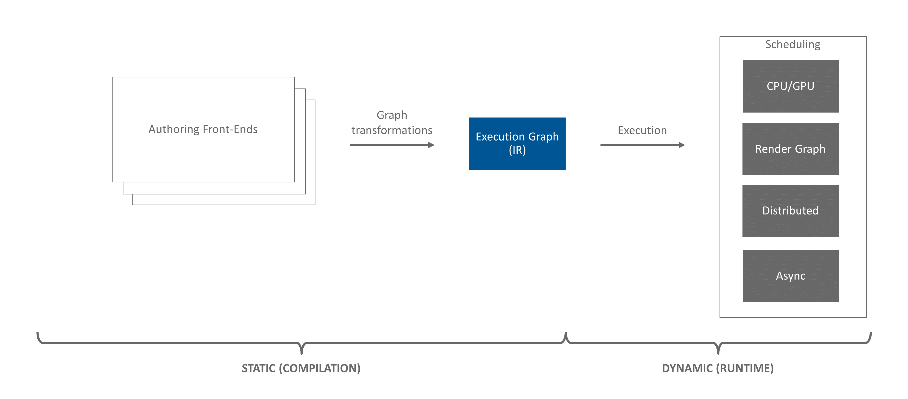
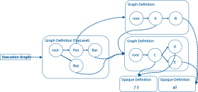

.. include:: Helpers.rst

.. _ef_graph_concepts:

Graph Concepts
------------------

*This article covers core graph concepts found in EF.  Readers are encouraged to review the* :ref:`ef_framework` *before
diving into this article.*

    The Execution Framework pipeline.  This article covers concepts found in the Execution Graph (IR).

The core data structure Execution Framework (EF) uses to describe execution is a *graph of graphs*. Each *graph*
contains a |root node|.  The root node can connect to zero or many downstream |nodes| via directed |edges|.

Nodes represent work to be executed. Edges represent ordering dependencies between nodes.

    A simple graph.

The work each node represents is encapsulated in a |definition|. Each node in the graph may have a pointer to a
definition. There are two categories of definitions: |opaque| and |graph|.

An *opaque definition* is a work implementation hidden from the framework. An example would be a function pointer.

The second type of definition is another *graph*. Allowing a node's work definition to be yet another graph is why
we say EF's core execution data structure is a *graph of graphs*.

The top-level container of the *graph of graphs* is called the |execution graph|.  The graphs to which individual
nodes point are called |graph definitions| or simply |graphs|.

The following sections dive into each of the topics above with the goal of providing the reader with a general
understanding of each of the core concepts in EF's *graph of graphs*.

.. _ef_nodes:

Nodes
==================

Nodes in a |graph| represent work to be executed.  The actual work to be performed is stored in a |definition|, to which
a node points.

Nodes can have both parent and child nodes.  This relationship between parent and child defines an ordering dependency.

The interface for interacting with nodes is |INode|.  EF contains the |Node| implementation of |INode| for instantiation
when constructing |graph definitions|.

Each node is logically contained within a single graph definition (i.e. |INodeGraphDef|).

.. _ef_edges:

Edges
==================

Edges represent ordering between |nodes| in a |graph definition|.  Edges are represented in EF with simple raw pointers
between nodes.  These pointers can be accessed with |INode::getParents()| to list nodes that are before a
node, and |INode::getChildren()| to list nodes that are after the node.

.. _ef_definition:

Definitions
==================

Definitions define the work each |node| represents.

.. _ef_opaque_definition:

Definitions can be *opaque*, meaning EF has no visibility into the actual work being performed.  Opaque definitions
implement the |INodeDef| interface.  Helper classes, like |NodeDefLambda| exists to easily wrap chunks of code into an
opaque definition.

.. _ef_graph_definition:

Definitions can also be defined with a *graph*, making the definitions transparent.  The transparency of *graph
definitions* enables EF to perform many optimizations such as:

- Execute nodes in the graph in parallel
- Optimize the graph for the current hardware environment
- Reorder/Defer execution of nodes to minimize lock contention

Many of these optimizations are enabled by writing custom |passes| and |executors|.  See :ref:`ef_pass_creation` and
:ref:`ef_executor_creation` for details.

Graph definitions are defined by the |INodeGraphDef| interface.  During graph construction, it is common for |IPass|
authors to instantiate custom graph definitions to bridge EF with the authoring layer.  The |NodeGraphDef| class is
designed to help implement these custom definitions.

Definition instances are not unique to each node.  Definitions are designed to be shared between multiple nodes.
This means two different |INode| instances are free to point to the same definition instance.  This not only saves
space, it also decreases graph construction time.

    A simple graph showing pointers from nodes to definitions.

Above we see the graph from :numref:`Figure %s <ef_fig_simple>`, but now with pointers to definitions (dashed lines).
Notice how definitions are shared between nodes.  Furthermore, notice  that nodes in graph definitions can point
to other graph definitions.

Both |INodeDef| (i.e. opaque definitions) and |INodeGraphDef| (i.e. graph definitions) inherit from the |IDef|
interface.  All user definitions must implement either |INodeDef| or |INodeGraphDef|.

Definitions are attached to nodes and can be accessed with |INode::getDef()|.  Note, a node is not required to have
a definition.  In fact, each graph's |root node| will not have an attached definition.

.. _ef_execution_graph:

Execution Graph
==================

The top-level container for execution is the *execution graph*.  The execution graph is special.  It is the only entity,
other than a |node|, that can contain a |definition|.  In particular, the execution graph always contains a single
|graph definition|. It is this graph definition that is the actual *graph of graphs*.  The execution graph does not
contain |nodes|, rather, it is the execution graph's definition that contains nodes.

In addition to containing the top-level graph definition, the execution graph's other jobs are to track:

- If the graph is currently being constructed
- Gross changes to the topologies in the execution graph.  See |invalidation| for details.

The execution graph is defined by the |IGraph| interface.  EF contains the |Graph| implementation of |IGraph| for
applications to instantiate.

.. _ef_topology:

Topology
==================

Each |graph definition| owns a *topology* object.  Each topology object is owned by a single graph definition.

The topology object has several tasks:

- Owns and provides access to the |root node|
- Assigns each node in the graph definition an unique index
- Handles and tracks |invalidation| of the topology (via |stamps|)

Topology is defined by the |ITopology| interface and accessed via |INodeGraphDef::getTopology()|.

.. _ef_root_node:

Root Nodes
==================

Each |graph definition| contains a |topology| which owns a *root node*.  The root node is where |traversal| in a
graph definition starts.  Only descendants of the root node will be traversed.

The root node is accessed with |ITopology::getRoot()|.  Use of |ITopology::getRoot()| is often seen during the
:ref:`construction <ef_definition_creation>` of a graph definition.

Root nodes are special in that they do not have an attached |definition|, though a graph definition's |executor| may
assign special meaning to the root node.

Root nodes are defined by the |INode| interface, just like any other node.

Each graph definition (technically the graph definition's topology) has a root node.  This means there are many
root nodes in EF (i.e. EF is a *graph of graphs*).

Next Steps
==================

In this article, an overview of graph concepts was provided.  To learn how these concepts are utilized
during graph construction, move on to :ref:`ef_pass_concepts`.
