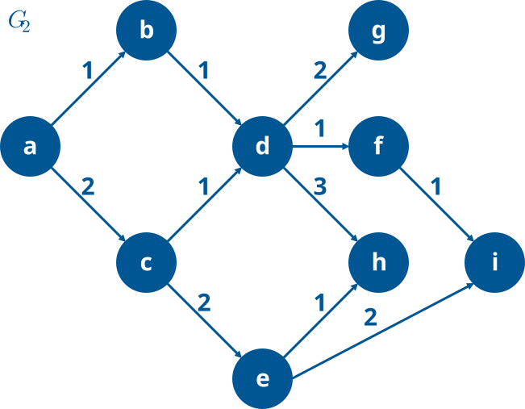
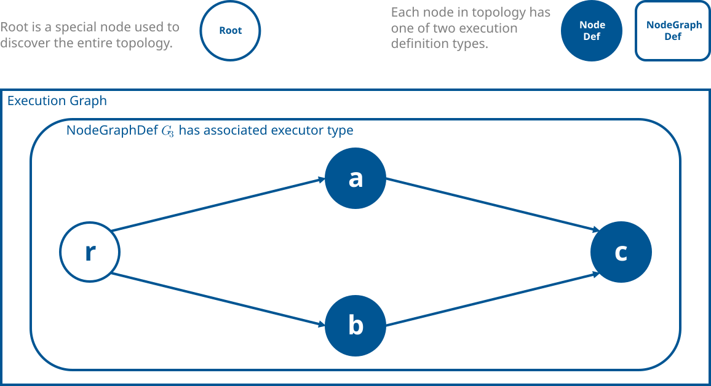
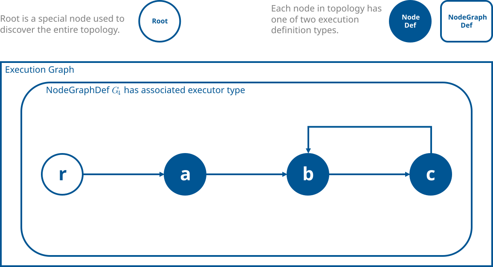

.. include:: Helpers.rst

.. |G1| replace:: :math:`G_1`
.. _G1: GraphTraversalGuide.html#ef-graph-traversal-01
.. |G2| replace:: :math:`G_2`
.. _G2: GraphTraversalAdvanced.html#ef-graph-traversal-02
.. |G3| replace:: :math:`G_3`
.. _G3: GraphTraversalAdvanced.html#ef-graph-traversal-03
.. |G4| replace:: :math:`G_4`
.. _G4: GraphTraversalAdvanced.html#ef-graph-traversal-04

.. _ef_graph_traversal_advanced:

Graph Traversal In-Depth
========================

|SHOW_ADVANCED_TOPIC_WARNING|

As was mentioned in the :ref:`ef_graph_traversal_guide`, **graph traversal** is an essential component of EF. It brings
dynamism to an otherwise-static representation of a runtime environment, allowing for fine-tuned decision-making when it
comes to how the IR is constructed, populated, transformed, and eventually evaluated. Although traversals can occur at
any point in time, typically (and perhaps most importantly) they are employed during |graph| *construction*
(see :ref:`ef_pass_concepts`) and *execution* (see :ref:`ef_execution_concepts`).

In order to form a practical and functional understanding of how |graph| traversal works, especially in regards to
its applications in EF, this document will build upon the example traversals highlighted in the
:ref:`ef_graph_traversal_guide` by introducing various key definitions and methodologies underpinning the subject
as a whole and tying the learnings together to explore their most significant utilizations in EF.

.. note::
    For the purposes of this discussion, we will only deal with *connected, cyclic, directed, simple graphs permitting
    loops* -- since those are the IR's characteristics -- and whenever the term *graph* is used generally one can assume
    that the aforementioned qualifiers apply, unless explicitly stated otherwise.

Core Search Algorithms
----------------------
Although there exist myriad different approaches to graph traversal, this section will focus on the so-called
**depth-first search (DFS)** and **breadth-first search (BFS)** techniques, which tend to be the most popular thanks to
their versatility and relative simplicity.

As can be seen in :ref:`getting_started_with_writing_graph_traversals` and :ref:`graph_traversal_apis`, EF fully
implements and exposes these algorithms on the API level to external developers so that the root logic doesn't have to
be rewritten on a per-user basis. These methods also come wrapped with
:ref:`other important functionality related to visit strategies <visitation_strategies>` that will be explained later;
for this reason, we relegate highlighting the API methods themselves for :ref:`a later section <graph_traversal_apis>`,
after :ref:`visitation_strategies` are covered. For the time being, we'll instead delve into a more conceptual,
non-EF-specific overview of these algorithms.

To facilitate this higher-level conversation, here we introduce the following connected, directed, acyclic graph
|G2|_:

    Generic (i.e. not EF-specific) graph |G2|_.

.. note::
    #. The individual edge members are ordered from tail to head, e.g. :math:`\{a, b\}` is directed from the
       upstream node :math:`a` to the downstream node :math:`b`.

    #. For clarity's sake, edges are ordered based on the node letterings' place in the alphabet (similar to
       |G1|_), e.g. :math:`\{a, b\}` and :math:`\{a, c\}` are the first and second edges protruding off of
       node :math:`a`. This in turn implies that |nodes| :math:`b` and :math:`c` are the first and second children of
       :math:`a`, respectively. These orders are also numbered explicitly on the figure itself.

.. _depth_first_search:

Depth-First Search (DFS)
~~~~~~~~~~~~~~~~~~~~~~~~
Starting at a given node, |DFS| will recursively visit all of the node's children. This effectively leads to |DFS|
exploring as far as possible downstream along a connected branch, marking nodes along the way as having been visited,
until it hits a dead end (usually defined as either reaching a node with no children or a node that has already been
visited), before backtracking to a previous node that still has open avenues for exploration. The search continues
until all nodes in the graph have been visited.

As an example, suppose that we were to start a |DFS| at node :math:`a \in G_2` and chose to enter nodes along the
*first* available edge (an important distinction to make, which is more fully addressed in
:ref:`visitation_strategies`). For simplicity's sake, let us further assume that we perform the search in a |serial|
fashion. Play through the following interactive animation to see what the resultant traversal and ordered set of visited
nodes/edges (which, when combined, form a *depth-first search tree*, highlighted in blue at the end) would look like:

.. note::
   Spread throughout this document are a series of interactive animations that show different traversals over various
   graphs in a step-by-step fashion. Some key points to consider:

    #. To move forward one step, press the ``>`` button. To move back one step, press the ``<`` button.
    #. To fast-forward to the final, fully-traversed graph, press the ``>>`` button. To go back to the start, press
       the ``<<`` button.
    #. The nodes/edges that have not been visited are colored in black.
    #. The nodes/edges that are currently being attempted to be visited are colored in yellow.
    #. The nodes/edges that have been successfully visited are colored in blue.
    #. The nodes that fail to be visited along a specific edge will glow red momentarily before returning to their
       initial color, while the corresponding edge will remain red (highlighting that we were not able to enter said
       node along that now-red edge).

.. raw:: html
   :file: ef-graph-traversal-anim-01.svg

Make sure to read :ref:`graph_traversal_code_example_1`, :ref:`graph_traversal_code_example_2`,
:ref:`graph_traversal_code_example_4`, :ref:`graph_traversal_code_example_5`, and :ref:`graph_traversal_code_example_6`
for traversal samples that utilize |DFS|.

.. _breadth_first_search:

Breadth-First Search (BFS)
~~~~~~~~~~~~~~~~~~~~~~~~~~
Starting at a given node, |BFS| will first visit all children of the current node before exploring any other
nodes that lie further downstream. Like |DFS|, this process will continue until all nodes in the graph have been
discovered.

As an example, suppose that we were to start a |BFS| at node :math:`a \in G_2` and chose to enter nodes along the
*first* available edge (similar to the |DFS| example above). As in the previous example, we'll be assuming a
|serial| traversal. The resultant exploration and ordered set of visited nodes/edges (which, when combined, form a
*breadth-first search tree*, highlighted in blue at the end) would look like this:

.. raw:: html
   :file: ef-graph-traversal-anim-02.svg

Make sure to read :ref:`graph_traversal_code_example_3` for traversal samples that utilize |BFS|.

.. _visitation_strategies:

Visitation Strategies
---------------------
Thus far many of our examples have asserted that we'd enter |nodes| on the *first available* |edge|, i.e. we would
always visit a |node| via the first connected |edge| that we happened to traverse over, regardless of whether or not the
|node| in question also has other entrance avenues. This doesn't always have to be the case, however, and some
situations will *force* us to utilize different sets of criteria when determining when a |node| should be entered during
exploration (see :ref:`graph_traversal_code_example_4` for a concrete example). The relevant decision-making logic is
encoded in so-called *visitation strategies*, which are policies passed down to traversal algorithms that inform the
latter of specific conditions that must be met prior to entering a |node|. Although developers are free to write their
own visit strategies, the three most commonly-used ones -- |VisitFirst|, |VisitLast|, and |VisitAll| -- have already
been implemented and made available through the API.

Note that the visit strategies presented below are templated to utilize a transient set of per-|node|-specific data
``NodeData`` that, among other information, tracks the number of |node| visits via a ``visitCount`` variable. This data
structure is only meant to exist for the duration of the |graph| traversal.

|VisitFirst| Strategy
~~~~~~~~~~~~~~~~~~~~~
The |VisitFirst| strategy allows for a given |node| to be entered the *first* time that it is discovered, i.e. along
the first available |edge|. This is the formal name given to the strategy employed in the |DFS| and |BFS| examples in
the :ref:`core_traversal_search_algorithms` section.

The implementation looks like this:

.. literalinclude:: ../../../../include/omni/graph/exec/unstable/Traversal.h
   :language: c++
   :dedent:
   :start-after: ef-docs visit-first-begin
   :end-before: ef-docs visit-first-end
   :name: ef_listing_visit_first
   :caption: |VisitFirst| strategy implementation.

Here's an animated example of a |serial| |DFS| through |graph| |G1|_ that employs the |VisitFirst| strategy:

.. raw:: html
   :file: ef-graph-traversal-anim-03.svg

Make sure to read :ref:`graph_traversal_code_example_1`, :ref:`graph_traversal_code_example_2`, and
:ref:`graph_traversal_code_example_6` for traversal samples that utilize the |VisitFirst| strategy.

.. _visit_last_strategy:

|VisitLast| Strategy
~~~~~~~~~~~~~~~~~~~~
The |VisitLast| strategy allows for a given |node| to be entered only when the *entirety* of its upstream/parent
|nodes| have already been visited, thereby implying that this is the last opportunity to enter the |node|. We sometimes
refer to the ordering of |node| visits produced by using |VisitLast| as being the *topographical* traversal order (as
was seen in :ref:`getting_started_with_writing_graph_traversals`, for example).

To justify the need and merit of this strategy, suppose we had the following IR |graph| |G3|_:

    Example IR |graph| |G3|_ which contains a fan in/out flow pattern. Assume that :math:`\{r,a\}` and
    :math:`\{r,b\}` are |root node| :math:`r`'s first and second |edges|, respectively.

As has been discussed in previous articles, connections between :math:`c` and the parents represent upstream execution
*dependencies* for :math:`c`, i.e. in order to successfully compute :math:`c`, we first need the results of
:math:`a`'s and :math:`b`'s executions. Now, suppose that we tried traversing this |graph| in a |serial|, |DFS| manner
using the same policy of entering any |node| on the *first available* |edge|, and immediately executing each |node| that
we visit. Based on what has already been presented, the traversal path (and subsequently the order of |node| executions)
would look like this (assuming we begin from :math:`r`):

.. math::

    r \rightarrow a \rightarrow c \rightarrow b

This is problematic because :math:`c` was evaluated *before* all of its parents; more specifically, not all of the
requisite upstream information for :math:`c`'s compute were passed down prior to triggering its evaluation, since
:math:`b` was executed after :math:`c`. To remedy this, we'd need to specify in the traversal implementation that
|nodes| are only to be entered once *all* of their parents have been executed. Said differently, we should only enter
on the *last* available |edge|, which implies that all other parents have already executed, and now that the final
parent is also done computing we can safely continue flowing downstream since we have the necessary upstream inputs to
perform subsequent calculations. In the above example, rather than directly entering :math:`c` from :math:`a`, we'd
actually first bounce to the other branch to evaluate :math:`b`, and *only then* enter :math:`c` from :math:`b`.
The amended traversal path would thus be:

.. math::

    r \rightarrow a \rightarrow b \rightarrow c

The implementation for |VisitLast| looks like this:

.. literalinclude:: ../../../../include/omni/graph/exec/unstable/Traversal.h
   :language: c++
   :dedent:
   :start-after: ef-docs visit-last-begin
   :end-before: ef-docs visit-last-end
   :name: ef_listing_visit_last
   :caption: |VisitLast| strategy implementation.

A couple of key factors that are worth mentioning here:

#. Because |nodes| connected to |root nodes| don't count the latter as parents, we need a special check to allow
   for such |nodes| to still be entered (``requiredCount == 0``).

#. When computing the ``requiredCount`` (i.e. number of visit attempts needed before a |node| can be entered), we
   subtract the number of parent cycles on the |node|. This is to allow the strategy to *still enter* |nodes| that
   are members of cycles, thereby ensuring that the entire |graph| is capable of being traversed using |VisitLast|.

To illustrate this last point, suppose that we have the following EF |graph| |G4|_:

      Example IR |graph| |G4|_ which contains a cycle.

Let us perform a (partial) |serial|, |DFS| traversal through this |graph| using the |VisitLast| policy starting
at :math:`r`. Going step-by-step:

#. From :math:`r` we try to visit all of its children. Since :math:`a` is its only child, we attempt to visit
   :math:`a`.
#. :math:`a` has no parents (recall that the |root node| doesn't get counted as the parent of any |node|)
   and no parent cycles, so ``requiredCount == 0``. This is also the first time we've attempted to enter :math:`a`,
   so ``currentVisit == 1``. By these two conditions, the |node| can be entered.
#. From :math:`a` we try to visit all of its children. Since :math:`b` is its only child, we attempt to visit
   :math:`b`.
#. :math:`b` has *2* parents (:math:`a` and :math:`c`, since both have directed |edges| pointing from themselves
   to :math:`b`) and 1 parent cycle (formed thanks to :math:`c`). Since this is the first time that we've visited
   :math:`b`, ``currentVisit == 1``. Now, suppose that we only computed ``requiredCount`` based exclusively off of
   the number of parents, i.e. ``auto requiredCount = node->getParents().size()``. In this case
   ``requiredCount == 2``, which implies that we'd need to visit both :math:`a` and :math:`c` first before entering
   :math:`c`. But, :math:`c` *also* lies *downstream* of :math:`b` in addition to being *upstream* (such is the
   nature of cycles), and the only way to enter :math:`c` is through :math:`b`. So we'd need to enter :math:`b`
   before :math:`c`, which can only be done if :math:`c` is visited, and on-and-on goes the circular logic. In short,
   using this specific rule we'd *never* be able to enter either :math:`b` or :math:`c` (as evidenced by the fact
   that our ``requiredCount`` of 2 is not equal to the ``currentVisit`` value of 1). While this could be viable
   visitation behavior for situations where we want to prune cycles from traversal, the |VisitLast| strategy was
   written with the goal of making *all* |nodes| in a cyclic |graph| be reachable. This is why we ultimately subtract
   the parent cycle count from the required total -- we essentially stipulate that it is *not* necessary for upstream
   |nodes| that are members of the same cycle(s) that the downstream |node| in question is in to be computed prior to
   entering the latter. Using this ruleset, ``requiredCount`` for :math:`b` becomes 1, and thus
   ``currentVisit == requiredCount`` is satisfied.

We skip the rest of the traversal steps since they're not relevant to the present discussion.

Here's an animated example of a |serial| |DFS| through |graph| |G1|_ that employs the |VisitLast| strategy:

.. raw:: html
   :file: ef-graph-traversal-anim-04.svg

Make sure to read :ref:`graph_traversal_code_example_4` for a traversal sample that utilizes the |VisitLast| strategy.

|VisitAll| Strategy
~~~~~~~~~~~~~~~~~~~
The |VisitAll| strategy allows for all |edges| in an EF |graph| to be explored. While the previous two strategies are
meant to be used with specific traversal continuation logic in mind (i.e. continuing traversal along the first/last
|edge| in the |VisitFirst|/|VisitLast| strategies, respectively), |VisitAll| is more open-ended in that it encourages
the user to establish how traversal continuation should proceed (this is touched on in more detail
:ref:`here <graph_traversal_apis>`).

The implementation looks like this:

.. literalinclude:: ../../../../include/omni/graph/exec/unstable/Traversal.h
   :language: c++
   :dedent:
   :start-after: ef-docs visit-all-begin
   :end-before: ef-docs visit-all-end
   :name: ef_listing_visit_all
   :caption: |VisitAll| strategy implementation.

Note how we're outputting the specific *type* of visit that gets made when processing a given |node| (i.e. did we
visit a |node| along its first |edge|, last |edge|, a cyclic |edge|, or something in between), unlike |VisitFirst| and
|VisitLast| which only check whether their own respective visit conditions have been met (and output a
``VisitOrder::eUnknown`` result if those conditions aren't satisfied).

Here's an animated example of a |serial| |DFS| through |graph| |G1|_ that employs the |VisitAll| strategy and
continues traversal along the first discovered |edge|:

.. raw:: html
   :file: ef-graph-traversal-anim-05.svg

Make sure to read :ref:`graph_traversal_code_example_3` and :ref:`graph_traversal_code_example_5` for traversal samples
that utilize the |VisitAll| strategy.

.. _graph_traversal_apis:

|Serial| vs. |Parallel| Graph Traversal
---------------------------------------
In the previous traversal examples we alluded to the fact that many of the searches were performed *serially*, as
opposed to in *parallel*. The difference between the two is presented below:

.. _serial_graph_traversal:

- |Serial|: A *single* thread is utilized to perform the |graph| traversal. As a consequence, |node| visitation ordering
  will be deterministic, and depends entirely on the order of the corresponding connecting |edges|. This is why, in both
  the |DFS| and |BFS| examples shown in :ref:`core_traversal_search_algorithms`, we visited |node| :math:`b` before
  |node| :math:`c` when kickstarting the search from |node| :math:`a`. While such |serial| traversal is usually easier
  to conceptualize -- hence their liberal use in this article -- it will also be much slower to traverse through a
  |graph| than an equivalent |parallel| search.

.. _parallel_graph_traversal:

- |Parallel|: *Multiple* threads are utilized to perform the |graph| traversal. As a consequence, |node| visitation
  ordering will *not* be deterministic, since different threads will begin and end their explorations at varying times
  depending on a number of external factors (the sizes of the subgraphs that are rooted at each child |node|,
  fluctuations in how the OS dispatches threads, etc.); this in turn implies that the generated depth/breadth-first
  search trees can differ between different concurrent traversals of the same |graph|. |Parallel| traversals will
  typically take *significantly* less time to complete than their |serial| counterparts.

Below is an example parallel graph traversal implementation using the APIs.

.. _graph_traversal_code_example_6:

Store and Print all Node Names **Concurrently**
~~~~~~~~~~~~~~~~~~~~~~~~~~~~~~~~~~~~~~~~~~~~~~~
:numref:`ef_store_and_print_all_node_names_concurrently` is similar to :numref:`ef_print_all_node_names`, except that we
now print the |node| names in *parallel* by performing the traversal in a multi-threaded fashion and store the results
in an external data container. Here ``tbb`` refer's to
`Intel's Threading Building Blocks <https://github.com/oneapi-src/oneTBB>`_ library.

.. literalinclude:: ../tests.cpp/TestTraversalDocs.cpp
   :language: c++
   :dedent:
   :start-after: ef-docs graph-traversal-code-example-6-begin
   :end-before: ef-docs graph-traversal-code-example-6-end
   :name: ef_store_and_print_all_node_names_concurrently
   :caption: |Parallel| |DFS| using the |VisitFirst| strategy to print and store all *top-level* visited |node| names.

Applying this concurrent traversal to |G1|_ would produce a list containing :math:`b`, :math:`e`, :math:`g`,
:math:`c`, :math:`f`, and :math:`d`, although the exact ordering is impossible to determine thanks to some inherent
non-determinisms associated with multi-threaded environments (variability when threads are spawned to perform work,
distribution of tasks amongst threads, etc.).

Traversal APIs
--------------
Now that we've covered |DFS|/|BFS| and :ref:`visitation_strategies`, let's bring our attention to the various traversal
API helper methods. Currently there are 4 such traversal functions, all of which can be found in
``include/omni/graph/exec/unstable/Traversal.h``:

As the names (somewhat) suggest:

- |traverseDepthFirst| can be used to perform |serial| |DFS|.
- |traverseBreadthFirst| can be used to perform |serial| |BFS|.
- |traverseDepthFirstAsync| can be used to perform *both* |serial| and |parallel| |DFS| (more on that in a bit).
- |traverseBreadthFirstAsync| can be used to perform *both* |serial| and |parallel| |BFS| (more on that in a bit).

It is worth mentioning that:

#. These methods are templated to include a ``Strategy`` type, which refers to the
   :ref:`visitation_strategies` from before. This further extends the traversal helpers' utility
   by not only making them compatible with the three already-existing visit strategies, but by also allowing users to
   pass in custom-defined policies for |graph| exploration, all without ever needing to touch the underlying traversal
   algorithms. Traversal behavior can thus be tweaked relatively simply and quickly by playing around with the specified
   visit strategies.
#. The traversal methods are also templated to injest an optional ``NodeUserData`` type struct, which can come in
   handy when we need to pass in more sophisticated per-|node| data. See :ref:`graph_traversal_code_example_5` for a
   practical use case.
#. All four of the traversal methods accept a user-defined callback as part of their arguments, which gets evaluated
   whenever a |node| is able to be visited. This is where all of the customized traversal logic for the samples provided
   in :ref:`getting_started_with_writing_graph_traversals` ultimately lives.
#. Technically |traverseDepthFirstAsync| and |traverseBreadthFirstAsync| don't implement |parallel| versions of these
   algorithms from the get-go; instead, they simply allocate an internal |Traversal| object to the heap so that all
   concurrently-running searches have access to the same object. The actual multithreaded search mechanism needs to be
   added by the user in the callback, an example of which can be found in :ref:`graph_traversal_code_example_6`. Note
   that this also means that one could technically use |traverseDepthFirstAsync|/|traverseBreadthFirstAsync| for
   |serial| searches by writing the appropriate callbacks, although this is discouraged since |traverseDepthFirst| and
   |traverseBreadthFirst| already exist to fulfill that functionality.
