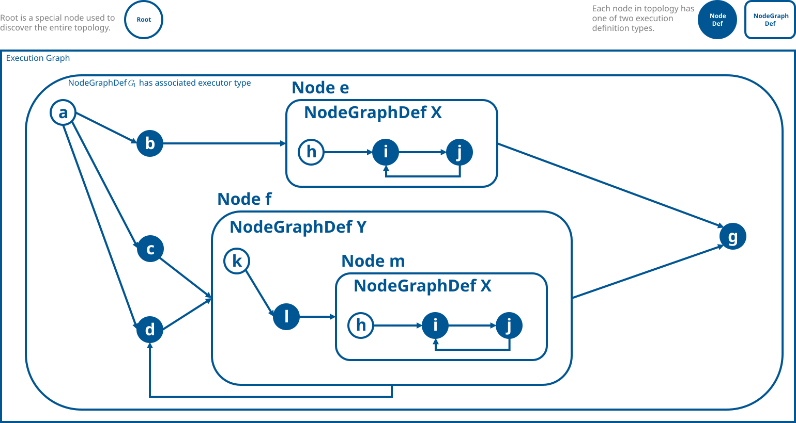

.. include:: Helpers.rst

.. |G1| replace:: :math:`G_1`
.. _G1: GraphTraversalGuide.html#ef-graph-traversal-01

.. _ef_graph_traversal_guide:

Graph Traversal Guide
=====================

|SHOW_GUIDE_WARNING|

**Graph traversal** -- the systematic visitation of |nodes| within the IR -- is an integral part of EF.

EF contains several built-in traversal functions:

- |traverseDepthFirst| traverses a graph in |depth-first| order.

- |traverseBreadthFirst| traverses a graph in |breadth-first| order.

- |traverseDepthFirstAsync| traverses a graph in |depth-first| order, potentially initiating asynchronous work before
  visiting the next node.

- |traverseBreadthFirstAsync| traverses a graph in |breadth-first| order, potentially initiating asynchronous work
  before visiting the next node.

The following sections examine a few code examples demonstrating how one can explore EF graphs in a customized manner
using the available APIs.

.. _getting_started_with_writing_graph_traversals:

Getting Started with Writing Graph Traversals
---------------------------------------------
In order to further elucidate the concepts embedded in these examples, some of the traversals will be applied to the
following sample IR |graph| |G1|_ in order to see what the corresponding output would look like for a concrete case:

    An example IR |graph| |G1|_.

Note that each |node|'s downstream |edges| are ordered alphabetically with respect to their connected children |nodes|,
e.g. for |node| :math:`a`, its first, second, and third |edges| are :math:`\{a,b\}`, :math:`\{a,c\}`, and
:math:`\{a,d\}`, respectively. Also note that the below examples are all assumed to reside within the
|omni::graph::exec::unstable| namespace.

.. _graph_traversal_code_example_1:

Print all Node Names
~~~~~~~~~~~~~~~~~~~~
:numref:`ef_print_all_node_names` shows how one can print out all *top-level* |node| names present in a
given IR |graph| in |serial| |DFS| ordering using the |VisitFirst| policy. Here the term *top-level* refers to |nodes|
that lie directly in the top level |execution graph| |definition|; any |nodes| not contained in the |execution graph|'s
|NodeGraphDef| (implying that they are contained within other |node|\s' |NodeGraphDef|\s) will not have their names
printed with the below code-block.

.. literalinclude:: ../tests.cpp/TestTraversalDocs.cpp
   :language: c++
   :dedent:
   :start-after: ef-docs graph-traversal-code-example-1-begin
   :end-before: ef-docs graph-traversal-code-example-1-end
   :name: ef_print_all_node_names
   :caption: |Serial| |DFS| using the |VisitFirst| strategy to print all *top-level* visited |node| names.

If we applied the above code-block to |G1|_, we would get the following ordered list of visited |node| names:

.. math::

    b \rightarrow e \rightarrow g \rightarrow c \rightarrow f \rightarrow d

Note that the |root node| :math:`a` is ignored since we *started* our visitations at :math:`a`, which would make
``prev`` point to :math:`a` during the very first traversal step, and since we aren't printing ``prev`` :math:`a`
doesn't show up in the output.

.. _graph_traversal_code_example_2:

Print all Node Traversal Paths **Recursively**
~~~~~~~~~~~~~~~~~~~~~~~~~~~~~~~~~~~~~~~~~~~~~~
:numref:`ef_print_all_node_traversal_paths_recursively` shows how one can *recursively* print the *traversal paths*
(list of upstream |nodes| that were visited prior to reaching the current |node|) of all |node|\s present in a given IR
|graph| in |serial| |DFS| ordering using the |VisitFirst| strategy; this will include all |nodes| that lie within other
non-|execution graph| |definitions| (i.e. inside other |node|\s' |NodeGraphDef|\s that are nested inside the
|execution graph| |definition|), hence the need for recursion. The resultant list of |nodes| can be referred to as the
member |nodes| of the *flattened* IR.

.. literalinclude:: ../tests.cpp/TestTraversalDocs.cpp
   :language: c++
   :dedent:
   :start-after: ef-docs graph-traversal-code-example-2-begin
   :end-before: ef-docs graph-traversal-code-example-2-end
   :name: ef_print_all_node_traversal_paths_recursively
   :caption: |Serial| |DFS| using the |VisitFirst| strategy to *recursively* print all visited |node| traversal paths.

Applying this logic to |G1|_, the list of |node| traversal paths (paired with their names as well for further
clarity, and ordered based on when each |node| was visited) would look something like this:

#. :math:`b: a/b`
#. :math:`e: a/b/e`
#. :math:`i: a/b/e/h/i`
#. :math:`j: a/b/e/h/i/j`
#. :math:`g: a/b/e/g`
#. :math:`c: a/c`
#. :math:`f: a/c/f`
#. :math:`l: a/c/f/k/l`
#. :math:`m: a/c/f/k/l/m`
#. :math:`i: a/c/f/k/l/m/h/i`
#. :math:`j: a/c/f/k/l/m/h/i/j`
#. :math:`d: a/c/f/d`

.. note::
   EF typically uses a more space-efficient path representation called the |ExecutionPath| when discussing nodal paths;
   the above example prints the explicit traversal path to highlight how the graph is crawled through.

.. _graph_traversal_code_example_3:

Print all Edges **Recursively**
~~~~~~~~~~~~~~~~~~~~~~~~~~~~~~~
:numref:`ef_print_all_edges_recursively` uses the |VisitAll| strategy to *recursively* store and print out all |edges|
in an IR |graph| in |serial| |BFS| order. Note that the choice of |serial| |BFS| is arbitrary (other search algorithms
could have been chosen to still print all top-level |edges|, albeit in a different order); only the selection of
|VisitAll| matters since *it* enables us to actually explore all of the |edges|. Also note that traversal continues
along the first discovered |edge| (similar to the |VisitFirst| policy).

.. literalinclude:: ../tests.cpp/TestTraversalDocs.cpp
   :language: c++
   :dedent:
   :start-after: ef-docs graph-traversal-code-example-3-begin
   :end-before: ef-docs graph-traversal-code-example-3-end
   :name: ef_print_all_edges_recursively
   :caption: |Serial| |BFS| using the |VisitAll| strategy to *recursively* print all |edges| in the inputted |graph|.

Running this traversal on |G1|_ would produce the following list of |edges| (in the order that they are visited):

.. math::

   &\set{a,b} \rightarrow \set{a,c} \rightarrow \set{a,d} \rightarrow \set{b,e} \rightarrow \set{a/b/e/h,a/b/e/h/i}
   \rightarrow \set{a/b/e/h/i,a/b/e/h/i/j} \rightarrow \set{a/b/e/h/i/j,a/b/e/h/i} \rightarrow \set{c,f} \rightarrow
   \set{k,l} \\
   &\rightarrow \set{l,m} \rightarrow \set{a/c/f/k/l/m/h,a/c/f/k/l/m/h/i} \rightarrow
   \set{a/c/f/k/l/m/h/i,a/c/f/k/l/m/h/i/j} \rightarrow \set{a/c/f/k/l/m/h/i/j,a/c/f/k/l/m/h/i} \\
   &\rightarrow \set{d,f} \rightarrow \set{e,g} \rightarrow \set{f,d} \rightarrow \set{f,g}

Note that for |node| instances which share the same definition (e.g. :math:`i`, :math:`j`, etc.), we've used their full
traversal path for clarity's sake.

.. _graph_traversal_code_example_4:

Print all Node Names **Recursively** in **Topological Order**
~~~~~~~~~~~~~~~~~~~~~~~~~~~~~~~~~~~~~~~~~~~~~~~~~~~~~~~~~~~~~
:numref:`ef_print_all_node_names_recursively_in_topological_order` highlights how one can *recursively* print out all
|node| names in *topological order* using the |VisitLast| strategy, meaning that no |node| will be visited until all of
its parents have been visited. Note that any traversal, whether it be a |serial| |DFS|, |serial| |BFS|, |parallel|
|DFS|, |parallel| |BFS|, or something else entirely, can be considered topological as long as it employs the |VisitLast|
strategy; this example has opted to utilize a |serial| |DFS| approach.

.. literalinclude:: ../tests.cpp/TestTraversalDocs.cpp
   :language: c++
   :dedent:
   :start-after: ef-docs graph-traversal-code-example-4-begin
   :end-before: ef-docs graph-traversal-code-example-4-end
   :name: ef_print_all_node_names_recursively_in_topological_order
   :caption: |Serial| |DFS| using the |VisitLast| strategy to *recursively* print all visited |nodes| in *topological order*.

Again, in the case of |G1|_, we would obtain the following ordered |node| name list:

.. math::

   b \rightarrow e \rightarrow a/b/e/h/i \rightarrow a/b/e/h/i/j \rightarrow c \rightarrow f \rightarrow l \rightarrow m
   \rightarrow a/c/f/k/l/m/h/i \rightarrow a/c/f/k/l/m/h/i/j \rightarrow d \rightarrow g

.. _graph_traversal_code_example_5:

Using Custom ``NodeUserData``
~~~~~~~~~~~~~~~~~~~~~~~~~~~~~
:numref:`ef_global_pass_scc` showcases how one can pass *custom node data* into the traversal methods to tackle
problems that would otherwise be much more inconvenient (or downright impossible) to solve if the API were missing that
flexibility. In this case we are using the ``SCC_NodeData`` struct to store per-|node| information that is necessary
for implementing `Tarjan's algorithm for strongly connected components
<https://en.wikipedia.org/wiki/Tarjan%27s_strongly_connected_components_algorithm>`_; this is what ultimately allows us
to create the global |graph| transformation pass responsible for detecting cycles in the |graph|.

.. literalinclude:: ../plugins/PassStronglyConnectedComponents.h
   :language: c++
   :dedent:
   :start-after: ef-docs global-pass-scc-begin
   :end-before: ef-docs global-pass-scc-end
   :name: ef_global_pass_scc
   :caption: The global pass used for detecting cycles in the execution graph.

.. _core_traversal_search_algorithms:

Next Steps
~~~~~~~~~~
To learn more about graph traversals in the context of EF, see :ref:`ef_graph_traversal_advanced`.
