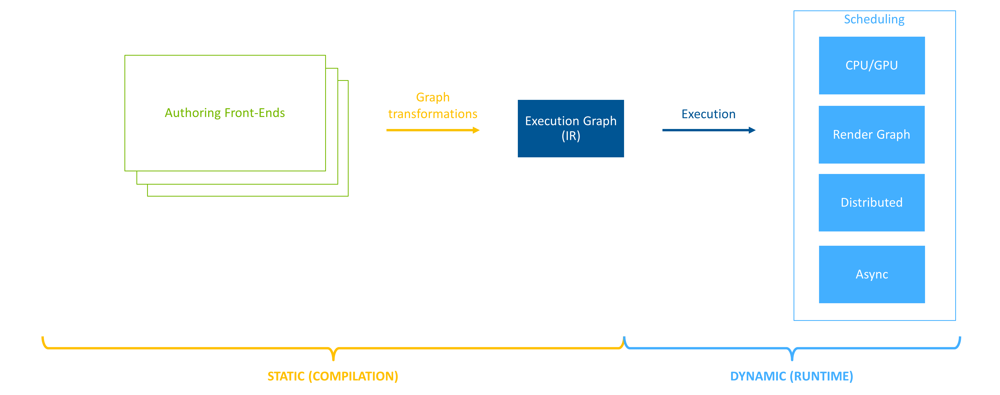
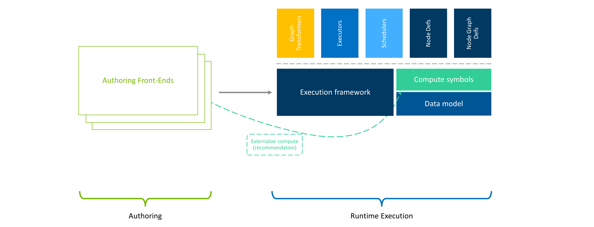
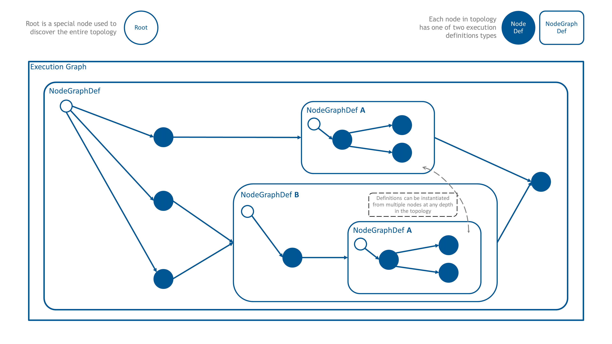

.. include:: Helpers.rst

.. _ef_framework:

Execution Framework Overview
############################

The |Omniverse| ecosystem enjoys a bevy of software components (e.g. |PhysX|, |RTX|, |USD|, |OmniGraph|, etc). These
software components can be assembled together to form domain specific applications and services. One of the powerful
concepts of the Omniverse ecosystem is that the assembly of these components is not limited to compile time. Rather,
*users* are able to assemble these components *on-the-fly* to create tailor-made tools, services, and experiences.

With this great power comes challenges. In particular, many of these software components are siloed and monolithic. Left
on their own, they can starve other components from hardware resources, and introduce non-deterministic behavior into
the system. Often the only way to integrate these components together was with a model "don't call me, I'll call you".

For such a dynamic environment to be viable, an intermediary must be present to guide these different components in
a composable way. The **Execution Framework** is this intermediary.

The Omniverse Execution Framework's job is to orchestrate, at runtime, computation across different software
components and logical application stages by decoupling the description of the compute from execution.

Architecture Pillars
---------------------------------------

The Execution Framework (i.e. EF) has three main architecture pillars.

    Decoupled architecture

The first pillar is **decoupling** the authoring format from the computation back end. Multiple authoring front ends are
able to populate EF's intermediate representation (IR). EF calls this intermediate representation the |execution graph|.
Once populated by the front end, the execution graph is transformed and refined, taking into account the available
hardware resources. By decoupling the authoring front end from the computation back end, developers are able to assemble
software components without worrying about multiple hardware configurations. Furthermore, the decoupling allows EF to
optimize the computation for the current execution environment (e.g. HyperScale).

    Extendable architecture

The second pillar is **extensibility.**  Extensibility allows developers to augment and extend EF's capabilities without
changes to the core library. Graph |transformations|, |traversals|, :ref:`execution behavior <ef_execution_concepts>`,
computation logic, and |scheduling| are examples of EF features that can be :ref:`extended <ef_plugin_creation>` by
developers.

    Composable architecture

The third pillar of EF is **composability**. Composability is the principle of constructing novel building
blocks out of existing smaller building blocks. Once constructed, these novel building blocks can be used to build yet
other larger building blocks. In EF, these building blocks are nodes (i.e. |Node|).

Nodes stores two important pieces of information. The first piece they store is connectivity information to other nodes
(i.e. topology edges). Second, they stores the **computation definition**. Computation |definitions| in EF are defined
by the |NodeDef| and |NodeGraphDef| classes. |NodeDef| defines opaque computation while |NodeGraphDef| contains an
entirely new graph. It is via |NodeGraphDef| that EF derives its composibility power.

The big picture of what EF is trying to do is simple: take all of the software components that wish to run, generate
nodes/graphs for the computation each component wants to perform, add edges between the different software components'
nodes/graphs to define execution order, and then optimize the graph for the current execution environment. Once the
*execution graph* is constructed, an *executor* traverses the graph (in parallel when possible) making sure each
software component gets its chance to compute.

Practical Examples
---------------------------------------

Let's take a look at how |Omniverse USD Composer|, built with |Omniverse Kit|, handles the the update of the USD stage.

Kit maintains a list of |extensions| (i.e. software components) that either the developer or user has requested to be
loaded. These extensions register callbacks into Kit to be executed at fixed points in Kit's update loop. Using an empty
scene, and USD Composer's default extensions, the populated execution graph looks like this:

.. raw:: html

    

.. raw:: html
    :file: ef-composer-execution-graph.svg

.. raw:: html

    <figure class="align-center"><figcaption>

    USD Composer's execution graph used to update the USD stage.
    
</figcaption></figure>

Notice in the picture above that each node in the graph is represented as an opaque node, except for the OmniGraph (OG)
front-end. The OmniGraph node further refines the compute definition by expressing its update pipeline with
*pre-simulation*, *simulation*, and *post-simulation* nodes. This would not be possible without EF's **composable
architecture**.

Below, we illustrate an example of a graph authored in OG that runs during the simulation stage of the OG pipeline. This
example runs as part of Omniverse Kit, with a limited number of extensions loaded to increase the readability of the
graph and to illustrate the dynamic aspect of the execution graph population.

.. raw:: html

    

.. raw:: html
    :file: ef-omni-graph-example.svg

.. raw:: html

    <figure class="align-center"><figcaption>

    An example of the OmniGraph definition
    
</figcaption></figure>

Generating more fine-grained execution definitions allows OG to scale performance with available CPU resources. Leveraging
**extensibility** allows implementation of executors for different graph types outside of the core OG library. This joined
with **composability** creates a foundation for executing compound graphs.

The final example in this overview focuses on execution pipelines in Omniverse Kit. Leveraging all of the architecture
pillars, we can start customizing per application (and/or per scene) execution pipelines. There is no longer a need to
base execution ordering only on a fixed number or keep runtime components siloed. In the picture below, as a
proof-of-concept, we define at runtime a new custom execution pipeline. This new pipeline runs before the "legacy" one
ordered by a magic number and introduces fixed and variable update times. Extending the ability of OG to choose the
pipeline stage in which it runs, we are able to place it anywhere in this new custom pipeline. Any other runtime
component can do the same thing and leverage the EF architecture to orchestrate executions in their application.

.. raw:: html

    

.. raw:: html
    :file: ef-customizable-execution-pipeline.svg

.. raw:: html

    <figure class="align-center"><figcaption>

    The customizable execution pipeline in Kit - POC
    
</figcaption></figure>

Next Steps
---------------------------------------

Above we provided a brief overview of EF's philosophy and capabilities.  Readers are encouraged to continue learning
about EF by first reviewing :ref:`ef_graph_concepts`.
