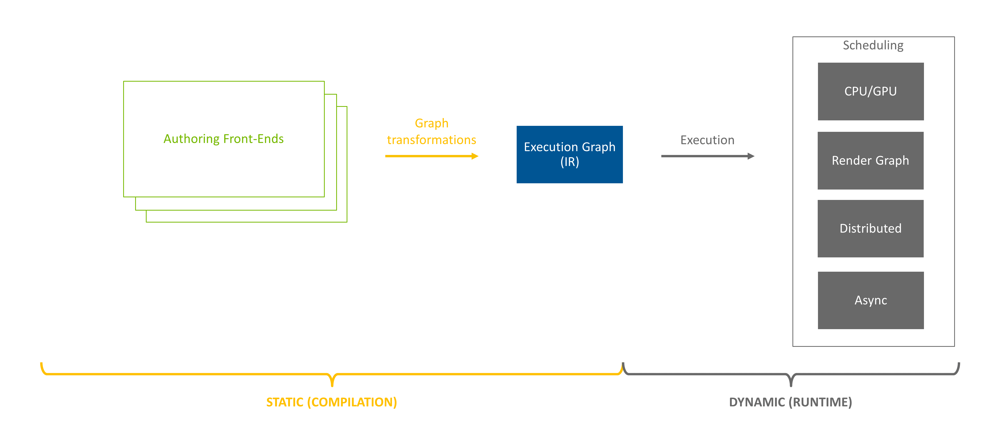
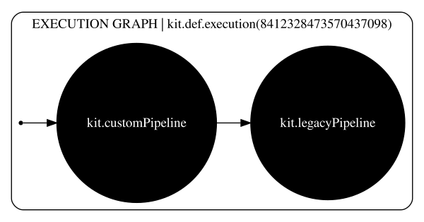
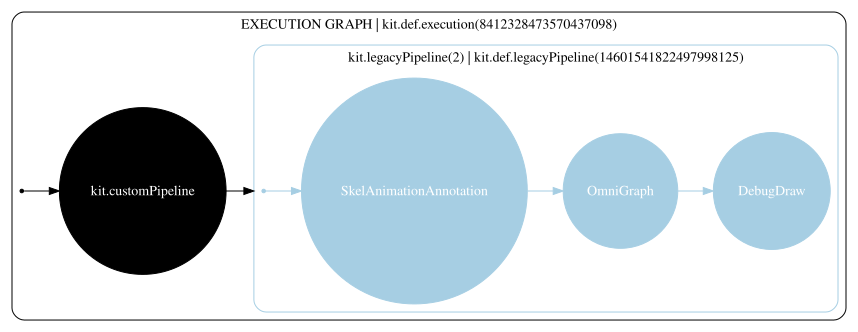
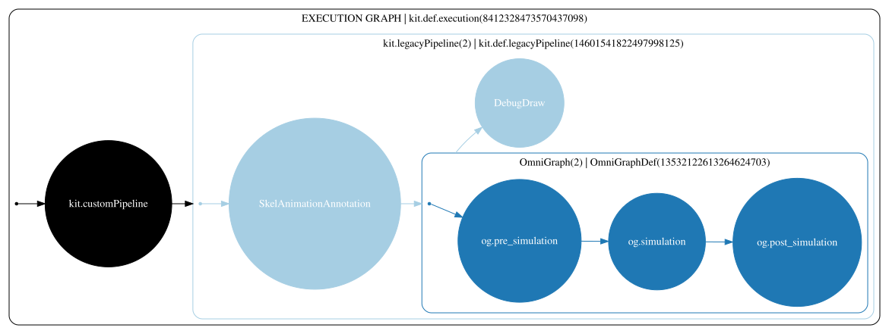
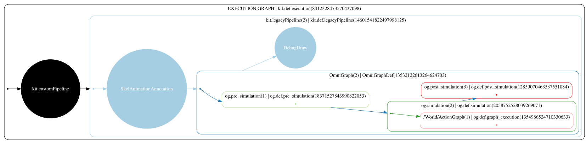

.. include:: Helpers.rst

.. _ef_pass_concepts:

Pass Concepts
#############

*This article covers core concepts found in EF's passes/graph transformations.  Readers are encouraged to review both
the* :ref:`ef_framework` *and* :ref:`ef_graph_concepts` *before diving into this article.*

    The Execution Framework pipeline.  This article covers graph transformation concepts.

Now that we understand the underlying structure of an |execution graph|, let's dive into the graph transformations to
see how the population and partitioning of |NodeGraphDef| is done to achieve the final topology.

Pass Pipeline
~~~~~~~~~~~~~

|PassPipeline| is the main orchestrator of graph construction. It composes the final topology of the graph, leveraging
passes from |PassRegistry|. It is possible to register different passes, some only known to the pass pipeline.

To build the graph, the pipeline will instantiate a |GraphBuilder| for each visited |definition| and give the builder to
each of the passes selected to run on the definition. Pass instances are not reused, i.e. each time a pass is selected
to run, it will be allocated, run, and immediately destroyed. Definitions can be shared by multiple nodes and care is
taken by |PassPipeline| to only process a definition once per topology.

Passes are grouped by |PassType|, with each having specific responsibilities and permissions. To learn more about pass
types, consult the documentation for |IPopulatePass|, |IPartitionPass|, and |IGlobalPass|.

Populate and Partitioning Passes
~~~~~~~~~~~~~~~~~~~~~~~~~~~~~~~~

Graph construction typically starts by running populate passes (i.e. |IPopulatePass|) over each node in the graph. If
the topology was altered during this step, the pipeline will run partitioning passes (i.e. |IPartitionPass|) on the
graph. If partitioning generated a new |Node| or |NodeGraphDef|, the pipeline again runs the population passes on the
new entities.

Partitioning runs only once on the graph, which means there won't be a second partitioning pass over the topology if the
second run of the population passes altered it. This is because population only alters definitions one level deeper than
the currently processed topology.

Global Passes
~~~~~~~~~~~~~~~~~~~~~~~~~~~~~~~~

Once the entire topology of the execution graph is processed by population and partitioning passes (potentially in a
threaded manner), the pipeline will give a chance to global passes (i.e. |IGlobalPass|) to run. Because global passes
have such a broad impact on both the graph and transformation performance, their use is discouraged.

Graph Builders
~~~~~~~~~~~~~~~~~~~~~~~~~~~~~~~~

When passes operate to create or alter the topology of a graph, they rely on |GraphBuilder| to perform topology
modification. Under the hood, builder implementation will leverage a private |IGraphBuilderNode| interface. Relying
directly on the |IGraphBuilderNode| interface is strongly discouraged.

Transformation Algorithm
~~~~~~~~~~~~~~~~~~~~~~~~~~~~~~~~

The following pseudo-code represents the overall graph transformation procedure. For simplicity, it illustrates serial
execution, but in |Omniverse Kit|, the pipeline process node's concurrently.

.. code-block:: tasm

    PROC PopulatePass(context, nodeGraphDef)
        graphBuilder <- create new instance for given nodeGraphDef
        FOR node IN nodes in topology in DFS order from root
            CALL PopulateNode(node)

        IF graphBuilder recorded modifications to the construction stamp
            CALL PartitionPass()

    PROC PartitionPass(context, nodeGraphDef)
        graphBuilder <- create new instance for given nodeGraphDef
        partitionPassInstances <- allocate and store pass instances that successfully initialize for nodeGraphDef

        FOR node IN nodes in topology in DFS order from root
            FOR initializedPass IN partitionPassInstances
                initializedPass.run(node)

        FOR initializedPass IN partitionPassInstances
            initializedPass.commit(graphBuilder)

        FOR newNodes IN graphBuilder
            CALL PopulateNode(newNodes)

    PROC GlobalPass(context, nodeGraphDef)
        FOR global pass from registry
            passInstance <- allocate new instance
            CALL passInstance.run()

    PROC PopulateNode(node)
        IF node has registered populate pass
            populatePassInstance <- allocate new instance
            populatePassInstance.run()
        ELSE IF node has NodeGraphDef definition and populate pass exists for it
            populatePassInstance <- allocate new instance
            populatePassInstance.run()

        IF node has NodeGraphDef
            CALL PopulatePass(context, node.getNodeGraphDef())

    PROC GraphTransformations(context, nodeGraphDef)
        IF nodeGraphDef needs construction
            CALL PopulatePass
            CALL GlobalPass

Let's take the following graph as an example and analyze step-by-step how it is constructed.

.. raw:: html

    

.. raw:: html
    :file: ef-omni-graph-example.svg

.. raw:: html

    <figure class="align-center"><figcaption>

    An example of constructed execution graph.
    
</figcaption></figure>

Graph transformation starts with a basic pipeline defined at the top level |NodeGraphDef|.

    Basic execution pipeline with custom and legacy pipeline stages.

While traversing the top-level definition, `StageUpdateDef` is created by a populate registered for the `kit.legacyPipeline` node.

    Legacy pipeline with loaded nodes from StageUpdate.

The ``PopulatePass`` procedure from our pseudo-code is now recursively called to expand the definition of any node
represented as part of `kit.def.legacyPipeline`. In the example we are exploring, we have several OmniGraph population
passes registered. The first one created the execution pipeline for OmniGraph.

    Expanded OmniGraph definition containing nodes representing its pipeline stages: Pre-Simulation -> Simulation ->
    Post-Simulation.

OmniGraph registers populate passes for each pipeline stage it created. These passes populate each pipeline stage's node
with a generic graph definition if the pipeline stage contains nodes in OG. In this example, an action graph is in the
simulation pipeline stage. Both the pre-simulation and post-simulation stages are empty.

    OG's populate passes create EF nodes for each OG graph in each OG pipeline stage.  Here we see the Simulation stage
    contains an Action Graph.

Finally, population runs on `og.def.graph_execution` and expands the |NodeGraphDef| to a custom one with an |Executor|
responsible for both generating and scheduling work.

.. raw:: html

    

.. raw:: html
    :file: ef-omni-graph-example.svg

.. raw:: html

    <figure class="align-center"><figcaption>

    Fully populated execution graph after all graph transformations.  Here we see the */World/ActionGraph* node has been
    populated with a definition that describes the OmniGraph Action Graph.
    
</figcaption></figure>

Next Steps
~~~~~~~~~~

In this article, an overview of graph transformations/graph construction was provided.  For an in-depth guide to
building your own passes, consult the :ref:`ef_pass_creation` guide.  To continue learning about EF's core concepts,
move on to :ref:`ef_execution_concepts`.
