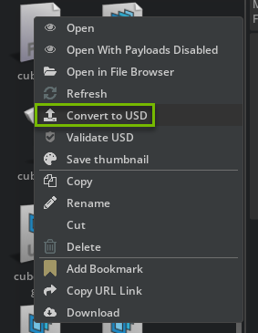
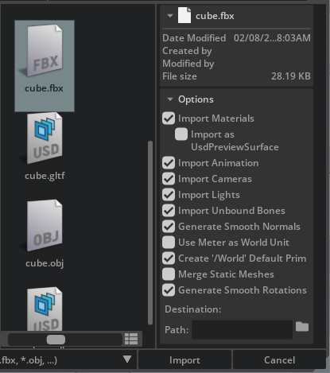
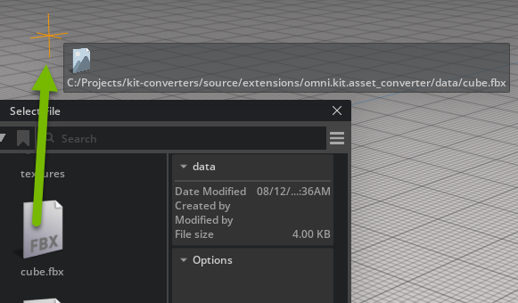

# Usage

## Overview

The Asset Converter extension is available in the following Omniverse Apps:
- Kit-App-Templates
- Isaac Sim

To begin conversion of an asset, open an Omniverse App. The user can then import the file into Omniverse as a USD file through the File menu or through the Content window.

## Import Methods

### File Menu Import

To import a CAD file into Omniverse:
1. Open the `File` menu
2. Select `Import`
3. Choose your CAD file

This method allows you to import CAD data into your scene either by reference or directly into your stage.


### Content Window Import

The Content window is located at the bottom of the Omniverse App by default. It displays a tree hierarchy of your file system and shows files in the current folder.

To access the Content window:
1. Go to the toolbar
2. Select "Window"
3. Choose "Content"

To convert a CAD file to USD:
1. Select the file in the Content window
2. Right-click to open the context menu
3. Choose `Convert to USD`



### File Selection

When selecting a file for import:
1. A file manager window will appear
2. Select your asset for conversion
3. For supported files, a panel will appear on the right side of the window
4. Update import options as needed



### Drag and Drop Import

You can also drag and drop assets directly into the application from either:
- Content Window
- File Browser

Supported file formats will be automatically recognized and processed.



## Programming Guide

### Basic Usage

Here's a simple example of using the Asset Converter in Python:

```python
import asyncio
import omni.kit.asset_converter

def progress_callback(current_step: int, total: int):
    # Show progress
    print(f"{current_step} of {total}")

async def convert(input_asset_path, output_asset_path):
    task_manager = converter.get_instance()
    task = task_manager.create_converter_task(input_asset_path, output_asset_path, progress_callback)
    success = await task.wait_until_finished()

    if not success:
        detailed_status_code = task.get_status()
        detailed_status_error_string = task.get_error_message()
        # Handle error case

# Usage
asyncio.ensure_future(convert(input_path, output_path))
```

### AssetConverterContext Options

The `create_converter_task` function supports an optional fourth parameter `AssetConverterContext` for customizing import/export behavior. Here are the available options:

```python
class AssetConverterContext:
    # Material Options
    ignore_materials = False             # Don't import/export materials
    keep_all_materials = False           # Keep non-referenced materials
    export_preview_surface = False       # Import materials as UsdPreviewSurface instead of MDL
    bake_mdl_material = False            # Bake MDL material when exporting

    # Geometry Options
    ignore_animations = False            # Don't import/export animations
    ignore_camera = False                # Don't import/export cameras
    ignore_light = False                 # Don't import/export lights
    single_mesh = False                  # Export all props into same USD without instancing
    merge_all_meshes = False             # Merge all meshes into a single mesh
    smooth_normals = True                # Smooth normals (assimp backend only)

    # Transform Options
    use_meter_as_world_unit = False      # Set world units to meters
    convert_fbx_to_y_up = False          # Force Y-up for FBX import
    convert_fbx_to_z_up = False          # Force Z-up for FBX import
    convert_stage_up_y = False           # Set stage up-axis to Y-up
    convert_stage_up_z = False           # Set stage up-axis to Z-up
    ignore_pivots = False                # Don't export pivots
    baking_scales = False                # Bake scales into meshes (FBX only)

    # Export Options
    embed_textures = True                # Embed textures in output (FBX/glTF only)
    export_separate_gltf = False         # Export glTF with separate bin file
    export_mdl_gltf_extension = False    # Export materials as NV_materials_mdl extension
    export_hidden_props = False          # Export hidden props from USD exporter
    disabling_instancing = False         # Don't export instancing assets with instanceable flag

    # Deprecated Options
    support_point_instancer = False      # Deprecated
    embed_mdl_in_usd = True              # Deprecated

    # Advanced Options
    create_world_as_default_root_prim = True            # Create /World as root prim
    use_double_precision_to_usd_transform_op = False    # Use double precision for transform ops
    ignore_flip_rotations = False                       # Don't ignore animation's flip rotation value
    ignore_unbound_bones = False                        # Don't ignore unbound bones (FBX only)
```