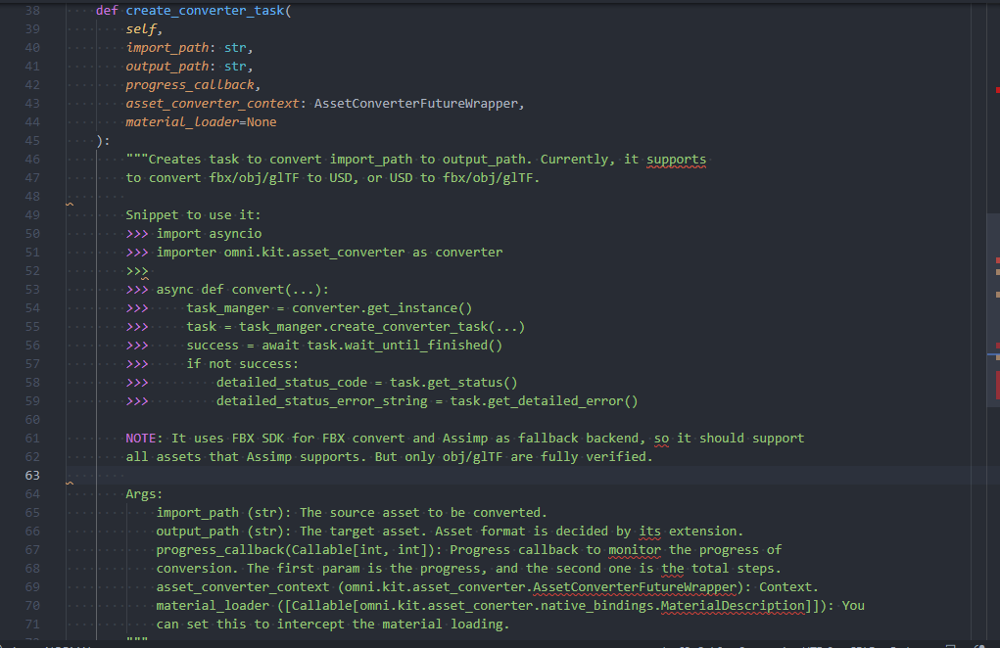

..
    This file was auto-generated by the 'repo_extension_docs' tool.
    Run 'repo extension_docs --help' for more details.

..
    [begin reference autogenerated]

.. _ext_omni_kit_asset_converter:

..
    [end reference autogenerated]

..
    [begin title autogenerated]

[omni.kit.asset_converter] Asset Converter
##########################################

..
    [end title autogenerated]

..
    [begin deprecation autogenerated]
..
    [end deprecation autogenerated]

..
    [begin version autogenerated]

**Version**: :guilabel:`5.0.17`

..
    [end version autogenerated]

..
    [begin description autogenerated]

The asset converter API for converting assets. It supports conversion between assets like OBJ, GLTF, FBX and USD.

..
    [end description autogenerated]

..
    [begin preview autogenerated]

..
    [end preview autogenerated]

..
    [begin enable-extension autogenerated]

Enable Extension
================

The extension can be enabled (if not already) in one of the following ways:

.. tab-set::
    .. tab-item:: Command-line interface
        :sync: tab_cli

        Define the next entry as an application argument from a terminal.

        .. code-block:: bash

            APP_SCRIPT.(sh|bat) --enable omni.kit.asset_converter

    .. tab-item:: Experience/extension configuration
        :sync: tab_toml

        Define the next entry under ``[dependencies]`` in an experience (``.kit``) file or an extension configuration (``extension.toml``) file.

        .. code-block:: ini

            [dependencies]
            "omni.kit.asset_converter" = {}

    .. tab-item:: Extension Manager UI
        :sync: tab_gui

        Open the *Window > Extensions* menu in a running application instance and search for ``omni.kit.asset_converter``.
        Then, toggle the enable control button if it is not already active.

..
    [end enable-extension autogenerated]

..
    [begin usage autogenerated]
..
    [end usage autogenerated]

..
    [begin api autogenerated]
..
    [end api autogenerated]

..
    [begin actions autogenerated]
..
    [end actions autogenerated]

..
    [begin ogn autogenerated]
..
    [end ogn autogenerated]

..
    [begin settings autogenerated]
..
    [end settings autogenerated]
