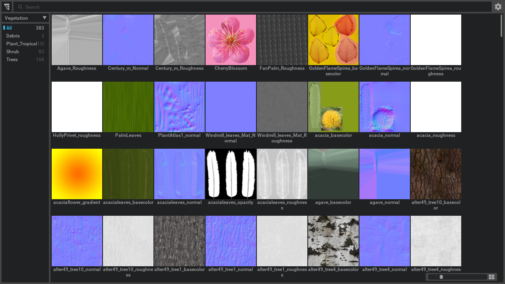
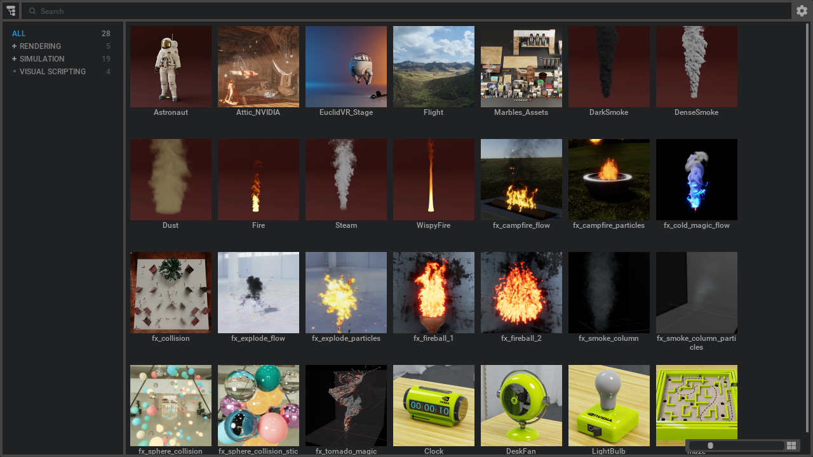

# Overview

Omni kit browser folder widgets.

Browser widgets:
- FolderBrowserWidget (example: omni.kit.browswer.texture window)

- TreeFolderBrowserWidget (example: omni.kit.browswer.sample window)

