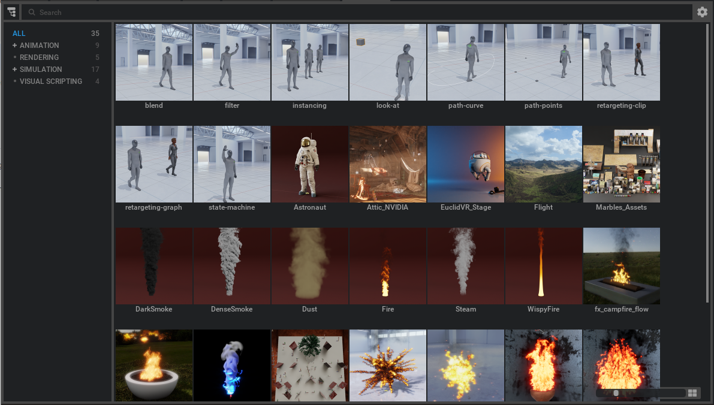

# Samples Browser Extension [omni.kit.browser.sample]

This is a browser that is used for displaying sample USD files that can be used in scenes.  It acts as an aggregator that multiple extensions can register with.



## Child Extension Code

Very little code is needed to make an additional "child" extension that can plug in to this Samples Browser.

### extension.toml

Besides the normal things that would go in the `extension.toml`, it is necessary to include a dependency on the samples browser extension, like this:

```python
[dependencies]
"omni.kit.browser.sample" = {}
```

and a setting with the folder name.  It's better to set the folder url in a setting so that users can override the
folder url in their own kit file.  The part before the '::' is the name you will see in the browser tree.  If you want additional levels of hierarchy, use the '/' format to specify parent categories.  This would create a __Flow__ category, and parent it under the __Simulation__ category.  Multiple folders can be specified, with commas separating them.

```python
[settings]
exts."omni.kit.my.extension".folders = [
    "Simulation/Flow::https://omniverse-content-production.s3.us-west-2.amazonaws.com/Assets/Extensions/Samples/Flow/samples"
]
```

### extension.py

This is all the important code you would need in the `extension.py`, to register the folder path on startup and unregister the path on shutdown:

```python
import omni.ext

class SampleExampleBrowserExtension(omni.ext.IExt):
    def on_startup(self, ext_id):
        self._settings = carb.settings.get_settings()

        # load rendering folders from setting
        self._sample_folders = self._settings.get("exts/omni.kit.my.extension/folders")

        for folder in self._sample_folders:
            omni.kit.browser.sample.register_sample_folder(folder)  # Name is before the url with "::" separating them

    def on_shutdown(self):
        for folder in self._sample_folders:
            url_part = folder.split("::")[-1]
            omni.kit.browser.sample.unregister_sample_folder(url_part)
```
