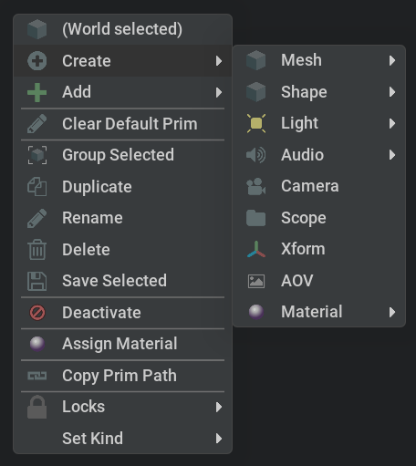

```{csv-table}
**Extension**: {{ extension_version }},**Documentation Generated**: {sub-ref}`today`
```

# Overview

This is the context menu used in stage and viewport windows. For documentation on creating/adding to context menu, see documentation for [omni.kit.widget.context_menu](https://docs.omniverse.nvidia.com/kit/docs/omni.kit.widget.context_menu/)
Functions supported are;
## get_widget_instance
- Get instance of omni.kit.widget.context_menu class
## get_instance
-  Get instance of context menu class
## close_menu
- Close currently open context menu. Used by tests not to leave context menu in bad state.
## reorder_menu_dict
- Reorder menus using "appear_after" value in menu
## post_notification
- Post a notification via omni.kit.notification_manager
## get_hovered_prim
- Get prim currently under mouse cursor or None
## add_menu
- Add custom menu to any context_menu
## get_menu_dict
- Get custom menus, returns list of dictionaries containing custom menu settings
## get_menu_event_stream
- Gets menu event stream

## Example of stage context menu


