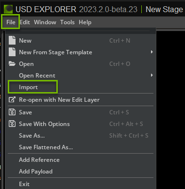
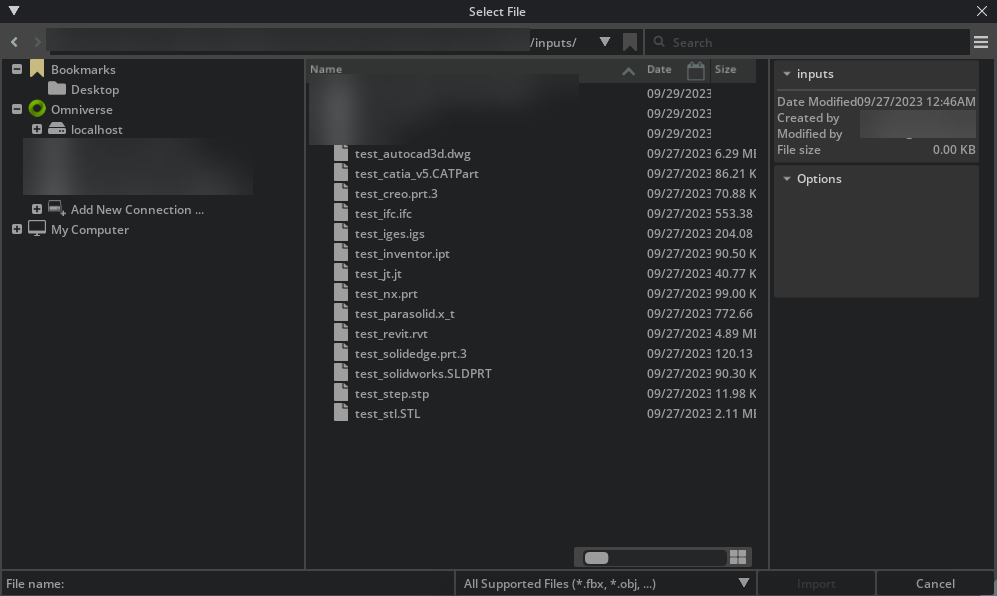
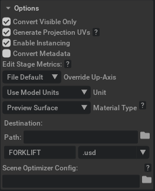

# CAD Converter

## 1 Overview

### 1.1 Introduction

The CAD Converter extension (omni.kit.converter.cad) depends on the HOOPS, DGN, and JT extensions for conversion from many common CAD file formats to USD.

### 1.2 System Requirements

To run Omniverse Kit and Omniverse Kit Apps, users should consult the [Applications and Application Templates Requirements](https://docs.omniverse.nvidia.com/materials-and-rendering/latest/common/technical-requirements.html#applications-and-application-templates) documentation.

### 1.3 Formats and Features Supported

The following file formats are supported by CAD Converter:

- CATIA V5 Files (`*.CATPart, *.CATProduct, *.CGR`)
- CATIA V6 Files (`*.3DXML`)
- Collada Files (`.dae`)
- IFC Files (`*.IFC, *.IFCZIP`)
- NX - Unigraphics Files (`*.PRT`)
- Parasolid Files (`*.XMT, *.X_T, *.X_B, *.XMT_TXT`)
- SolidWorks Files (`*.SLDPRT, *.SLDASM`)
- STL Files (`*.STL`)
- ACIS Files (`*.SAT, *.SAB`)
- Autodesk Inventor Files (`*.IPT, *.IAM`)
- Autodesk 3DS Files (`*.3DS`)
- AutoCAD 3D Files (`*.DWG, *.DXF`)
- Creo - Pro/E Files (`*.ASM, *.PRT`)
- Revit Files (`*.RVT, *.RFA`)
- Solid Edge Files (`*.ASM, *.PAR, *.PWD, *.PSM`)
- Step/Iges (`*.STEP, *.IGES`)
- JT Files (`*.JT`)
- DGN (`*.DGN`)
- OBJ Files (`*.OBJ`)
- FBX Files (`*.FBX`)
- 3MF Files (`*.3MF`)
- GLTF Files (`*.GLTF, *.GLB`)

**_NOTE:_** The file formats \*.fbx, \*.obj, \*.gltf, \*.glb, \*.ply, \*.lxo, \*.md5, \*.e57  and \*.pts are supported by Asset Converter and also available by default.

**_NOTE:_** If expert tools such as PTC Creo, Autodesk Revit or Autodesk Alias are installed, we recommend using the corresponding connectors. These provide more extensive options for conversion.

**_NOTE:_** CAD Assemblies may not work when converting files from Nucleus. When converting assemblies with external references we recommend either working with local files or using Omniverse Drive.

### 1.4 Known Issues and Unsupported

- Some DGN geometry data is not supported and will not convert USD mesh. If you have an example of such a DGN file, please let us know so we can troubleshoot and fix any remaining issues.
- Converting to USD can take more memory and CPU power depending on the type of data and Tessellation settings. File size is not an indicator of how fast a conversion will take or how much memory is required. In most cases we recommend a minimum of 16 GB. Complex files will need up to 32 GB of memory available for conversion.
- PMI and BIM data is not converted for *.dgn, *.jt, *.fbx, *.obj, *.gltf, *.glb, , *.ply, *.lxo, *.md5, *.e57  and *.pts
- Most properties are not converted to USD attributes.

We recommend converting Revit and Creo files using the Connectors instead of the CAD Converter for best results.

### 1.5 Getting Help

For support and issue reporting:

- **Enterprise Customers**: [NVIDIA Omniverse Enterprise Support](https://www.nvidia.com/en-us/omniverse/enterprise/support/)
- **All Users**: [NVIDIA Developer Forums](https://forums.developer.nvidia.com/t/how-to-report-an-issue-with-omniverse/199675)

## 2 Related Extensions

The `omni.kit.converter.cad` extension is a bundled extension that imports multiple related extensions to provide comprehensive CAD file conversion capabilities. It serves as a container that brings together core converters, GUI wrappers, services and utilities to enable seamless CAD file conversion workflows.

### 2.1 Core Converter Extensions

These extensions handle the actual file conversion:

- **Hoops Core**: {doc}`omni.kit.converter.hoops_core<omni.kit.converter.hoops_core:Overview>`
- **DGN Core**: {doc}`omni.kit.converter.dgn_core<omni.kit.converter.dgn_core:Overview>`
- **JT Core**: {doc}`omni.kit.converter.jt_core<omni.kit.converter.jt_core:Overview>`

### 2.2 GUI Wrapper Extensions

These extensions provide user interface components:

- **Hoops GUI**: {doc}`omni.kit.converter.hoops<omni.kit.converter.hoops:Overview>`
- **DGN GUI**: {doc}`omni.kit.converter.dgn<omni.kit.converter.dgn:Overview>`
- **JT GUI**: {doc}`omni.kit.converter.jt<omni.kit.converter.jt:Overview>`

### 2.3 Services

These services enable server-side conversion capabilities:

- **Asset Converter Service**: {doc}`omni.services.convert.asset<omni.services.convert.asset:Overview>`
- **CAD Converter Service**: {doc}`omni.services.convert.cad<omni.services.convert.cad:Overview>`

### 2.4 Utilities

Shared utilities and common functionality:

- **Converter Common**: {doc}`omni.kit.converter.common<omni.kit.converter.common:Overview>`

### 2.5 Included Versions

Current extension versions included in this release:

| Extension | Version |
|-----------|---------|
| omni.kit.converter.common | 507.1.2 |
| omni.kit.converter.dgn | 509.1.0 |
| omni.kit.converter.dgn_core | 510.1.0 |
| omni.kit.converter.hoops | 509.1.0 |
| omni.kit.converter.hoops_core | 509.1.0 |
| omni.kit.converter.jt | 508.1.0 |
| omni.kit.converter.jt_core | 508.1.0 |
| omni.services.convert.asset | 508.0.2 |
| omni.services.convert.cad | 507.0.2 |
## 3 Usage UI/UX

The CAD Converter extensions are available via Kit-App-Template (KAT), Kit SDK, and Isaac Sim. To download any of these Omniverse Apps, please visit the NVIDIA Omniverse [Github](https://github.com/NVIDIA-Omniverse) or the [NGC Catalog](https://catalog.ngc.nvidia.com/collections?filters=platform%7COmniverse%7Cpltfm_omniverse&orderBy=weightPopularDESC&query=&page=&pageSize=).

### 3.1 Omniverse Apps Import Functionality

To begin conversion of a CAD file, open an Omniverse App. Once open, confirm the `omni.kit.converter.cad` is enabled:
- Navigate to Window -> Extension Manager
- Search for `omni.kit.converter.cad`
- Locate and click on the extension.
- If needed, download and enable the extension. This will enable the entire suite of CAD Converter extensions.

The user can then import the CAD file into Omniverse via two workflows: via `File Menu Window` or via the `Content Window`.

### 3.1.1 Import through the File menu

To import a CAD file into Omniverse, choose `Import` in the `File` menu. Use this method to import CAD Data into your scene - either by reference or directly into your stage.

The user should now see a window similar to a file manager. The user needs to then select a CAD file for conversion from this window.

When a supported CAD file has been selected, the user should see a panel on the right-side of the window like below:

The user can change the options based on the file format. For details on conversion options, please consult the converter GUI extensions:
- Hoops GUI: {doc}`omni.kit.converter.hoops<omni.kit.converter.hoops:Overview>`
- DGN GUI: {doc}`omni.kit.converter.dgn<omni.kit.converter.dgn:Overview>`
- JT GUI: {doc}`omni.kit.converter.jt<omni.kit.converter.jt:Overview>`

### 3.2 Import through the Content Window
By default the Content window is located at the bottom of the Omniverse App.  To convert a CAD file to USD, select the file in the Content window and choose `Convert to USD` in the context menu with right mouse button.

> **Note:** The `Content` Window tab provides a file browser interface for navigating and managing files. If it is not shown, go to the Menu toolbar, select "Window", and then select "Content".

## 4 Kit Service

For local Kit Service setup, refer to:
- Asset Converter Service: {doc}`omni.services.convert.asset<omni.services.convert.asset:Overview>`
- CAD Converter Service: {doc}`omni.services.convert.cad<omni.services.convert.cad:Overview>`

## 5 Switching CAD Converter Versions

To switch to a different CAD Converter version:

1. Open Extension Manager
2. Search for and select `omni.kit.converter.common`
3. Disable `omni.kit.converter.common` to disable all CAD Converter extensions
4. Search for and select `omni.kit.converter.cad`.  Do not enable the extension yet, as the libraries need to be unloaded during the application restart.
5. Click the menu icon (three vertical dots)
6. Select your desired version and set it to Autoload
7. Restart the Omniverse application

The new version will be active when the application relaunches.

Note: Only one version of `omni.kit.converter.common` can be enabled at a time, as it is the core dependency for all CAD Converter extensions.

## 6 Cleaning Extension System Cache

If you experience issues with extensions loading older versions or other unexpected behaviors, the extension cache may be corrupted. To clear the extension system cache:

1. Open Extensions Manager via `Window` -> `Extensions`
2. Click the menu icon (☰) and select `Settings`
3. Navigate to the `Extension System Cache` section (scroll to the bottom)
4. Click the `Clean` button to clear the cache
5. If issues persist, click `Open` button to open the directory and manually delete corrupted files from the cache folders

## 7 Licensing Terms of Use and Third-Party Notices
The `omni.kit.converter.cad` and related CAD converter Extensions are Omniverse Extensions.
Do not redistribute or sublicense without express permission or agreement.
Please read the [Omniverse License Agreements](https://docs.omniverse.nvidia.com/extensions/latest/common/NVIDIA_Omniverse_License_Agreement.html) and the Third_Party_Notices.md for detailed license information.