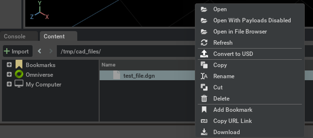
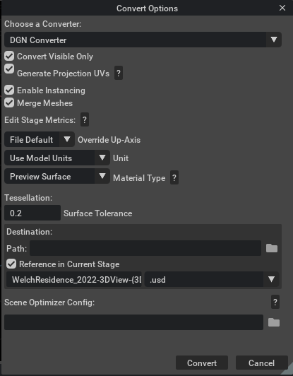

# Usage

The user can then import the DGN file into Omniverse via two workflows: via `File Menu Window` or via the `Content Window`.

## How to Import and Convert Files

### File -> Import

1. To import a CAD file into Omniverse, choose `Import` in the `File` menu.
2. The user should now see a window similar to a file manager. The user needs to then select a DGN file for conversion from this window.
3. Refer to [Converter Options](#converter-options) section for more information on conversion settings.

### Import through the Content Window

1. By default the Content window is located at the bottom of the Omniverse App.  To convert a CAD file to USD, select the file in the Content window and choose `Convert to USD` in the context menu with right mouse button.

2. Browse to the location of your file or files, select them, and right-click, and select `Convert to USD` in the Context menu.
3. The Converter Options dialog window will appear, modify any options as needed, and click Convert.

> **Note:** The `Content` Window tab provides a file browser interface for navigating and managing files. If it is not shown, go to the Menu toolbar, select "Window", and then select "Content".

## Converter Options

The DGN converter provides several options to control how files are converted:

### Conversion Options

| Option | Description |
|--------|-------------|
| Convert Visible Only | If enabled, skips hidden elements. If disabled, converts hidden elements but sets them to invisible. |
| Generate Projection UVs | When UV texture coordinates are missing, uses Scene Optimizer Kit Extension to generate texture coordinates for meshes. Uses default values as described in the [Generate Projection UVs](https://docs.omniverse.nvidia.com/extensions/latest/ext_scene-optimizer/operations.html#generate-projection-uvs) documentation. |
| Enable Instancing | Controls whether [instancing](https://docs.omniverse.nvidia.com/dang/latest/guide/usd/instancing.html#scenegraph-instancing) is used in the USD output. |
| Merge Meshes | When enabled, meshes sharing the same level, color, and element type are merged for optimization. When disabled, mesh merging is skipped. |

### Stage Metrics Options

These [options](https://docs.omniverse.nvidia.com/extensions/latest/ext_scene-optimizer/operations.html#edit-stage-metrics) modify the stage's metersPerUnit and upAxis settings, applying relevant transformations to maintain proper world space units.

| Option | Description |
|--------|-------------|
| Override Up-Axis | Override the stage's up-axis to Y-up, Z-up, or use converter default |
| Meters Per Unit | Set the stage's meters per unit metric (0.0 retains original conversion value) |

### Material Options

| Material Type | Description |
|--------------|-------------|
| None | No materials generated |
| USD Preview Surface | Default option, compatible with Universal renderer contexts |
| OmniPBR (+ USD Preview Surface) | Compatible with both RTX and Universal renderer contexts |

### Tessellation Control

The surface tolerance setting controls mesh accuracy versus performance:

| Tolerance Range | Use Case | Result |
|----------------|----------|---------|
| Low (0.001 - 0.01) | High precision needs | More detailed mesh, larger files, slower processing |
| High (0.1 - 1.0) | Visualization (recommended) | Less detailed mesh, smaller files, faster processing |

Default value is 0.2 for balanced performance and quality. Setting to 0 automatically uses 2.5% of model's bounding box diagonal.

> **Note:** For detailed information about tessellation, see Open Design Alliance's [blog post](https://www.opendesign.com/blog/2019/may/tessellation-and-surface-tolerance)

### Output Options

| Option | Description |
|--------|-------------|
| Path | Destination folder for converted USD (defaults to source location) |
| Scene Optimizer Config | Path to Scene Optimizer JSON config file or JSON string for predefined optimization stack. See [Scene Optimizer Service documentation](https://docs.omniverse.nvidia.com/kit/docs/omni.services.scene.optimizer/latest/overview.html). |

### Getting Help

- [Omniverse Enterprise Customer Support Services](https://www.nvidia.com/en-us/omniverse/enterprise/support/). 
- The Developer Community can also ask questions or report issues on [Omniverse Developer forums](https://forums.developer.nvidia.com/c/omniverse).
