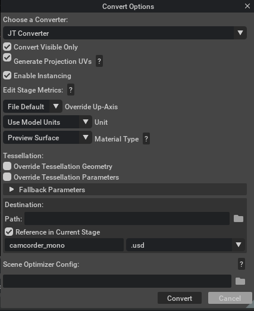

# Usage

The user can import CAD files into Omniverse via two workflows: through the **File Menu Window** or through the **Content Window**.

## How to Import and Convert Files

### File → Import

1. To import a JT file into Omniverse, choose **Import** in the **File** menu.
2. A file manager window will appear. Select a JT file for conversion from this window.
3. Refer to the [Converter Options](#converter-options) section for more information on conversion settings.

### Import through the Content Window

1. By default, the Content window is located at the bottom of the Omniverse App. To convert a JT file to USD, select the file in the Content window and choose **Convert to USD** in the context menu (right-click).
2. Browse to the location of your file(s), select them, right-click, and select **Convert to USD** in the context menu.
3. The Converter Options dialog window will appear. Modify any options as needed and click **Convert**.

> **Note:** The **Content** Window tab provides a file browser interface for navigating and managing files. If it is not shown, go to the Menu toolbar, select **Window**, and then select **Content**.

## Converter Options

### Convert Visible Only

If enabled, skip hidden elements; otherwise, convert hidden elements but set them to invisible.

### Generate Projection UVs

If UV texture coordinates are missing, this option will use the Scene Optimizer Kit Extension as a post-conversion process to generate texture coordinates for meshes. When this option is enabled, default values are used as described in the [Generate Projection UVs](https://docs.omniverse.nvidia.com/extensions/latest/ext_scene-optimizer/operations.html#generate-projection-uvs) section of the Scene Optimizer documentation.

### Enable Instancing

This option determines whether [Scenegraph Instancing](https://docs.omniverse.nvidia.com/dang/latest/guide/usd/instancing.html#scenegraph-instancing) will be used in the USD.

### Edit Stage Metrics

These [options](https://docs.omniverse.nvidia.com/extensions/latest/ext_scene-optimizer/operations.html#edit-stage-metrics) change the `metersPerUnit` and/or `upAxis` of a stage's active edit target layer by updating the layer's metadata and applying relevant transformations to attributes that represent world space units so that they reflect the new `metersPerUnit`/`upAxis`.

#### Override Up-Axis

Override the up-axis of the converted USD's stage to Y-up, Z-up, or default to the converter's up-axis setting.

#### Meters Per Unit

Set the meters per unit for the converted USD's stage metric. If set to 0.0, the converted USD will retain the meters per unit from conversion.

### Material Selection

Set the material type for the target renderer:

- **None**: No materials are generated.
- **USD Preview Surface** (default): Compatible with Universal renderer contexts.
- **OmniPBR (+ USD Preview Surface)**: Compatible with RTX and Universal renderer contexts.

### Override Tessellation Geometry

If enabled, embedded tessellation geometry will be ignored in favor of explicit tessellation of surface geometry.

### Override Tessellation Parameters

If enabled, embedded tessellation parameters will be ignored in favor of explicit tessellation parameters. You may specify these values under `Fallback Parameters`

#### Chord Height Tolerance
- The absolute or relative maximal chord height for a polygonal segment with respect to the model.

#### Angular Tolerance
- The maximum angle deviation between subsequent polygonal segments in an approximation of an edge.

#### Parameter Length
- The maximum polygonal segment length.

#### Max Aspect
- The maximum ratio of the longest side of a triangle to the shortest.

#### Min Edge Length
- The minimum length of the edges in the tessellated mesh.

## Destination Options

The entry points for conversion expose different destination options.

### File → Import

Recommended for importing data into your stage.

### Content Browser → Convert to USD

#### Destination Options

**Convert to USD** is recommended to convert files to external USD files only. You may choose to **Reference in Current Stage** or not.

**Path**: The default location for the converted USD file matches the source file's location. You may specify an alternative destination if preferred.

Folder for the converted USD. The default location is the exact location, and the CAD file is selected for conversion or selection of a specific destination.

### Scene Optimizer Config

Provide a path to a saved Scene Optimizer JSON configuration file or a JSON formatted string for executing a predefined optimization process stack. See the [Scene Optimizer Service documentation](https://docs.omniverse.nvidia.com/kit/docs/omni.services.scene.optimizer/latest/overview.html) for details.

## Getting Help

- [Omniverse Enterprise Customer Support Services](https://www.nvidia.com/en-us/omniverse/enterprise/support/)
- The Developer Community can also ask questions or report issues on the [Omniverse Developer forums](https://forums.developer.nvidia.com/c/omniverse)
