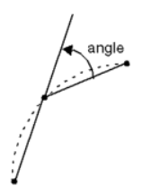
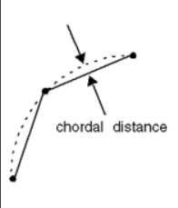

# Overview

`omni.kit.converter.jt_core` uses the Siemens JT Open Toolkit (JTTK) SDK to convert JT data formats to USD. This is a core extension without a GUI that provides the fundamental JT conversion functionality. It can be used directly through its Python API, or accessed through the GUI extension `omni.kit.converter.jt` which provides a user interface for the conversion process.

Upon loading, it registers with the CAD Converter service (`omni.services.convert.cad`) if available, allowing other extensions to utilize its conversion capabilities.

## CAD CONVERTER CONFIG FILE INPUTS:

### JSON Converter Settings:

**_NOTE:_** Some converter options have been updated with new keys to replace legacy ones (often in Hungarian notation, e.g. `bInstancing`). Legacy keys are supported for backward compatibility but will be deprecated. This documentation uses the new keys and provides information about legacy keys in the description of each option.

**Format**: "setting name" : default value

#### Converter Option: Convert Curves

Description: If true, convert curve elements into USD Basis Curves; else, ignore these elements. The legacy key for this option is `bConvertCurves`.

Default Value: false
Value Ranges: true, false
Data Format: bool

Config File Example:
```json
"convertCurves" : false
```

#### Converter Option: Generate UVs

Description: If true, use Scene Optimizer to generate uvs for any Mesh prims that do not have them.

See [Scene Optimizer Service documentation](https://docs.omniverse.nvidia.com/kit/docs/omni.services.scene.optimizer/latest/overview.html) for details.

Default Value: true
Value Ranges: true, false
Data Format: bool

Config File Example:
```json
"bOptimize" : true
```

#### Converter Option: Instancing Style

Description: Style of instancing to use in USD when handling instanced Parts and Assemblies in the JT file;
  - eNone = 0, eReference = 1, eInstanceableReference = 2.
The legacy key for this option is `bInstancing`.

Default Value: 0
Value Ranges: [0, 2]
- 0: No Instancing
- 1: Reference (reuses geometry/materials, not instanceable)
- 2: Instanceable Reference (reuses geometry/materials, instanceable)
Data Format: integer (enumeration)

Config File Example:
```json
"instancingStyle" : 0
```

#### Converter Option: Material Select

Description: Sets the material type for target renderer.

Default Value: 1
Value Ranges: [0, 2]
- 0: No materials
- 1: USD Preview Surface; default and compatible with Universal renderers
- 2: OmniPBR + USD Preview Surface; compatible with RTX and Universal renderers
Data Format: integer (enumeration)

Config File Example:
```json
"materialType" : 1
```

#### Converter Option: Override Tessellation Geometry

Description: If true, embedded tessellation geometry will be ignored in favour for explicit tessellation of surface geometry.

Default Value: false
Value Ranges: true, false
Data Format: bool

Config File Example:
```json
"overrideTessellationGeometry" : false
```

#### Converter Option: Override Tessellation Parameters

Description: If true, embedded tessellation parameters will be ignored in favour for explicit tessellation parameters.

Default Value: false
Value Ranges: true, false
Data Format: bool

Config File Example:
```json
"overrideTessellationParameters" : false
```

#### Converter Option: Fallback Tessellation Parameter - Angular

Description: The maximum angle (in degrees) between two adjacent (tessellated) line segments in a curve approximation. For best results use chordal values in conjunction with the `fallbackTessParamChordal` converter option.




Value Ranges: [0.0, 90.0]
Data Format: float

Config File Example:
```json
"fallbackTessParamAngular" : 0.0
```

#### Converter Option: Fallback Tessellation Parameter - Chordal

Description: The maximum distance that a (tessellated) line segment may deviate from the actual curve it is approximating. For best results use chordal values in conjunction with the `fallbackTessParamAngular` converter option.




Value Ranges: [0.0, 1.0]
Data Format: float

Config File Example:
```json
"fallbackTessParamChordal" : 0.0
```

#### Converter Option: Fallback Tessellation Parameter - Hole Removal Fraction

Description: The size tolerance of holes and arcs (e.g., "fillets") to suppress. The value specified represents a floating point fractional percentage of the bounding box diagonal of the part undergoing suppression. A value of 0.0 indicates no suppression.


Value Ranges: [0.0, 1.0]
Data Format: float

Config File Example:
```json
"fallbackTessParamHoleRemovalFraction" : 0.0
```

#### Converter Option: Fallback Tessellation Parameter - Length

Description: Sets the maximum edge length for fallback tessellation when embedded tessellation parameters are overridden. The maximum absolute length of (tessellated) line segments in a curve approximation.

Value Ranges: Non-negative numbers
Data Format: float

Config File Example:
```json
"fallbackTessParamLength" : 0.0
```

#### Converter Option: Fallback Tessellation Parameter - Max Aspect

Description: Sets the maximum allowable aspect ratio of the longest side to the shortest.

Value Ranges: Non-negative numbers
Data Format: float

Config File Example:
```json
"fallbackTessParamMaxAspect" : 0.0
```

#### Converter Option: Fallback Tessellation Parameter - Min Angle

Description: Sets the minimum allowable angle in units of radians.

Value Ranges: Non-negative numbers
Data Format: float

Config File Example:
```json
"fallbackTessParamMinAngle" : 0.0
```

#### Converter Option: Fallback Tessellation Parameter - Min Edge Length

Description: Sets the minimum edge length for tessellation.

Value Ranges: Non-negative numbers
Data Format: float

Config File Example:
```json
"fallbackTessParamMinEdgeLength" : 0.0
```

#### Converter Option: Fallback Tessellation Parameter - Trim Suppress

Description: If true, sets trim suppress.

Default Value: false
Value Ranges: true, false
Data Format: bool

Config File Example:
```json
"fallbackTessParamTrimSuppress" : false
```

#### Converter Option: Flatten

Description: If true, flattens the hierarchy of the converted USD structure, creating a single level of geometry.

Default Value: false
Value Ranges: true, false
Data Format: bool

Config File Example:
```json
"flatten" : false
```

#### Converter Option: Layer Filter Style

Description: Determines how layer filtering is applied during conversion. This option controls the treatment of filtered (e.g., hidden) entities in the source JT file. The possible values are:

- `0` (eNone): Apply no filtering; all entities are converted.
- `1` (eOmit): Do not convert the filtered entity or its descendants (skip hidden elements).
- `2` (eDeactivate): Convert all entities and deactivate the ones that were filtered.
- `3` (eHide): Convert all entities and hide the ones that were filtered (set their visibility to "invisible").

This option replaces the legacy `bConvertHidden` key:
- `bConvertHidden: true` is equivalent to `layerFilterStyle: 3` (eHide).
- `bConvertHidden: false` is equivalent to `layerFilterStyle: 1` (eOmit).

Default Value: 1 (eOmit)
Value Ranges: [0, 3]
Data Format: integer (enumeration)

Config File Example:
```json
"layerFilterStyle" : 1
```

#### Converter Option: Progress Logging

Description: If true, enables progress logging during the conversion process.

Default Value: true
Value Ranges: true, false
Data Format: bool

Config File Example:
```json
"progressLogging" : true
```

#### Converter Option: Convert Hidden

Description: If true, converts hidden elements in the JT file; if false, hidden elements are ignored.
**Note:** This option will be deprecated; please use [Layer Filter Style](#converter-option-layer-filter-style) instead.

Default Value: false
Value Ranges: true, false
Data Format: bool

Config File Example:
```json
"bConvertHidden" : false
```

#### Converter Option: Override Up-Axis

Description: Override the up-axis of the converted USD's stage to Y-up, Z-up, or default to the converter's up-axis setting.

Default Value: 0
Value Ranges: [0, 2]
- 0 to default to converter's up-axis
- 1 to override to Y-up
- 2 to override to Z-up
Data Format: integer

Config File Example:
```json
"iUpAxis" : 0
```

#### Converter Option: Meters Per Unit

Description: Set the meters per unit converted USD's stage metric. If set to 0.0, the converted USD will retain the meters per unit from conversion.

Default Value: 1.0
Value Ranges: Positive numbers
Data Format: double

Config File Example:
```json
"dMetersPerUnit" : 1.0
```

#### Converter Option: Scene Optimizer Config

Description: (Experimental feature) Provide a path to a saved Scene Optimizer JSON configuration file or a JSON formatted string for executing a predefined optimization process stack.

See [Scene Optimizer Service documentation](https://docs.omniverse.nvidia.com/kit/docs/omni.services.scene.optimizer/latest/overview.html) for details.

Default Value: ""
Data Format: string

Config File Example:
```json
"sOptimizeConfig" : "converter_config_example.json"
```

### Full `converter_config_example.json`:

```json
{
    "convertCurves": true,
    "fallbackTessParamAngular": 0,
    "fallbackTessParamChordal": 0,
    "fallbackTessParamHoleRemovalFraction": 0,
    "fallbackTessParamLength": 0,
    "fallbackTessParamMaxAspect": 0,
    "fallbackTessParamMinAngle": 0,
    "fallbackTessParamMinEdgeLength": 0,
    "fallbackTessParamTrimSuppress": false,
    "flatten": false,
    "instancingStyle": 2,
    "layerFilterStyle": 1,
    "materialType": 1,
    "overrideTessellationGeometry": false,
    "overrideTessellationParameters": false,
    "progressLogging": true,
    "sOptimizeConfig": "",
    "bOptimize": true,
    "bConvertHidden": false,
    "iUpAxis": 0,
    "dMetersPerUnit": 0.0
}
```

## Licensing Terms of Use and Third-Party Notices
The `omni.kit.converter.jt_core` and related CAD converter Extensions are Omniverse Core Extensions.
Do not redistribute or sublicense without express permission or agreement.
Please read the [Omniverse License Agreements](https://docs.omniverse.nvidia.com/extensions/latest/common/NVIDIA_Omniverse_License_Agreement.html) and the Third_Party_Notices.md for detailed license information.

**Please read the Siemens License Terms in the [Third_Party_Notices.md](Third_Party_Notices.md) for details.**