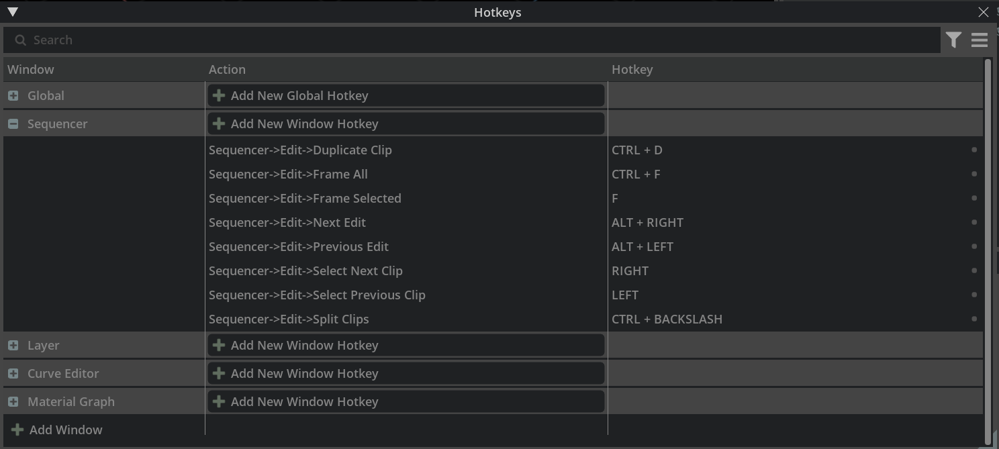

```{csv-table}
**Extension**: {{ extension_version }},**Documentation Generated**: {sub-ref}`today`
```

# Overview

Hotkeys window helps user to manager hotkeys.

All hotkeys are categorized by windows. Hotkeys defined for special window list in the category with window name. Hotkeys defined for global list in the "Global".  



User could also:
- Add Window category
- Add New Hotkey for Global or Window
- Edit Hotkey
- Delete user-defined hotkey
- Restore Hotkey changes
- Search hotkeys by keyword
- Filter hotkeys by defined filters
- Export hotkeys to preset file
- Import hotkeys from preset file
- Restore all hotkeys

