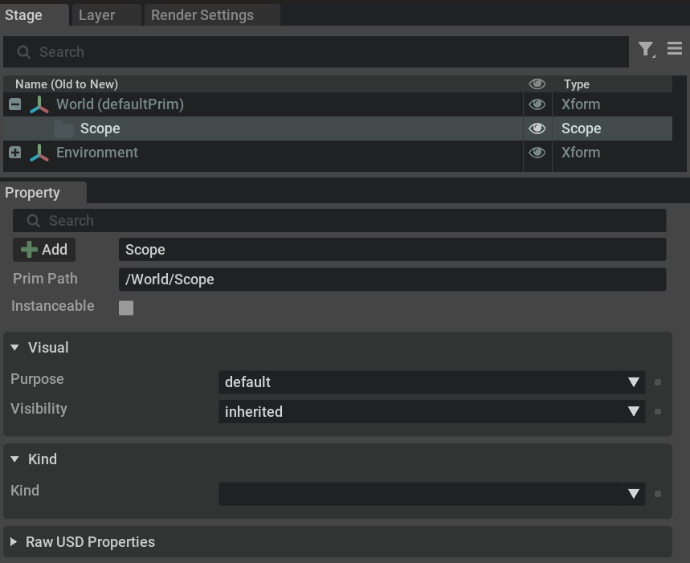
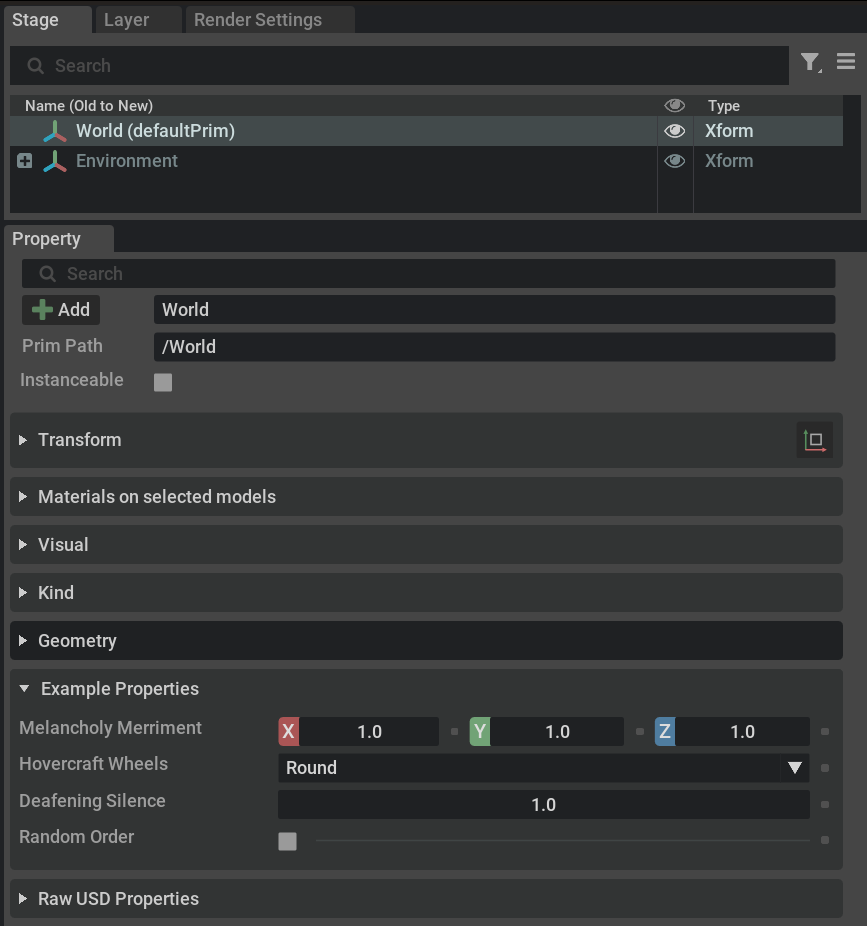
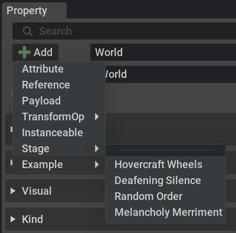

```{csv-table}
**Extension**: {{ extension_version }},**Documentation Generated**: {sub-ref}`today`
```

# Usage Examples

The `omni.kit.property.usd` extension offers widgets that displays properties and enables users to modify them. Additional features such as property filtering for convenient searching are included as well as convenience functions to add new properties.
Building upon omni.kit.window.property, `omni.kit.property.usd` specializes in managing USD properties, including basic Usd.Prim information showcased through the PrimPathWidget, which is also used in the example below.




## Register new property window handler with non-schema properties.

This example is also available in extension manager, called omni.kit.property.example

What does this code do?
- Register "prim" handler of name "example_properties" & uses ExampleAttributeWidget class to build UI.
- Removes "prim" handler of name "example_properties" on shutdown.
- Defines `ExampleAttributeWidget` class which overrides `on_new_payload()` & `_customize_props_layout()` functions.

```{code-block} python
import omni.ext
from pxr import Sdf, Usd, UsdGeom, Gf
from omni.kit.property.usd.prim_selection_payload import PrimSelectionPayload


class ExamplePropertyExtension(omni.ext.IExt):
    def __init__(self):
        super().__init__()
        self._registered = False
        self._menu_items = []

    def on_startup(self, ext_id):
        self._register_widget()

    def on_shutdown(self):
        if self._registered:
            self._unregister_widget()

    def _register_widget(self):
        import omni.kit.window.property as property_window_ext
        from .example_attribute_widget import ExampleAttributeWidget

        property_window = property_window_ext.get_window()
        if property_window:
            # register ExampleAttributeWidget class with property window.
            # you can have multiple of these but must have to be different scheme names
            # but always "prim" or "layer" type
            #   "prim" when a prim is selected
            #   "layer" only seen when root layer is selected in layer window
            property_window.register_widget("prim", "example_properties", ExampleAttributeWidget())
            self._registered = True
            # ordering of property widget is controlled by omni.kit.property.bundle

    def _unregister_widget(self):
        import omni.kit.window.property as property_window_ext

        property_window = property_window_ext.get_window()
        if property_window:
            # remove ExampleAttributeWidget class with property window
            property_window.unregister_widget("prim", "example_properties")
            self._registered = False
```

## ExampleAttributeWidget source

This widget class handles `Usd.Attributes` for prim/example_properties and builds UI.

```{code-block} python
import copy
import carb
import omni.ui as ui
import omni.usd
from pxr import Usd, Sdf, Vt, Gf, UsdGeom, Trace
from typing import List
from omni.kit.property.usd.usd_property_widget import UsdPropertiesWidget, UsdPropertyUiEntry
from omni.kit.property.usd.usd_property_widget import create_primspec_token, create_primspec_float, create_primspec_bool


class ExampleAttributeWidget(UsdPropertiesWidget):
    def __init__(self):
        super().__init__(title="Example Properties", collapsed=False)
        self._attribute_list = ["hovercraftWheels", "deafeningSilence", "randomOrder", "melancholyMerriment"]

        # As these attributes are not part of the schema, placeholders need to be added. These are not
        # part of the prim until the value is changed. They will be added via prim.CreateAttribute() function.
        self.add_custom_schema_attribute("melancholyMerriment", lambda p: p.IsA(UsdGeom.Xform) or p.IsA(UsdGeom.Mesh), None, "", {Sdf.PrimSpec.TypeNameKey: "float3", "customData": {"default": Gf.Vec3f(1.0, 1.0, 1.0)}})
        self.add_custom_schema_attribute("hovercraftWheels",    lambda p: p.IsA(UsdGeom.Xform) or p.IsA(UsdGeom.Mesh), None, "", create_primspec_token(["None", "Square", "Round", "Triangle"], "Round"))
        self.add_custom_schema_attribute("deafeningSilence",    lambda p: p.IsA(UsdGeom.Xform) or p.IsA(UsdGeom.Mesh), None, "", create_primspec_float(1.0))
        self.add_custom_schema_attribute("randomOrder",         lambda p: p.IsA(UsdGeom.Xform) or p.IsA(UsdGeom.Mesh), None, "", create_primspec_bool(False))

    def on_new_payload(self, payload):
        """
        Called when a new payload is delivered. PropertyWidget can take this opportunity to update its UI models, 
        or schedule full UI rebuild.

        Args:
            payload: The new payload to refresh UI or update model.

        Return:
            True if the UI needs to be rebuilt. build_impl will be called as a result.
            False if the UI does not need to be rebuilt. build_impl will not be called.
        """

        # nothing selected, so do not show widget. If you don't do this
        # you widget will be always on, like the path widget you see
        # at the top.
        if not payload or len(payload) == 0:
            return False

        # filter out special cases like large number of prim selected. As
        # this can cause UI stalls in certain cases
        if not super().on_new_payload(payload):
            return False

        # check is all selected prims are relevant class/types
        used = []
        for prim_path in self._payload:
            prim = self._get_prim(prim_path)
            if not prim or not (prim.IsA(UsdGeom.Xform) or prim.IsA(UsdGeom.Mesh)):
                return False
            if self.is_custom_schema_attribute_used(prim):
                used.append(None)
            used.append(prim)

        return used is not None

    def _customize_props_layout(self, props):
        """
        To reorder the properties display order, reorder entries in props list.
        To override display group or name, call prop.override_display_group or prop.override_display_name respectively.
        If you want to hide/add certain property, remove/add them to the list.

        NOTE: All above changes won't go back to USD, they're pure UI overrides.

        Args:
            props: List of Tuple(property_name, property_group, metadata)

        Example:

            for prop in props:
                # Change display group:
                prop.override_display_group("New Display Group")

                # Change display name (you can change other metadata, it won't be write back to USD, only affect UI):
                prop.override_display_name("New Display Name")

            # add additional "property" that doesn't exist.
            props.append(UsdPropertyUiEntry("PlaceHolder", "Group", { Sdf.PrimSpec.TypeNameKey: "bool"}, Usd.Property))
        """
        from omni.kit.property.usd.custom_layout_helper import CustomLayoutFrame, CustomLayoutGroup, CustomLayoutProperty
        from omni.kit.property.usd.usd_property_widget_builder import UsdPropertiesWidgetBuilder
        from omni.kit.window.property.templates import HORIZONTAL_SPACING, LABEL_HEIGHT, LABEL_WIDTH

        self.add_custom_schema_attributes_to_props(props)

        # remove any unwanted props (all of the Xform & Mesh
        # attributes as we don't want to display them in the widget)
        for attr in copy.copy(props):
            if not attr.attr_name in self._attribute_list:
                props.remove(attr)

        # custom UI attributes
        frame = CustomLayoutFrame(hide_extra=False)
        with frame:
            # Set layout order. this rearranges attributes in widget to the following order.
            CustomLayoutProperty("melancholyMerriment", "Melancholy Merriment")
            CustomLayoutProperty("hovercraftWheels", "Hovercraft Wheels")
            CustomLayoutProperty("deafeningSilence", "Deafening Silence")
            CustomLayoutProperty("randomOrder", "Random Order")

        return frame.apply(props)
```
This will add a new CollapsableFrame called "Example Properties" in the property window, but will be only visible when prims of type Xform or Mesh are selected.



## Add to the PrimPathWidget

Add new menu items for adding custom properties to prims.

What does this code do?
- Register add menus to omni.kit.property.usd
- Removes add menus on shutdown.
- Defines the functions that the menus requires.

```{code-block} python
    def on_startup(self, ext_id):
        ...
        self._menu_items = []
        self._register_add_menus()

    def on_shutdown(self):
        self._unregister_add_menus()
        ...

    def _register_add_menus(self):
        from omni.kit.property.usd import PrimPathWidget

        # add menus to property window path/+add and context menus +add submenu.
        # show_fn: controls when option will be shown, IE when selected prim(s) are Xform or Mesh.
        # onclick_fn: is called when user selects menu item.
        self._menu_items.append(
            PrimPathWidget.add_button_menu_entry(
                "Example/Hovercraft Wheels",
                show_fn=ExamplePropertyExtension.prim_is_example_type,
                onclick_fn=ExamplePropertyExtension.click_add_hovercraft_wheels
            )
        )

        self._menu_items.append(
            PrimPathWidget.add_button_menu_entry(
                "Example/Deafening Silence",
                show_fn=ExamplePropertyExtension.prim_is_example_type,
                onclick_fn=ExamplePropertyExtension.click_add_deafening_silence
            )
        )

        self._menu_items.append(
            PrimPathWidget.add_button_menu_entry(
                "Example/Random Order",
                show_fn=ExamplePropertyExtension.prim_is_example_type,
                onclick_fn=ExamplePropertyExtension.click_add_random_order
            )
        )

        self._menu_items.append(
            PrimPathWidget.add_button_menu_entry(
                "Example/Melancholy Merriment",
                show_fn=ExamplePropertyExtension.prim_is_example_type,
                onclick_fn=ExamplePropertyExtension.click_add_melancholy_merriment
            )
        )

    def _unregister_add_menus(self):
        from omni.kit.property.usd import PrimPathWidget

        # remove menus to property window path/+add and context menus +add submenu.
        for item in self._menu_items:
            PrimPathWidget.remove_button_menu_entry(item)

        self._menu_items = None

    @staticmethod
    def prim_is_example_type(objects: dict) -> bool:
        """
        checks if prims are required type
        """
        if not "stage" in objects or not "prim_list" in objects or not objects["stage"]:
            return False

        stage = objects["stage"]
        if not stage:
            return False

        prim_list = objects["prim_list"]
        for path in prim_list:
            if isinstance(path, Usd.Prim):
                prim = path
            else:
                prim = stage.GetPrimAtPath(path)
            if prim:
                if not (prim.IsA(UsdGeom.Xform) or prim.IsA(UsdGeom.Mesh)):
                    return False

        return len(prim_list) > 0

    @staticmethod
    def click_add_hovercraft_wheels(payload: PrimSelectionPayload):
        """
        create hovercraftWheels Prim.Attribute
        """
        stage = payload.get_stage()
        for prim_path in payload:
            prim = stage.GetPrimAtPath(prim_path) if stage and prim_path else None
            if prim:
                attr = prim.CreateAttribute("hovercraftWheels",  Sdf.ValueTypeNames.Token, False)
                attr.SetMetadata("allowedTokens", ["None", "Square", "Round", "Triangle"])
                attr.Set("Round")

    @staticmethod
    def click_add_deafening_silence(payload: PrimSelectionPayload):
        """
        create deafeningSilence Prim.Attribute
        """
        stage = payload.get_stage()
        for prim_path in payload:
            prim = stage.GetPrimAtPath(prim_path) if stage and prim_path else None
            if prim:
                attr = prim.CreateAttribute("deafeningSilence",  Sdf.ValueTypeNames.Float, False)
                attr.Set(1.0)

    @staticmethod
    def click_add_random_order(payload: PrimSelectionPayload):
        """
        create randomOrder Prim.Attribute
        """
        stage = payload.get_stage()
        for prim_path in payload:
            prim = stage.GetPrimAtPath(prim_path) if stage and prim_path else None
            if prim:
                attr = prim.CreateAttribute("randomOrder",  Sdf.ValueTypeNames.Bool, False)
                attr.Set(False)

    @staticmethod
    def click_add_melancholy_merriment(payload: PrimSelectionPayload):
        """
        create melancholyMerriment Prim.Attribute
        """
        stage = payload.get_stage()
        for prim_path in payload:
            prim = stage.GetPrimAtPath(prim_path) if stage and prim_path else None
            if prim:
                attr = prim.CreateAttribute("melancholyMerriment", Sdf.ValueTypeNames.Float3, False)
                attr.Set(Gf.Vec3f(1.0, 1.0, 1.0))
```
Which will add a new "Example" submenu to the PrimPathWidget:




# omni.kit.property.usd version 4.3.0 and above

## Examples of using register_schema

### These schema API's cannot be removed from UsdLux prims, so tag them as NO_REMOVE

```{code-block} python
from omni.kit.property.usd import RegisteredSchemaCodes, register_schema

register_schema(
    "LightSchemaAttributesWidget",
    ["LightAPI", "CollectionAPI:lightLink", "CollectionAPI:shadowLink"],
    RegisteredSchemaCodes.NO_REMOVE,
)
```
### Remove all "Physics", "Physx" schema API's from Add/Remove by marking them as PRIVATE
```{code-block} python
from pxr import Tf
from omni.kit.property.usd import RegisteredSchemaCodes, register_schema

other_schemas = []
schema_reg = Usd.SchemaRegistry()
for t in Tf.Type.FindByName("UsdAPISchemaBase").GetAllDerivedTypes():
    if schema_reg.IsAppliedAPISchema(t):
        api_schema = schema_reg.GetAPISchemaTypeName(t)
        if any(key in api_schema for key in ["Physics", "Physx"]):
            if t not in self._all_schemas:
                other_schemas.append(t)
register_schema("PhysicsWidget", other_schemas, RegisteredSchemaCodes.PRIVATE)
```
**NOTE:** By marking "Physics", "Physx" Schema API's as PRIVATE it upto the owning widget to handle them.
**NOTE:** Only widgets that are derived from **UsdPropertiesWidget** will be able to opt into **show_schemas()**
