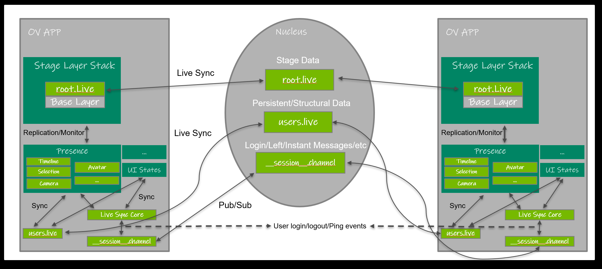

```{csv-table}
**Extension**: {{ extension_version }},**Documentation Generated**: {sub-ref}`today`
```

# Overview
[Layer](https://openusd.org/release/glossary.html#usdglossary-layer) is the atomic persistent storage for USD.
Extension {py:mod}`omni.kit.usd.layers` is built on top of USD that serves to provide utilities and workflows around layers.
Through which, user can query layer states, subscribe layer changes, switch authoring mode, and start live-syncing for layers.
This extension is the core that serves as the foundation for layer widgets, like `omni.kit.widget.layers`, all collaboration related extensions,
like `omni.kit.collaboration.*`, and all other components inside Kit that need easier access to layer states. The following
sections will introduce each module and how to access them through Python API.

## Layer State Management
USD runtime does not handle ACL information from file system, nor can it detect changes from other users dynamically.
Omniverse is designed for multi-users to co-work together simultaneously. Layer state management takes the responsibility
to manage layer states and provide a cache view to all layers in the current UsdContext for fast query and access. Also,
it provides the functionality to subscribe layer changes with Carbonite event stream. The following states/properties are
extended or encapsulated from vanilla USD for better access for layers to support dynamical notification:

- **Writable or not**. USD only provides a runtime flag to make the layer read-only. It does not care about access permission
from the file system. We extended this to include file system permissions.
- **Muteness**. Muteness in USD is not serialized, and in order to support persistence, it defines two influence scopes as below:
  1. **Local**. When it's in local scope, mute states are only local without persistence.
  2. **Global**. When it's in global scope, mute states will be saved for the next session and live-synced in Live Session.
In this mode, mute states will be persistent inside the customLayerData of root layer.
- **Layer Lock**. Lock status is the concept to support locking layers so users cannot switch it as edit target nor it cannot be saved.
It’s a flag saved inside the custom data of the layer to be locked. So it can be serialized and live updated. Lock is not real file ACL,
but only an UX hint to guide UI.
- **Dirtiness**. Whether it has pending edits that are not saved yet. Unlike dirty flag of PXR_NS::SdfLayer::IsDirty(), dirty state is returned oly for non-anonymous layer.
- **Up-to-date or not**. If this layer in memory is out of sync with the version on the disk or Nucleus server.
- **Layer Name**. It supports to assign user readable name to a layer and serialize it. By default, the layer name is the file name.
- **Layer Owner**. The file owner who creates the layer file. It only applies to files that exist in the Nucleus server.

You can refer {py:class}`omni.kit.usd.layers.LayersState` for all Python APIs, and {cpp:class}`omni::kit::usd::layers::ILayersState` for
all cpp APIs to access and query layer properties/states. And see [Programming Guide](#programming-guide) about how to get the interface instance.

## Live Session
### Glossary
* `USD Stage`: A USD Stage is a runtime concept that’s specific to the one that’s opened with USD API.
* `Base Layer`: Base layer is the one which you create the Live Session for and in the layer stack of the USD stage. Each
Live Session is bound to an unique base layer.
* `Live Layer`: Live Layer is the USD layer that supports Omni-Objects with extension .live. Authoring to Live Layer will be live-synced.
* `Connectors`: Plugins or extensions of DCC tools that connect to Omniverse.
* `Live User`: A Live User is the instance that joins the Live Session.
* `Live Session Owner`: A Live Session owner is the one that has the permission to merge the Live Session to base layer.
* `Presenter`: A Live Session Presenter is the one that controls the timeline to scrub/play the animation.
* `Live Prim`: A Live Prim is the USD prim that has one of its references or payloads in Live Session.

### What’s a Live Session?
A Live Session is a concept that all Omniverse connectors can join in to do live-syncing to the same USD stage. User stories about Live Session:
* A Live Session is bound to a base layer.
* Live users use connectors to list or find Live Sessions.
* Live users use connectors to join the existing Live Sessions.
* Live users can invite other live users to join the Live Session.
* A live user can join multiple Live Sessions at the same time.
* A USD stage can have multiple Live Sessions joined at the same time for multiple base layers.
Live users who join the same Live Session can see what other users' modifications towards the USD stage in realtime.
They can be aware of each other by querying the session.

### Physical Structure of Live Session
All the Live Sessions will be physically mapped as `$(Base Directory)`/.live/`$(Layer Name)`.live/`$(session name)`/.live, where:
* `Base Directory` is where the base layer is located at.
* `Layer Name` is the name of the base layer.
* `Session Name` is the name of the session.

Under the Live Session folder, it includes:
* `A meta file (__session__.toml)`: this meta file records the metadata of this Live Session. It includes:
   1. Description of the Live Session.
   2. Date of creation. (Can be fetched from Nucleus)
   3. Name of the Live Session.
   4. Owner of the Live Session. (Can be fetched from Nucleus)
   5. Layer of this Live Session is bound to.
   6. Presenter of the Live Session. (By default, it's the same as owner)

   One example of __session__.toml:
   ```
   version = "1.0"
   name = "Test Live Session"
   stage_url = "omniverse://ov-content/test/test.usd"
   description = "A test Live Session for demo omni-objects"
   user_name = "lrohan@nvidia.com"
   presenter = "lrohan@nvidia.com"
   ```

* `A Nucleus Channel file (__session__.channel)`, this channel file can be used to communicate with other peers to be aware of users in this session. The protocol defined to communicate through the channel can be referred to in the next section.
* `Live Layer`: All the live files belong to the Live Session. The root one is named as root.live.
* `Shared Data Folder (shared_data)`: It defines the standard location for shared data between clients.
Currently, Presence Layer {py:mod}`omni.kit.collaboration.presence_layer` uses it to share spatial awareness data.
* `Others`.


### How does a Live Session work?
Physically, Live Session creates a space that users can co-work together. Users who join the same session will insert Live Layer
into the layer stack of the opened stage. Then the Live Layer will contribute to the stage composition as its USD layer which is
powered by NVIDIA technology `Omni-Objects` that creates an endpoint of local client so any users who accesses the same Live Layer
can see  other users' modifications transparently. It supports to create/join Live Sessions for both subLayers in the local layer
stack and references or payloads. REMINDER: `Omni-Objects` is supported by Nucleus server only currently. That means you can only
create Live Session in the Nucleus server for base layers that are in the server also.

### Data Share in Live Session
As described above, users in the same session can share the data or view the modifications from others. Before joining the session,
all users see the same states to the base stage. All further modifications/states are shared in different ways. It includes 2 parts:
* Data share of stage modifications. Modifications towards the USD stage are broadcasted through `Live Layer`. All modifications will
be broadcasted automatically to all users, and contributed to the stage composition.
* Data share of others. Besides USD modifications, it also includes other data that needs to be shared across the session,
like querying users, user login/logout events, or session merge/stop, and so on. It's through two ways: Nucleus Channel
provided by extension {py:mod}`omni.kit.collaboration.channel_manager` and shared data folder as described in the last section. The Nucleus Channel
will be used for transient events, which will be defined below with details. Shared data folder can be used to
host customized data that's defined by application. Kit already provides a default method for developers to use, which is
Presence Layer (extension {py:mod}`omni.kit.collaboration.presence_layer`), through which users can share structural and persistent
data to all users with the power and convenience of utilizing USD API. See the following graph for the dataflow of a Omniverse
APP that joins a Live Session.



### Live Session Implementation
Kit supports two kinds of Live Sessions: Live Session for subLayer and prim. As described in the above [section](#how-does-a-live-session-work),
joining a Live Session will add a Live Layer into the stage's composition stack. When you join a Live Session for a subLayer, the Live Layer
will be inserted into your local subLayer stack, while it will be inserted into the prim's referenceList/payloadList for `Live Prim` (see API {py:func}`omni.kit.usd.layers.LiveSyncing.join_live_session` about joining Live Session for a subLayer or prim). As described, a Live Session is bound
to a base layer only. However, USD could support to reference the same base layer for multiple times, for example, a layer that's referenced
for multiple prims. Those prims can join Live Sessions for the same base layer separately. If those Live Prims joined the same Live Sessions,
they physically share the same Live Session instance. You can also stop Live Session for single prim or you can stop all Live Prims for
the specific base layer (see API {py:func}`omni.kit.usd.layers.LiveSyncing.stop_live_session` for details).

You can refer {py:class}`omni.kit.usd.layers.LiveSyncing` for all Python APIs, and {cpp:class}`omni::kit::usd::layers::ILiveSyncing` for
all cpp APIs to access and query layer properties/states. And see [Programming Guide](#programming-guide) about how to get the interface instance.

### How to Enable Your Extension to be Live Synced?
In section [Data Share in Live Session](#data-share-in-live-session), it mentions 3 ways to do data share across a Live Session:
Live Layer, Nucleus Channel, and Presence Layer. So if your extension only makes modifications to the opened stage in the current
UsdContext, you only need to make sure your changes are made to the Live Layer if you want them to be live-synced to other users.
For other data, you can see {py:mod}`omni.kit.collaboration.presence_layer` for reference. Currently, the Nucleus Channel that's bound to a Live Session is not opened externally. So if you want to share anything with the Nucleus Channel, you'd have to open/operate channel
directly with {py:mod}`omni.kit.collaboration.channel_manager`.

**REMINDER: You must add {py:mod}`omni.kit.collaboration.channel_manager` into your ext's dependency list to enable live syncing feature for your ext along with this module.**

### Common Questions
#### Question 1: Why can't I see my changes after joining a Live Session?
`A`: This normally happens when you fix your data authoring to the
specific layer. Live Session does not promise all of your modifications
to any layers are live-synced. It will only live-sync those changes made to the Live Layer. So it's developer's responsibility to sync the data
model between Live Layer and your local modifications. It's strongly recommended to do the authoring in the current edit target. Because when a stage joins a Live Session, it will change the edit target to the Live Layer. If you want your changes to be viewable by other clients, and you don't need to support Live Sessions standalone, you should always make changes to the current edit target without realizing the existence of other sublayers.

## Experimental Features
{py:mod}`omni.kit.usd.layers` provides a bunch of experimental features for developers to implement related workflows easier.
### Specs Locking
Specs Locking module aims to provide universal solution to USD so it could support locking to prims/properties so user cannot edit
locked prims/properties. USD does not provide a layer that could support that, but it provides [PXR_NS::SdfLayerStateDelegate](https://openusd.org/dev/api/class_sdf_layer_state_delegate_base.html) that can monitor authoring state information associated to a layer.
This module utilizes it to monitor changes to USD stage, and revert them back once we have the prims/properties locked. `Currently, the lock states are not persistent`.

You can refer {py:class}`omni.kit.usd.layers.SpecsLocking` for all Python APIs, and {cpp:class}`omni::kit::usd::layers::ISpecsLocking`
for all cpp APIs to access and query layer properties/states. And see [Programming Guide](#programming-guide) about how to get the interface instance.

### Auto Authoring
USD supports switching edit targets so that all authoring will take place in that specified layer. When it's working with multiple sublayers,
this kind of freedom may cause experience issues. The user has to be aware the changes made are not overridden in any stronger layer.
We extend a new mode called Auto Authoring to improve it. In this mode, all changes will firstly go into a middle delegate layer and
it will then distribute edits (per frame) into their corresponding layers where the edits have the strongest opinions. So it cannot
switch edit targets freely, and users do not need to be aware of the existence of multi-sublayers and how USD will compose the changes.

You can refer {py:class}`omni.kit.usd.layers.AutoAuthoring` for all Python APIs, and {cpp:class}`omni::kit::usd::layers::IAutoAuthoring`
for all cpp APIs to access and query layer properties/states. And see [Programming Guide](#programming-guide) about how to get the interface instance.

#### How does Auto Authoring Work?
When it switches to Auto Authoring mode (see {py:class}`omni.kit.usd.layers.Layers` about how to switch edit mode), an auto authoring layer
will be created under the session layer and all authoring will be done inside this auto authoring layer. For each modification to the stage,
Auto Authoring backend will forward the change to the layer that has corresponding strongest opinion automatically. What if the changed prim
did not exist before? Those newly created prims are forwarded to the `Default Layer`, which is the fallback layer of the modifications if
they have never been created before.

### Specs Linking
Layer link is a concept to support linking prim changes to specific layers, and serialization of those links. So if the prims/attributes are linked,
all the edits to those prims or attributes will be forwarded to the layers specified. This is an experimental feature right now.

You can refer {py:class}`omni.kit.usd.layers.SpecsLinking` for all Python APIs, and {cpp:class}`omni::kit::usd::layers::ISpecsLinking` for all cpp APIs
to access and query layer properties/states. And see [Programming Guide](#programming-guide) about how to get the interface instance.

## Programming Guide
Currently, both C++ and Python API to query layer states and control workflows are supported. However, the Python API is full-fledged and the recommended way
to access all APIs. For more information on python usages, please refer to [python examples](usage-python).
