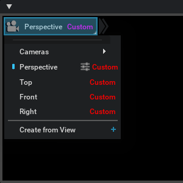
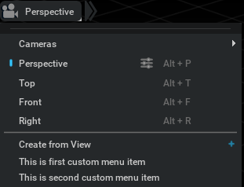

```{csv-table}
**Extension**: {{ extension_version }},**Documentation Generated**: {sub-ref}`today`
```

# Usage Examples

## Register Custom Widgets to Camera Button and Menu Item
```python
from typing import Optional
import weakref
from omni.kit.viewport.menubar.camera import AbstractCameraButtonDelegate, AbstractCameraMenuItemDelegate
from omni import ui
from pxr import Sdf


class MyButtonDelegate(AbstractCameraButtonDelegate):
    def build_widget(self, parent_id: int, viewport_api: "ViewportAPI", camera_path: Sdf.Path) -> Optional[ui.Widget]:
        widget = ui.HStack()
        with widget:
            ui.Spacer(width=4)
            ui.Label("Custom", style={"color": 0xFFFF00FF})
        return widget

    def on_parent_destroyed(self, parent_id: int) -> None:
        return

    def on_camera_path_changed(self, parent_id: int, camera_path: Sdf.Path):
        return

class MyItemDelegate(AbstractCameraMenuItemDelegate):
    def build_widget(self, parent_id: int, viewport_api: "ViewportAPI", camera_path: Sdf.Path) -> Optional[ui.Widget]:
        widget = ui.HStack()
        with widget:
            ui.Spacer(width=4)
            ui.Label("Custom", style={"color": 0xFF0000FF})
        return widget

    def on_parent_destroyed(self, parent_id: int) -> None:
        return

    def on_camera_path_changed(self, parent_id: int, camera_path: Sdf.Path):
        return

# Define delegates before camera menu bar display
button_delegate = MyButtonDelegate()
item_delegate = MyItemDelegate()

# Clean delegates if not use anymore
# button_delegate.destroy()
# item_delegate.destroy()
```



## Register Custom Menu Item
```python
from omni import ui

def __create_first(viewport_context, root):
    ui.MenuItem("This is first custom menu item")

def __create_second(viewport_context, root):
    ui.MenuItem("This is second custom menu item")

# Get the viewport camera menu bar extension instance
extension = get_instance()

# Register new enu items
extension.register_menu_item(__create_second, order=20)
extension.register_menu_item(__create_first, order=10)

# Deregister menu items if not use anymore
# extension.deregister_menu_item(__create_first)
# extension.deregister_menu_item(__create_second)
```


## Register Custom Menu Item Type

```python
from omni.kit.viewport.menubar.camera import get_instance, SingleCameraMenuItemBase

# Define a custom menu item type
def custom_single_camera_menu_item(*args, **kwargs):
    class CustomSingleCameraMenuItem(SingleCameraMenuItemBase):
        def _option_clicked(self):
            # Do something when clicking the option icon on the right of this menu item
            return

    return CustomSingleCameraMenuItem(*args, **kwargs)

# Get the viewport camera menu bar extension instance
extension = get_instance()

# Register the custom menu item type
extension.register_menu_item_type(custom_single_camera_menu_item)
```
