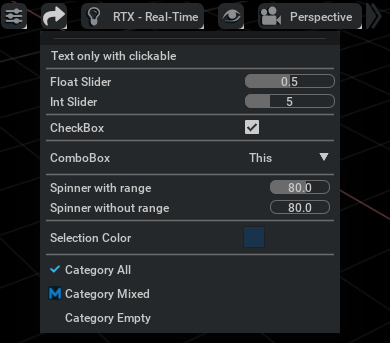
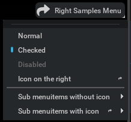
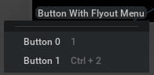

```{csv-table}
**Extension**: {{ extension_version }},**Documentation Generated**: {sub-ref}`today`
```

# Usage Examples

## Create a Icon Menu Item With Drop Down Menu at Left of Default Viewport Menubar
```python
from typing import Dict

import carb
import carb.settings
from omni.kit.viewport.menubar.core import (
    IconMenuDelegate,
    SliderMenuDelegate,
    CheckboxMenuDelegate,
    ViewportMenuContainer,
    FloatArraySettingColorMenuItem,
    ComboBoxMenuDelegate,
    SpinnerMenuDelegate,
    ComboBoxModel,
    CategoryMenuDelegate,
    CategoryStatus,
)
import omni.ui as ui

ICON_PATH = carb.tokens.get_tokens_interface().resolve("${glyphs}")

UI_STYLE = {
    "Menu.Item.Icon::Sample": {"image_url": f"{ICON_PATH}/share.svg", "margin_width": 4, "margin_height": 4},
}


class LeftExampleMenuContainer(ViewportMenuContainer):
    """The menu aligned to left"""

    def __init__(self):
        self._settings = carb.settings.get_settings()
        self._settings.set("/exts/omni.kit.viewport.menubar.example/left/visible", True)
        self._settings.set("/exts/omni.kit.viewport.menubar.example/left/order", -100)
        super().__init__(
            name="Left Samples Menu",
            delegate=IconMenuDelegate("Sample"),
            visible_setting_path="/exts/omni.kit.viewport.menubar.example/left/visible",
            order_setting_path="/exts/omni.kit.viewport.menubar.example/left/order",
            style=UI_STYLE
        )

        self._settings = carb.settings.get_settings()

        self.float_slider_delegate = None

    def build_fn(self, factory: Dict):
        ui.Menu(
            self.name, delegate=self._delegate, on_build_fn=self._build_menu_items, style=self._style
        )

    def _build_menu_items(self):
        ui.MenuItem("Text only with clickable", hide_on_click=False, onclick_fn=lambda: print("Text Menu clicked"))

        ui.Separator()

        self.float_slider_delegate = SliderMenuDelegate(
            model=ui.SimpleFloatModel(0.5),
            min=0.0,
            max=1.0,
            tooltip="Float slider Sample",
        )
        ui.MenuItem(
            "Float Slider",
            hide_on_click=False,
            delegate=self.float_slider_delegate
        )

        ui.MenuItem(
            "Int Slider",
            hide_on_click=False,
            delegate=SliderMenuDelegate(
                model=ui.SimpleIntModel(5),
                min=1,
                max=15,
                slider_class=ui.IntSlider,
                tooltip="Int slider Sample",
            ),
        )

        ui.Separator()

        ui.MenuItem(
            "CheckBox",
            hide_on_click=False,
            delegate=CheckboxMenuDelegate(
                model=ui.SimpleBoolModel(True),
                tooltip="CheckBox Sample",
            ),
        )

        ui.Separator()

        ui.MenuItem(
            "ComboBox",
            delegate=ComboBoxMenuDelegate(
                model=ComboBoxModel(["This", "is", "a", "test", "combobox"], values=[0, 1, 2, 3, 4])
            ),
            hide_on_click=False,
        )

        ui.Separator()
        ui.MenuItem(
            "Spinner with range",
            delegate=SpinnerMenuDelegate(
                model=ui.SimpleIntModel(80), min=50, max=100,
            ),
            hide_on_click=False,
        )
        ui.MenuItem(
            "Spinner without range",
            delegate=SpinnerMenuDelegate(
                model=ui.SimpleIntModel(80),
            ),
            hide_on_click=False,
        )

        ui.Separator()

        FloatArraySettingColorMenuItem(
            "/exts/omni.kit.viewport.menubar.example/left/color",
            [0.1, 0.2, 0.3],
            name="Selection Color",
            start_index=0
        )

        ui.Separator()
        ui.MenuItem(
            "Category All",
            delegate=CategoryMenuDelegate(CategoryStatus.ALL)
        )
        ui.MenuItem(
            "Category Mixed",
            delegate=CategoryMenuDelegate(CategoryStatus.MIXED)
        )
        ui.MenuItem(
            "Category Empty",
            delegate=CategoryMenuDelegate(CategoryStatus.EMPTY)
        )

left_menu = LeftExampleMenuContainer()
```


## Create a Icon Menu Item With Drop Down Menu at right of Default Viewport Menubar
```python
from typing import Dict
from functools import partial

import carb
import carb.settings
from omni.kit.viewport.menubar.core import (
    IconMenuDelegate,
    ViewportMenuContainer,
    ViewportMenuDelegate,
)
import omni.ui as ui

ICON_PATH = carb.tokens.get_tokens_interface().resolve("${glyphs}")

UI_STYLE = {
    "Menu.Item.Icon::Sample": {"image_url": f"{ICON_PATH}/share.svg", "margin_width": 4, "margin_height": 4},
}


class RightExampleMenuContainer(ViewportMenuContainer):
    """The menu aligned to right"""

    def __init__(self):
        self._settings = carb.settings.get_settings()
        self._settings.set("/exts/omni.kit.viewport.menubar.example/right/visible", True)
        self._settings.set("/exts/omni.kit.viewport.menubar.example/right/order", 100)
        super().__init__(
            name="Right Samples Menu",
            delegate=IconMenuDelegate("Sample", text=True),
            visible_setting_path="/exts/omni.kit.viewport.menubar.example/right/visible",
            order_setting_path="/exts/omni.kit.viewport.menubar.example/right/order",
            style=UI_STYLE
        )

        self._settings = carb.settings.get_settings()

    def build_fn(self, factory: Dict):
        """Entry point for the menu bar"""
        ui.Menu(
            self.name, delegate=self._delegate, on_build_fn=partial(self._build_menu_items, factory), style=UI_STYLE
        )

    def _build_menu_items(self, factory):
        ui.MenuItem(
            "Normal",
            checkable=False,
            delegate=ViewportMenuDelegate(),
        )

        ui.MenuItem(
            "Checked",
            checkable=True,
            checked=True,
            delegate=ViewportMenuDelegate(),
        )

        ui.MenuItem(
            "Disabled",
            enabled=False,
            delegate=ViewportMenuDelegate(),
        )

        ui.MenuItem(
            "Icon on the right",
            delegate=ViewportMenuDelegate(icon_name="Sample")
        )

        ui.Separator()

        with ui.Menu(
            "Sub menuitems without icon",
            delegate=ViewportMenuDelegate()
        ):
            for i in range(5):
                ui.MenuItem(f"Sub item {i}", delegate=ViewportMenuDelegate(),)

        with ui.Menu(
            "Sub menuitems with icon",
            delegate=ViewportMenuDelegate(icon_name="Sample"),
        ):
            for i in range(5):
                ui.MenuItem(f"Sub item {i}", delegate=ViewportMenuDelegate(),)
                
right_menu = RightExampleMenuContainer()
```


## Create a New Menubar at Bottom of Viewport Window With a Button Item
```python
import copy
from typing import List
from omni.kit.viewport.menubar.core import ViewportButtonItem, ViewportMenubar, VIEWPORT_MENUBAR_STYLE
from omni import ui

class ButtonExample(ViewportButtonItem):
    """The button example"""

    def __init__(self, btn_id: int = 0, **kwargs):
        self._settings = carb.settings.get_settings()
        setting_root = f"/exts/omni.kit.viewport.menubar.example/button/{btn_id}"
        setting_visible = f"{setting_root}/visible"
        setting_order = f"{setting_root}/order"
        self._settings.set(setting_visible, True)
        self._settings.set(setting_order, -90)
        self.clicked = False

        test_ui_style = copy.copy(VIEWPORT_MENUBAR_STYLE)
        test_ui_style.update(UI_STYLE)
        super().__init__(
            text=kwargs.pop("text", None) or "Button With Flyout Menu",
            name=kwargs.pop("name", None) or "Sample",
            visible_setting_path=setting_visible,
            order_setting_path=setting_order,
            onclick_fn=self._on_click,
            build_menu_fn=self._build_menu_items if not kwargs.get("build_window_fn", None) else None,
            style=test_ui_style,
            **kwargs,
        )

    def _build_menu_items(self) -> List[ui.MenuItem]:
        return [
            ui.MenuItem(
                "Button 0",
                delegate=ViewportMenuDelegate(),
                hotkey_text="1",
            ),

            ui.MenuItem(
                "Button 1",
                delegate=ViewportMenuDelegate(),
                hotkey_text="CTRL + 2",
            ),
        ]

    def _on_click(self):
        self.clicked = True

class ViewportBottomBar(ViewportMenubar):
    def __init__(self):
        super().__init__("BOTTOM_BAR")

    def build_fn(self, menu_items, factory):
        with ui.VStack():
            ui.Spacer()
            super().build_fn(menu_items, factory)
            
bottom_bar = ViewportBottomBar()
with bottom_bar:
    button_menu = ButtonExample()
```
