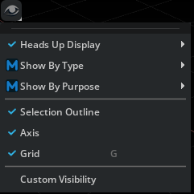
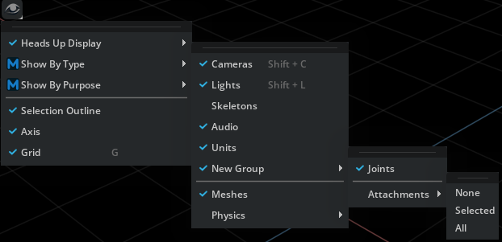
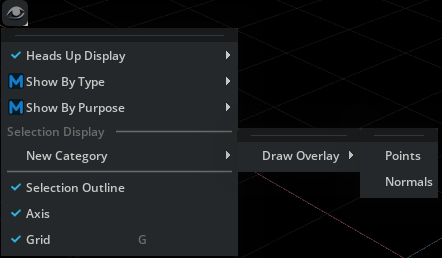

```{csv-table}
**Extension**: {{ extension_version }},**Documentation Generated**: {sub-ref}`today`
```

# Usage Examples

## Add Custom Display Settings

```python
from omni.kit.viewport.menubar.display import get_instance

# Register a custom display setting
instance = get_instance()
instance.register_custom_setting("Custom Visibility", "/exts/my_extension/custom_visibility")
```


## Add Custom Category Item to Builtin Category in Display Menu

```python
from omni.kit.viewport.menubar.display import get_instance
from omni.kit.viewport.menubar.core import CategoryCollectionItem, CategoryCustomItem, CategoryStateItem, SelectableMenuItem, ViewportMenuDelegate
import omni.ui as ui

def _build_menu():
  with ui.Menu("Attachments", delegate=ViewportMenuDelegate()):
    ui.MenuItem("None")
    ui.MenuItem("Selected")
    ui.MenuItem("All")

new_item = CategoryCollectionItem(
  "New Group",
  [
    CategoryStateItem("Joints", ui.SimpleBoolModel(True)),
    CategoryCustomItem("Attachments", _build_menu)
  ]
)
instance = get_instance()
instance.register_custom_category_item("Show By Type", new_item)
```


## Add New Category to Display Menu

```python
from omni.kit.viewport.menubar.display import get_instance
from omni.kit.viewport.menubar.core import CategoryCollectionItem, CategoryCustomItem, SelectableMenuItem
from omni import ui

category = "Draw Overlay"
section = "Selection Display"

def on_shown(s):
    print("on_shown: {s}")

overlay_item = CategoryCollectionItem(
  category,
  [
    CategoryCustomItem("Points", lambda: SelectableMenuItem("Points", model=ui.SimpleBoolModel())),
    CategoryCustomItem("Normals", lambda: SelectableMenuItem("Normals", model=ui.SimpleBoolModel()))
  ],
  shown_changed_fn=on_shown
)

instance = get_instance()
instance.register_custom_category_item("New Category", overlay_item, section)
```
