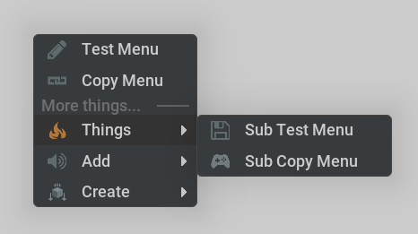
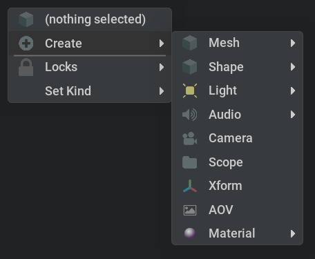
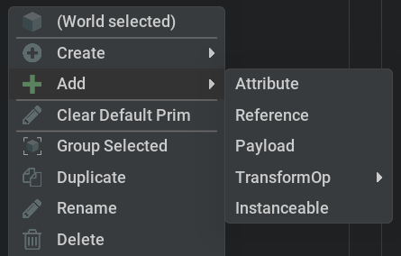
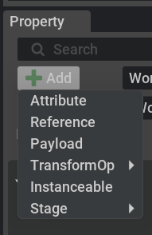

```{csv-table}
**Extension**: {{ extension_version }},**Documentation Generated**: {sub-ref}`today`
```

# Overview

This is the low level context menu that drives omni.kit.context_menu and other extensions. This is a widget.

## Implement a context menu in window

```{code-block} python
import omni.ui as ui
import omni.usd
import omni.kit.widget.context_menu
from omni.kit.widget.context_menu import DefaultMenuDelegate

# custom menu delegate
class MyMenuDelegate(DefaultMenuDelegate):
    def get_parameters(self, name, kwargs):
        if name == "tearable":
            kwargs[name] = False

class MyContextMenu():

    def __init__(self, window: ui.Window):
        # set window to call _on_mouse_released on mouse release
        window.frame.set_mouse_released_fn(self._on_mouse_released)
        # create menu delegate
        self._menu_delegate = MyMenuDelegate()

    def _on_mouse_released(self, x, y, button, m):
        """Called when the user presses & releases the mouse button"""
        if button == 0: # right mouse button only
            return

        # setup objects, this dictionary passed to all functions
        objects = {
            "stage": omni.usd.get_context().get_stage(),
            "prim_list": omni.usd.get_context().get_selection().get_selected_prim_paths(),
            "menu_xpos": x,
            "menu_ypos": y,
        }

        # setup context menus
        submenu_list = [
            {"name": "Sub Test Menu", "glyph": "menu_save.svg", "show_fn": [self.is_prim_selected], "onclick_fn": self.test_menu_clicked },
            {"name": "Sub Copy Menu", "glyph": "gamepad.svg", "onclick_fn": self.copy_menu_clicked},
        ]
        add_list = omni.kit.widget.context_menu.get_menu_dict("ADD", "")
        create_list = omni.kit.widget.context_menu.get_menu_dict("CREATE", "")

        menu_list = [
                {"name": "Test Menu", "glyph": "menu_rename.svg", "show_fn": [self.is_prim_selected], "onclick_fn": self.test_menu_clicked },
                {"name": "Copy Menu", "glyph": "menu_link.svg", "onclick_fn": self.copy_menu_clicked},
                {"name": "", "header": "More things..."},
                {'name': { 'Things': submenu_list }, "glyph": "menu_flow.svg", },
                {'name': { 'Add': add_list }, "glyph": "menu_audio.svg", },
                {'name': { 'Create': create_list }, "glyph": "physics_dark.svg", },
        ]

        # show menu
        omni.kit.widget.context_menu.get_instance().show_context_menu("My test context menu", objects=objects, menu_list=menu_list, delegate=self._menu_delegate)

    # show_fn functions
    def is_prim_selected(self, objects: dict):
        return bool(objects["prim_list"])

    # click functions
    def copy_menu_clicked(self, objects: dict):
        print("copy_menu_clicked")
        # add code here

    def test_menu_clicked(self, objects):
        print("test_menu_clicked")
        # add code here
```

which will look like this




## add to create menu

```{code-block} python
menu_dict = {
    'glyph': f"{EXTENSION_FOLDER_PATH}/data/fish_icon.svg",
    'name': 'Fish',
    'onclick_fn': on_create_fish
}
self._context_menu = omni.kit.widget.context_menu.add_menu(menu_dict, "CREATE")
```

Which can be found here.



## add to add menu

```{code-block} python
menu_dict = {
    'glyph': f"{EXTENSION_FOLDER_PATH}/data/cheese_icon.svg",
    'name': 'Cheese',
    'onclick_fn': on_create_cheese
}
self._context_menu = omni.kit.widget.context_menu.add_menu(menu_dict, "ADD")
```

Which can be found in these locations.


 

## Supported parameters by context menu dictionary

- "name" is name shown on menu. (if name is "" then a menu ui.Separator is added. Can be combined with show_fn).
- "glyph" is icon shown on menu, can use full paths to extensions.
- "name_fn" function to get menu item name.
- "show_fn" function or list of functions used to decide if menu item is shown. All functions must return True to show.
- "enabled_fn" function or list of functions used to decide if menu item is enabled. All functions must return True to be enabled.
- "onclick_fn" function to be called when user clicks menu item.
- "onclick_action" action to be called when user clicks menu item.
- "checked_fn" function returns True/False and shows solid/grey tick.
- "header" as be used with name of "" to use named ui.Separator.
- "populate_fn" a function to be called to populate the menu. Can be combined with show_fn.
- "appear_after" a identifier of menu name. Used by custom menus and will allow custom menu to change order.
- "show_fn_async" this is async function to set items visible flag. These behave differently to show_fn callbacks as the item will be created regardless and have its visibility set to False then its up-to the show_fn_async callback to set the visible flag to True if required.

```{code-block} python
    menu_list = [
            {"name": "Test Menu", "glyph": "menu_rename.svg", "show_fn_async": is_item_checkpointable, "onclick_fn": self.test_menu_clicked },
    ]

    async def is_item_checkpointable(objects: dict, menu_item: ui.MenuItem):
        """
        async show function. The `menu_item` is created but not visible, if this item is shown then `menu_item.visible = True`
        This scans all the prims in the stage looking for a material, if one is found then it can "assign material"
        and `menu_item.visible = True`
        """
        if "item" in objects:
            path = objects["item"].path
            if VersioningHelper.is_versioning_enabled():
                if await VersioningHelper.check_server_checkpoint_support_async(
                    VersioningHelper.extract_server_from_url(path)
                ):
                    menu_item.visible = True
```
