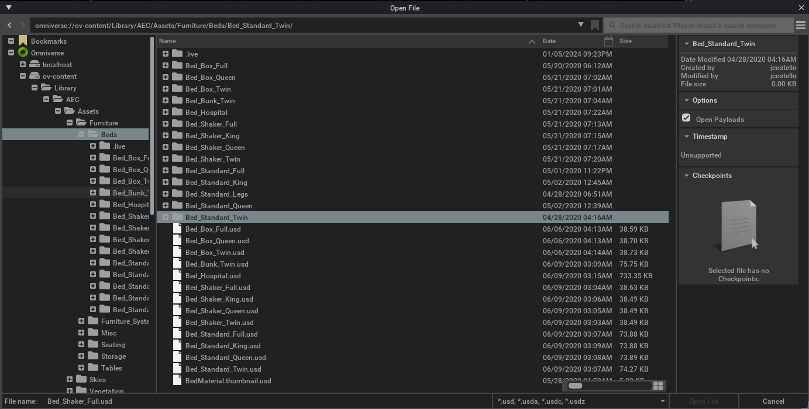
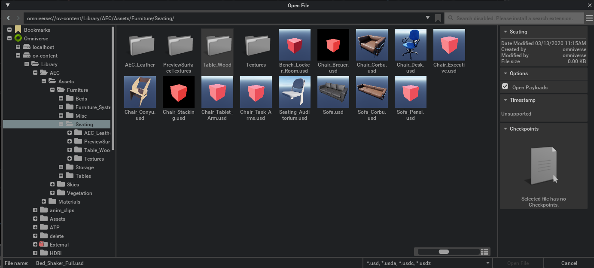

```{csv-table}
**Extension**: {{ extension_version }},**Documentation Generated**: {sub-ref}`today`
```

# Overview

This extension provides a widget to navigate through a filesystem while offering two options to display it, tree view and grid view.
- Tree View


- Grid View


Both views can mount multiple directories locally on the machine or remotely on servers, with remote servers being Omniverse Nucleus Servers. At the bottom of the hierarchy are file browser items which can be either folders or files.

```{mermaid}
graph TD;
    subgraph FileBrowserView
        FileBrowserTreeView
        FileBrowserGridView
    end
    FileBrowserWidget --> FileBrowserTreeView
    FileBrowserWidget --> FileBrowserGridView
    subgraph OmniverseServers["Omniverse Nucleus Servers(NucleusModel)"]
        OVContent["omniverse://ov-content"]
        OVTest["omniverse://ov-test"]
    end
    subgraph Directories["Directories(FileSystemModel)"]
        Assets["/assets"]
        Source["/source"]
        Data["/data"]
    end
    subgraph FileBrowserModel
        OmniverseServers
        Directories
    end
    FileBrowserTreeView --> OmniverseServers
    FileBrowserTreeView --> Directories
    FileBrowserGridView --> OmniverseServers
    FileBrowserGridView --> Directories
    subgraph FileSystemItem
        Fruits[fruits]
        Animals[animals]
        Dog["dog.usd"]
        Cat["cat.usd"]
        Goat["goat.usd"]
        Apple["apple.usd"]
        Pear["pear.usd"]
        Script1["script1.py"]
        Script2["script2.py"]
    end
    subgraph NucleusItem
        Table["table.usd"]
        Chair["chair.usd"]
    end
    subgraph FileBrowserItem
        FileSystemItem
        NucleusItem
    end
    Assets --> Fruits
    Assets --> Animals
    Animals --> Dog
    Animals --> Cat
    Animals --> Goat
    Fruits --> Apple
    Fruits --> Pear
    Source --> Script1
    Source --> Script2
    OVContent --> Table
    OVContent --> Chair
```

## Example
Here is a example to create the file browser widget under a window and adding a model to display items under "ov-content" server.
```
window = ui.Window("DemoFileBrowser", width=1000, height=500)
with window.frame:
    browser = FileBrowserWidget("Demo",
        allow_multi_selection=False,
        show_grid_view=True,
        # Only keep folders and USD files
        filter_fn=lambda item: item is not None and item._is_folder or item.path.endswith(".usd")
    )
    # Add a model NucleusModel or FileSystemModel
    model = NucleusModel("ov-content", "omniverse://ov-content")
    browser.add_model_as_subtree(model)
```