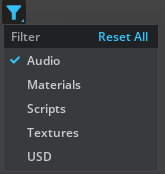

```{csv-table}
**Extension**: {{ extension_version }},**Documentation Generated**: {sub-ref}`today`
```

# Usage Examples

## Create a Filter Button with Option Items
```python
import omni.ui as ui
from omni.kit.widget.options_menu import OptionItem
from omni.kit.widget.filter import FilterButton

# Create filter option items
option_items = [
    OptionItem("audio", text="Audio"),
    OptionItem("materials", text="Materials"),
    OptionItem("scripts", text="Scripts"),
    OptionItem("textures", text="Textures"),
    OptionItem("usd", text="USD"),
]

# Display the filter button in a UI window
window = ui.Window("Filter Example Window", width=200, height=200)
with window.frame:
    with ui.VStack():
        # Create a filter button with the given option items
        filter_button = FilterButton(option_items)

# Set first filter item on
model = filter_button.model
model.get_item_children()[0].value = True
```
