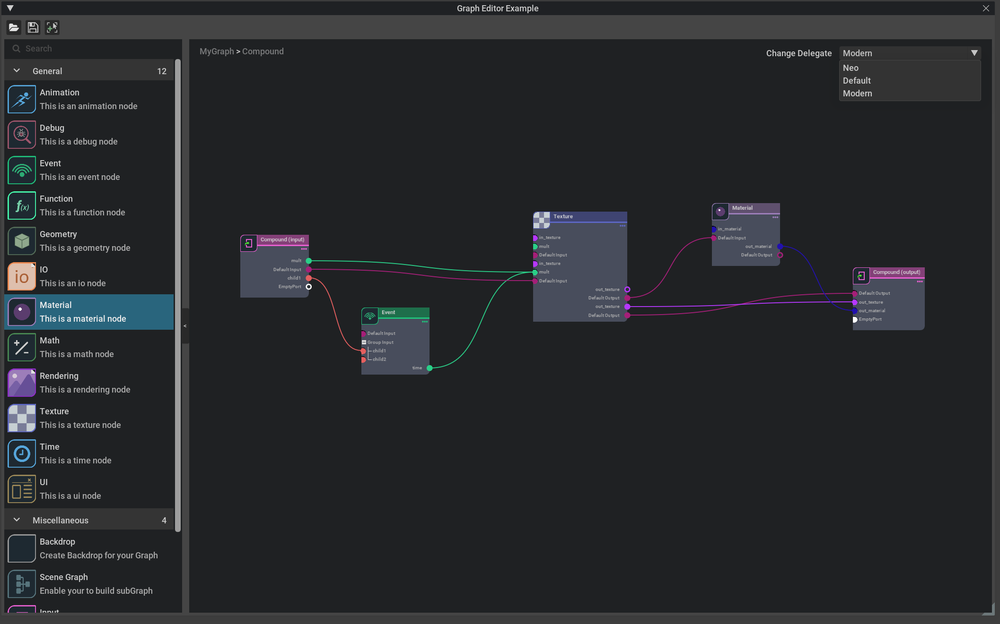

```{csv-table}
**Extension**: {{ extension_version }},**Documentation Generated**: {sub-ref}`today`
```

# Overview

Omni.kit.widget.graph provides the base for the delegate of graph nodes. It also defines the standard interface for graph models. With the layout algorithm, GraphView gives a visualization layer of how graph nodes display and how they connect/disconnect with each to form a graph.

## Delegate
The graph node's delegate defines how the graph node looks like. It has two types of layout: List and Column. It defines the appearance of the ports, header, footer and connection.

The delegate keeps multiple delegates and pick them depending on the
routing conditions. The conditions could be a type or a lambda expression. We use type routing to make the specific kind of nodes unique (e.g. backdrop delegate or compound delegate), and also we can use the lambda function to make the particular state of nodes unique (e.g. full expanded or collapsed delegate).

## Model
GraphModel defines the base class for the Graph model. It defines the standard interface to be able to interoperate with the components of the model-view architecture. The model manages two kinds of data elements. Node and port are the atomic data elements of the model.

## Widget
GraphNode Represents the Widget for the single node. Uses the model and the delegate to fill up its layout. The overall graph layout follows the method developed by Sugiyama which computes the coordinates for drawing the entire directed graphs. GraphView plays as the visualization layer of omni.kit.widget.graph. It behaves like a regular widget and displays nodes and their connections.

## Batch Position Helper
This extension also adds support for batch position updates for graphs. It makes moving a collection of nodes together super easy by inheriting from GraphModelBatchPositionHelper, such as multi-selection, backdrops etc.

## Relationship with omni.kit.graph.editor.core
For users to easily set up a graph framework, we provide another extension `omni.kit.graph.editor.core` which is based on this extension.

omni.kit.graph.editor.core is more on the application level which defines the graph to have a catalog view to show all the available graph nodes and the graph editor view to construct the actual graph by dragging nodes from the catalog view, while `omni.kit.widget.graph` is the core definition of how graphs work.

There is the documentation extension of `omni.kit.graph.docs` which explains how `omni.kit.graph.editor.core` is built up. Also we provide a real graph example extension called `omni.kit.graph.editor.example` which is based on `omni.kit.graph.editor.core`. It showcases how you can easily build a graph extension by feeding in your customized graph model and how to control the graph look by switching among different graph delegates.

Here is an example graph built from `omni.kit.graph.editor.example`:

