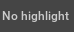
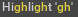
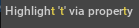
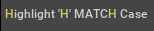
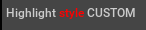

```{csv-table}
**Extension**: {{ extension_version }},**Documentation Generated**: {sub-ref}`today`
```

# Usage Examples

## Display Label Without Highlight
```python
from omni.kit.widget.highlight_label import HighlightLabel
import omni.ui as ui

window = ui.Window("Test Window", width=500, height=500)
with window.frame:
    HighlightLabel("No highlight")
```


## Highlight Entire Text
```python
from omni.kit.widget.highlight_label import HighlightLabel
import omni.ui as ui

window = ui.Window("Test Window", width=500, height=500)
with window.frame:
    HighlightLabel("Highlight All", highlight="Highlight All")
```


## Highlight Specific Substring
```python
from omni.kit.widget.highlight_label import HighlightLabel
import omni.ui as ui

window = ui.Window("Test Window", width=500, height=500)
with window.frame:
    HighlightLabel("Highlight 'gh'", highlight="gh")
```


## Set Highlight Through Property
```python
from omni.kit.widget.highlight_label import HighlightLabel
import omni.ui as ui

window = ui.Window("Test Window", width=500, height=500)
with window.frame:
    label = HighlightLabel("Highlight 't' via property")
    label.highlight = "t"
```


## Case-sensitive Highlight
```python
from omni.kit.widget.highlight_label import HighlightLabel
import omni.ui as ui

window = ui.Window("Test Window", width=500, height=500)
with window.frame:
    HighlightLabel("Highlight 'H' MATCH Case", highlight="H", match_case=True)
```


## Custom Style for Highlight
```python
from omni.kit.widget.highlight_label import HighlightLabel
import omni.ui as ui

CUSTOM_UI_STYLE = {
    "HighlightLabel": {"color": 0xFFFFFFFF},
    "HighlightLabel::highlight": {"color": 0xFF0000FF},
}

window = ui.Window("Test Window", width=500, height=500)
with window.frame:
    HighlightLabel("Highlight style CUSTOM", highlight="style", style=CUSTOM_UI_STYLE)
```
