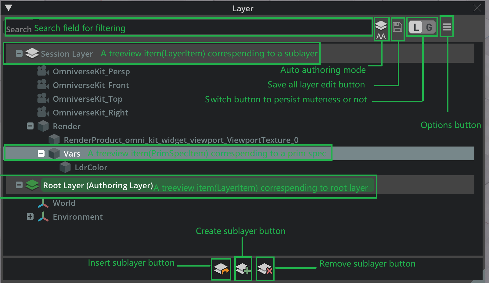
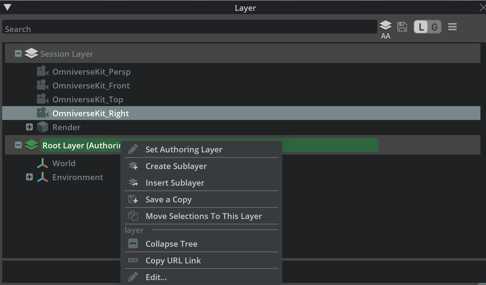
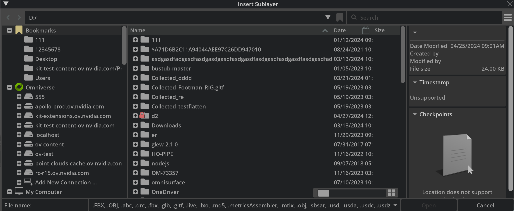
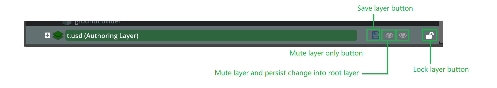

```{csv-table}
**Extension**: {{ extension_version }},**Documentation Generated**: {sub-ref}`today`
```

# Overview

The layer widget extension provides a widget for viewing and interacting with the USD layers in the local layer stack. By default, the widget
displays the current layer prim hierarchy, with one columns, namely the prim name. 


## Functionality

### Searching
```{eval-rst}
.. image:: search.png
    :width: 60%
```

In the search field, users can type in filter text for prim paths to search for prims with matching keywords. 

### Options Menu
```{eval-rst}
.. image:: options.png
    :width: 35%
```

In the options menu, user can toggle on/off layer widget options, or reset them.

### Context Menu


Right clicking in the stage widget will displays the stage widget context menu. Context include the current USD stage
context, prim selection, hovered prim, etc. For more details on context menu items, please refer to {py:class}`omni.kit.widget.layer.ContextMenu`.

## Insert/Create/Remove sublayer


Click the "Insert Sublayer" button on the widget bottom or menu item from the context menu, it shows a layer dialog that allows user to pick new sublayer path.


For the new inserted sublayer, there four new buttons allow user to save/mute/lock the new layer.
