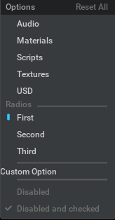
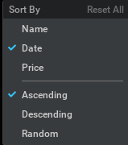

# Usage Examples

## Create an OptionsMenu with Various Items

```python
from omni.kit.widget.options_menu import OptionsMenu, OptionsModel, OptionItem, OptionSeparator, OptionRadios, OptionCustom
import omni.ui as ui

# Define a custom build function for the custom menu item
def custom_build_function():
    return ui.Label("Custom Option")

# Define radio options
radios = [
    ("Radios", None),
    "First",
    ("Second", "Second Radio"),
    "Third",
]

# Create an options model with items
options_model = OptionsModel(
    "Options",
    [
        OptionItem("audio", text="Audio"),
        OptionItem("materials", text="Materials"),
        OptionItem("scripts", text="Scripts"),
        OptionItem("textures", text="Textures"),
        OptionItem("usd", text="USD"),
        OptionRadios(radios, default="First"),
        OptionSeparator(),
        OptionCustom(build_fn=custom_build_function),
        OptionSeparator(),
        OptionItem("Disabled", enabled=False),
        OptionItem("Disabled and checked", default=True, enabled=False),
    ]
)

# Instantiate and display the options menu
options_menu = OptionsMenu(model=options_model)
options_menu.show_at(100, 100)  # Position where the menu will appear
```


## Rebuild OptionsMenu

```python
import omni.ui as ui
from omni.kit.widget.options_menu import OptionsMenu, OptionsModel, OptionItem, OptionSeparator, OptionCustom

# Function to build custom menu items
def build_custom_menu_item():
    ui.Label("Custom Menu Item")

# Initialize the options model with various items
model = OptionsModel(
    "Options",
    [
        OptionItem("Audio", text="Audio"),
        OptionItem("Materials", text="Materials"),
        OptionItem("Scripts", text="Scripts"),
        OptionSeparator(),
        OptionCustom(build_custom_menu_item)  # Using OptionCustom for custom build function
    ]
)

# Create and display an options menu
menu = OptionsMenu(model)
menu.show_at(100, 100)  # Display the menu at position (100, 100)

# ... Perform some operations that may change the menu items' values ...
items = model.get_item_children()
items[1].value = True # Set 'Materials' to checked

# Replace with new items
model.rebuild_items(
    [
        OptionItem("Test"),
        OptionSeparator(),
        OptionItem("More"),
    ])
```

## Get and Set Values of Menu Items

```python
import omni.ui as ui
from omni.kit.widget.options_menu import OptionsMenu, OptionsModel, OptionItem, OptionSeparator, OptionCustom

# Function to build custom menu items
def build_custom_menu_item():
    ui.Label("Custom Menu Item")

# Initialize the options model with various items
model = OptionsModel(
    "Options",
    [
        OptionItem("Audio", text="Audio"),
        OptionItem("Materials", text="Materials"),
        OptionItem("Scripts", text="Scripts"),
        OptionSeparator(),
        OptionCustom(build_custom_menu_item)  # Using OptionCustom for custom build function
    ]
)

# Create and display an options menu
menu = OptionsMenu(model)
menu.show_at(100, 100)  # Display the menu at position (100, 100)

# Get the list of items from the model
items = model.get_item_children()

# Example of setting a specific item's value
items[0].value = True  # Set the "Audio" option item to checked

# Example of getting a specific item's value
audio_is_checked = items[0].value  # Get the value of the "Audio" option item
```

## RadioMenu
```python
from omni.kit.widget.options_menu import RadioMenu, RadioModel

field_model = RadioModel(["Name", "Date", "Price"], default_index=1)
order_model = RadioModel(["Ascending", "Descending", "Random"])
        
menu = RadioMenu("Sort By", [field_model, order_model])
menu.show_at(100, 100)
```


