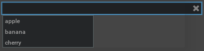
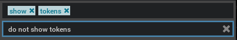

# Usage Examples

## Create a General Search Field with Callback

```python
from typing import List, Optional
from omni.kit.widget.searchfield import SearchField
from omni import ui

def on_search(search_words: Optional[List[str]]):
    if search_words is not None:
        print(f"Now searching {search_words}")

search_field = SearchField(on_search_fn=on_search)
```


## Create a Search Field with Suggestions

```python
from omni.kit.widget.searchfield import SearchField
from omni import ui

search_field = SearchField(suggestions=["apple", "banana", "cherry"])
```


## Create a Search Field without Tokens

```python
from omni.kit.widget.searchfield import SearchField
from omni import ui

search_field = SearchField(show_tokens=True)
search_field.search_words = ["show", "tokens"]

search_field_no_tokens = SearchField(show_tokens=False)
search_field_no_tokens.text = "do not show tokens"
```

