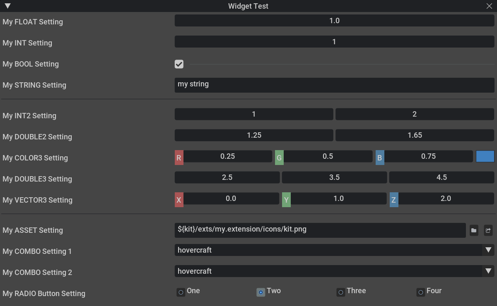

```{csv-table}
**Extension**: {{ extension_version }},**Documentation Generated**: {sub-ref}`today`
```

# Overview

omni.kit.widget.settings has a library of widget functions that access values via settings, used by:
- omni.kit.property.transform
- omni.kit.viewport.menubar.core
- omni.kit.window.extensions
- [omni.kit.window.preferences](https://docs.omniverse.nvidia.com/kit/docs/omni.kit.window.preferences/)
- omni.rtx.window.settings

# Adding widgets to your UI

## 1. Define settings in toml
extension.toml
```
[settings]
persistent.exts."my.extension".mySettingFLOAT = 1.0
persistent.exts."my.extension".mySettingINT = 1
persistent.exts."my.extension".mySettingBOOL = true
persistent.exts."my.extension".mySettingSTRING = "my string"
persistent.exts."my.extension".mySettingCOLOR3 = [0.25, 0.5, 0.75]
persistent.exts."my.extension".mySettingDOUBLE3 = [2.5, 3.5, 4.5]
persistent.exts."my.extension".mySettingINT2 = [1, 2]
persistent.exts."my.extension".mySettingDOUBLE2 = [1.25, 1.65]
persistent.exts."my.extension".mySettingVECTOR3 = [0, 1, 2]
persistent.exts."my.extension".mySettingASSET = "${kit}/exts/my.extension/icons/kit.png"
persistent.exts."my.extension".mySettingCombo1 = "hovercraft"
persistent.exts."my.extension".mySettingCombo2 = 1
persistent.exts."my.extension".mySettingRADIO.value = "Two"
persistent.exts."my.extension".mySettingRADIO.items = ["One", "Two", "Three", "Four"]
```
## 2. Build the UI
example.py
```
import omni.ui as ui
from omni.kit.widget.settings import SettingType, SettingWidgetType, create_setting_widget, create_setting_widget_combo, SettingsSearchableCombo

PERSISTENT_SETTINGS_PREFIX = "/persistent"

my_window = ui.Window("Widget Test", width=800, height=800)
with my_window.frame:
    with ui.VStack(spacing=10):
        combo_list = ["my", "hovercraft", "is", "full", "of", "eels"]

        with ui.HStack(height=24):
            ui.Label("My FLOAT Setting", width=ui.Percent(35))
            create_setting_widget(PERSISTENT_SETTINGS_PREFIX + "/exts/my.extension/mySettingFLOAT", SettingType.FLOAT)

        with ui.HStack(height=24):
            ui.Label("My INT Setting", width=ui.Percent(35))
            create_setting_widget(PERSISTENT_SETTINGS_PREFIX + "/exts/my.extension/mySettingINT", SettingType.INT)

        with ui.HStack(height=24):
            ui.Label("My BOOL Setting", width=ui.Percent(35))
            create_setting_widget(PERSISTENT_SETTINGS_PREFIX + "/exts/my.extension/mySettingBOOL", SettingType.BOOL)

        with ui.HStack(height=24):
            ui.Label("My STRING Setting", width=ui.Percent(35))
            create_setting_widget(PERSISTENT_SETTINGS_PREFIX + "/exts/my.extension/mySettingSTRING", SettingType.STRING)

        ui.Separator(height=5)

        with ui.HStack(height=24):
            ui.Label("My INT2 Setting", width=ui.Percent(35))
            create_setting_widget(PERSISTENT_SETTINGS_PREFIX + "/exts/my.extension/mySettingINT2", SettingType.INT2)

        with ui.HStack(height=24):
            ui.Label("My DOUBLE2 Setting", width=ui.Percent(35))
            create_setting_widget(PERSISTENT_SETTINGS_PREFIX + "/exts/my.extension/mySettingDOUBLE2", SettingType.DOUBLE2)

        with ui.HStack(height=24):
            ui.Label("My COLOR3 Setting", width=ui.Percent(35))
            create_setting_widget(PERSISTENT_SETTINGS_PREFIX + "/exts/my.extension/mySettingCOLOR3", SettingType.COLOR3)

        with ui.HStack(height=24):
            ui.Label("My DOUBLE3 Setting", width=ui.Percent(35))
            create_setting_widget(PERSISTENT_SETTINGS_PREFIX + "/exts/my.extension/mySettingDOUBLE3", SettingType.DOUBLE3)

        with ui.HStack(height=24):
            ui.Label("My VECTOR3 Setting", width=ui.Percent(35))
            create_setting_widget(PERSISTENT_SETTINGS_PREFIX + "/exts/my.extension/mySettingVECTOR3", SettingWidgetType.VECTOR3)

        ui.Separator(height=5)

        with ui.HStack(height=24):
            ui.Label("My ASSET Setting", width=ui.Percent(35))
            create_setting_widget(PERSISTENT_SETTINGS_PREFIX + "/exts/my.extension/mySettingASSET", SettingType.ASSET)

        with ui.HStack(height=24):
            ui.Label("My COMBO Setting 1", width=ui.Percent(35))
            create_setting_widget_combo(PERSISTENT_SETTINGS_PREFIX + "/exts/my.extension/mySettingCombo1", combo_list)

        with ui.HStack(height=24):
            ui.Label("My COMBO Setting 2", width=ui.Percent(35))
            create_setting_widget_combo(PERSISTENT_SETTINGS_PREFIX + "/exts/my.extension/mySettingCombo2", combo_list, setting_is_index=True)

        with ui.HStack(height=24):
            ui.Label("My RADIO Button Setting", word_wrap=True, width=ui.Percent(35))
            create_setting_widget(PERSISTENT_SETTINGS_PREFIX + "/exts/my.extension/mySettingRADIO/value", SettingWidgetType.RADIOBUTTON)

```

Which looks like this


