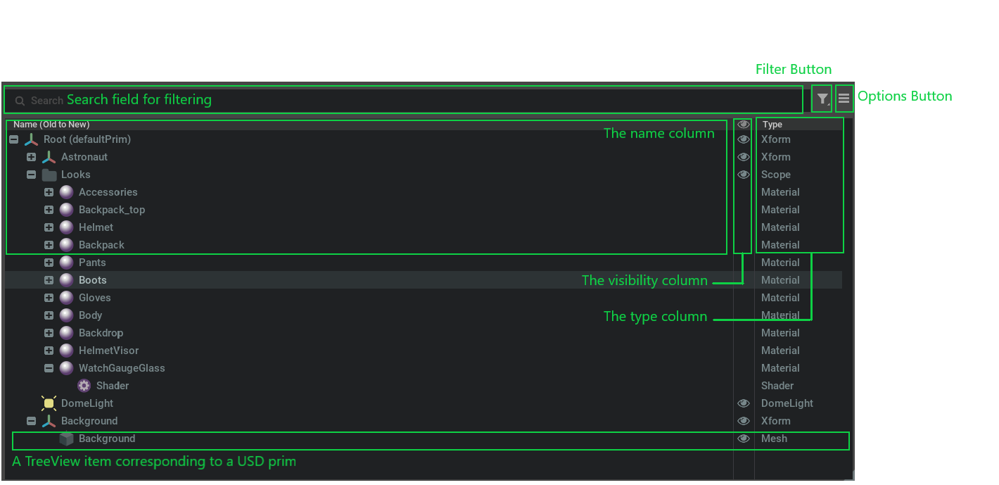
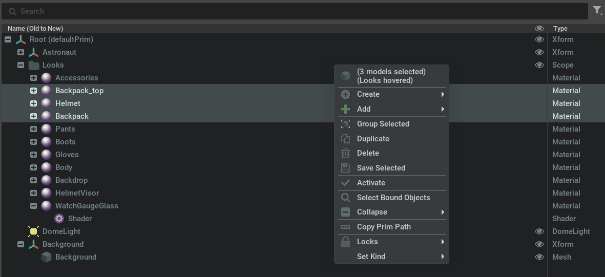

```{csv-table}
**Extension**: {{ extension_version }},**Documentation Generated**: {sub-ref}`today`
```

# Overview

The stage widget extension provides a widget for viewing and interacting with the USD stage. By default, the widget
displays the current stage prim hierarchy, with three columns, namely the prim name, type and visibility column. It also
provides API for customization for stage columns, so that users are able to register their own column delegates.


## Functionality

### Searching
```{eval-rst}
.. image:: search.png
    :width: 60%
```

In the search field, users can type in filter text for prim paths to search for prims with matching keywords. Matched
pattern will be higtlighted. When "Flat List Search" is enabled in the options menu, search results will be displayed as
a flat list regardless of the prim hierarchy. Otherwise search results will maintain their prim hierarchy.

### Filtering
```{eval-rst}
.. image:: filter.png
    :width: 20%
```

With the filter button, users can filter to specific types of prims as shown in the above image, or filter by the states
of the prim (hidden, inactive, undefined, abstract).

### Options Menu
```{eval-rst}
.. image:: options.png
    :width: 35%
```

In the options menu, user can toggle on/off stage widget options, or reset them.

### Sorting
```{eval-rst}
.. image:: sort.png
    :width: 60%
```

If a column delegate supports sorting, users can sort prims by sort policy provided for that column. Here's an example
of sorting options for the name column.

### Re-ordering
By default, users can drag and drop prims to re-parent prims and change the prim hierarchy. When "Enable Children Reorder"
is enabled in the options menu, users can re-order prims by drag and dropping tree view items.

### Context Menu


Right clicking in the stage widget will displays the stage widget context menu. Context include the current USD stage
context, prim selection, hovered prim, etc. For more details on context menu items, please refer to {py:class}`omni.kit.widget.stage.ContextMenu`.


## Column Delegate
Users can create custom `StageColumnDelegate` to add a custom column in the stage widget. For details on how to achieve
this, please refer to [Creating Custom Stage Column Delegate](USAGE_PYTHON.md#creating-custom-stage-column-delegates).


## Commands
There are two commands defined in the current extension: `ChangePrimDisplayName` and `ReorderPrimCommand`. Please refer
to {py:class}`omni.kit.widget.stage.ChangePrimDisplayNameCommand` and {py:class}`omni.kit.widget.stage.ChangePrimDisplayNameCommand`
for more details.
