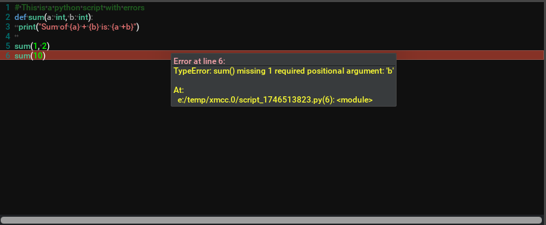

# omni.kit.widget.text_editor

## Overview

It's binding of ImGuiColorTextEdit in omni.ui, syntax highlighting text editor.
It approximates typical code editor look and feel.



## Fonts

TextEditor widget supports fonts from style

```
import omni.ui as ui
from omni.kit.widget.text_editor import TextEditor

font = "c:/windows/fonts/consola.ttf"

my_window = ui.Window("Example", width=600, height=300)
with my_window.frame:
    TextEditor(
        text="The quick brown fox",
        style={"font": font})
```

## Syntax Highlighting

TextEditor widget supports many languages to highlight the syntax.

This is the list of the languages:

```
TextEditor.Syntax.NONE
TextEditor.Syntax.PYTHON
TextEditor.Syntax.CPLUSPLUS
TextEditor.Syntax.HLSL
TextEditor.Syntax.GLSL
TextEditor.Syntax.C
TextEditor.Syntax.SQL
TextEditor.Syntax.ANGELSCRIPT
TextEditor.Syntax.LUA
```

```
import omni.ui as ui
from omni.kit.widget.text_editor import TextEditor

font = "c:/windows/fonts/consola.ttf"

my_window = ui.Window("Example", width=600, height=300)
with my_window.frame:
    TextEditor(
        text=open(__file__).read(),
        style={"font": font},
        syntax=TextEditor.Syntax.PYTHON)
```
