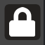

# Toolbar Usage Examples

To register widgets on a [Toolbar](omni.kit.widget.toolbar/omni.kit.widget.toolbar.Toolbar), first you need a [WidgetGroup](omni.kit.widget.toolbar/omni.kit.widget.toolbar.WidgetGroup) to host your `omni.ui` widgets. For how to create a custom [WidgetGroup](omni.kit.widget.toolbar/omni.kit.widget.toolbar.WidgetGroup), check out [](USAGE_WIDGET_GROUP).

Here we will be using a [SimpleToolButton](omni.kit.widget.toolbar/omni.kit.widget.toolbar.SimpleToolButton) to create the WidgetGroup with one `omni.ui.ToolButton` and register it with the Toolbar.

```python
from carb.input import KeyboardInput as Key
from omni.kit.widget.toolbar import SimpleToolButton, get_instance

# Create a WidgetGroup using SimpleToolButton
simple_button = SimpleToolButton(
    name="test_simple",
    tooltip="Test Simple ToolButton",
    icon_path='${glyphs}/lock_open.svg',
    icon_checked_path='${glyphs}/lock.svg',
    hotkey=Key.L,
    toggled_fn=lambda c: print(f"Toggled {c}")
)

# Get the global instance of Toolbar widget
toolbar = get_instance()

# Add the WidgetGroup to the Toolbar
toolbar.add_widget(widget_group=simple_button, priority=100)
```

You should see a new button added to the toolbar.


When you click on it, the icon shape will change from "unlocked" to "locked" and print `Toggled True` in the console, and the button shows a pressed background.



To remove the button from toolbar, simply do

```python
# Remove button from toolbar
toolbar.remove_widget(simple_button)

# Cleanup the button object
simple_button.clean()
del simple_button
```
