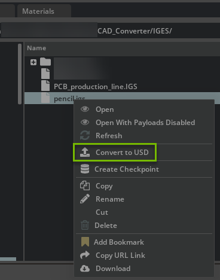

# CAD Converter

## 1.0 Overview

### 1.1 Introduction

The CAD Converter extension (omni.kit.converter.cad) depends on the HOOPS, DGN, and JT extensions for conversion from many common CAD file formats to USD.

### 1.2 System Requirements

To run Omniverse Kit and Omniverse Kit Apps, users must follow the below technical requirements.

Driver Version Requirements:
| Driver Version Support | Windows                                                    | Linux                                                 |
| ---------------------- | ---------------------------------------------------------- | ----------------------------------------------------- |
| Recommended            | 537.58 (GameReady, Studio), 537.70 (RTX/Quadro, Grid/vGPU) | 535.129.03 (GameReady, Studio, RTX/Quadro, Grid/vGPU) |
| Minimum                | 537.58 (GameReady, Studio), 537.70 (RTX/Quadro, Grid/vGPU) | 535.129.03 (GameReady, Studio, RTX/Quadro, Grid/vGPU) |

Suggested Minimums by Product:
| Product | Supported Operating Systems | Min CPU: (intel/amd) | Min Ram | Min GPU | Min Disk |
| --- | --- | --- | --- | --- | --- |
| Kit | <ul><li>Windows 10/11</li><li>Ubuntu 20.04/22.04</li><li>CentOS 7</li></ul> | <ul><li>Intel i7 Gen 5</li><li>AMD Ryzen</li></ul> | 16GB | GeForce RTX 3070 | 250GB |
| <ul><li>USD Presenter</li><li>USD Composer</li><li>USD Explorer</li></ul> | <ul><li>Windows 10/11</li><li>Ubuntu 20.04/22.04</li><li>CentOS 7</li></ul> | <ul><li>Intel i7 Gen 5</li><li>AMD Ryzen</li></ul> | 16GB | GeForce RTX 3070 | 250GB |


Please consult Omniverse documentation for details on technical requirements: https://docs.omniverse.nvidia.com/materials-and-rendering/latest/common/technical-requirements.html


### 1.3 Formats and Features Supported

The following file formats are supported by CAD Converter:

- CATIA V5 Files (`*.CATPart, *.CATProduct, *.CGR`)
- CATIA V6 Files (`*.3DXML`)
- IFC Files (`*.IFC, *.IFCZIP`)
- NX - Unigraphics Files (`*.PRT`)
- Parasolid Files (`*.XMT, *.X_T, *.X_B, *.XMT_TXT`)
- SolidWorks Files (`*.SLDPRT, *.SLDASM`)
- STL Files (`*.STL`)
- ACIS Files (`*.SAT, *.SAB`)
- Autodesk Inventor Files (`*.IPT, *.IAM`)
- Autodesk 3DS Files (`*.3DS`)
- AutoCAD 3D Files (`*.DWG, *.DXF`)
- Creo - Pro/E Files (`*.ASM, *.PRT`)
- Revit Files (`*.RVT, *.RFA`)
- Solid Edge Files (`*.ASM, *.PAR, *.PWD, *.PSM`)
- Step/Iges (`*.STEP, *.IGES`)
- JT Files (`*.JT`)
- DGN (`*.DGN`)
- OBJ Files (`*.OBJ`)
- FBX Files (`*.FBX`)
- 3MF Files (`*.3MF`)
- GLTF Files (`*.GLTF, *.GLB`)

**_NOTE:_** The file formats \*.fbx, \*.obj, \*.gltf, \*.glb, \*.lxo, \*.md5, \*.e57 and \*.pts are supported by Asset Converter and also available by default.

**_NOTE:_** If expert tools such as PTC Creo, Autodesk Revit or Autodesk Alias are installed, we recommend using the corresponding connectors. These provide more extensive options for conversion.

**_NOTE:_** CAD Assemblies may not work when converting files from Nucleus. When converting assemblies with external references we recommend either working with local files or using Omniverse Drive.


### 1.4 Known Issues and Unsupported

- Some DGN geometry data is not supported and will not convert USD mesh. If you have an example of such a DGN file, please let us know so we can troubleshoot and fix any remaining issues.
- Converting to USD can take more memory and CPU power depending on the type of data and Tessellation settings. File size is not an indicator of how fast a conversion will take or how much memory is required. In most cases we recommend a minimum of 16 GB. Complex files will need up to 32 GB of memory available for conversion.
- PMI and BIM data is not converted.
- Most properties are not converted to USD attributes.

We recommend converting Revit and Creo files using the Connectors instead of the CAD Converter for best results.


### 1.5 Getting Help

Enterprise Customers can report Omniverse issues here: https://www.nvidia.com/en-us/omniverse/enterprise/support/
Alternatively, uses can also report Omniverse issues on NVIDIA forums:  https://forums.developer.nvidia.com/t/how-to-report-an-issue-with-omniverse/199675


## 2.0 Related Extensions

These related extensions make up the CAD Converter. This extension provides import tasks to the extensions through their interfaces. The DGN Core extension, however, is launched and provided configuration options through a subprocess to avoid library conflicts with those loaded by the other converters.


### 2.1 Converter Core Extensions

- Hoops Core: {doc}`omni.kit.converter.hoops_core<omni.kit.converter.hoops_core:Overview>`
- DGN Core: {doc}`omni.kit.converter.dgn_core<omni.kit.converter.dgn_core:Overview>`
- JT Core: {doc}`omni.kit.converter.jt_core<omni.kit.converter.jt_core:Overview>`


### 2.2 Converter Wrapper Extensions

- Hoops GUI: {doc}`omni.kit.converter.hoops<omni.kit.converter.hoops:Overview>`
- DGN GUI: {doc}`omni.kit.converter.dgn<omni.kit.converter.dgn:Overview>`
- JT GUI: {doc}`omni.kit.converter.jt<omni.kit.converter.jt:Overview>`

### 2.3 Converter Versions Included:

- omni.kit.converter.common = {version = 500.4.0}
- omni.kit.converter.hoops_core = {version = 501.3.0}
- omni.kit.converter.dgn_core = {version = 500.3.0}
- omni.kit.converter.jt_core = {version = 500.3.0}
- omni.kit.converter.hoops = {version = 501.3.0}
- omni.kit.converter.dgn = {version = 500.3.0}
- omni.kit.converter.jt = {version = 500.3.0}
- omni.services.convert.asset = {version = 500.2.0}
- omni.services.convert.cad = {version = 500.3.0}

### 2.3 Services

- Asset Converter Service: {doc}`omni.services.convert.asset<omni.services.convert.asset:Overview>`
- CAD Converter Service: {doc}`omni.services.convert.cad<omni.services.convert.cad:Overview>`


### 2.4 Utils

- Converter Common: {doc}`omni.kit.converter.common<omni.kit.converter.common:Overview>`


## 3.0 Usage UI/UX

The CAD Converter GUI extensions are available on builds of USD Composer, USD Explorer, and Isaac Sim. To obtain any of these Omniverse Apps, go to https://docs.omniverse.nvidia.com/launcher/latest/overview.html for steps to download and install the Omniverse Launcher. The Omniverse Launcher provides access and installs Omniverse Apps.

### 3.1 Omniverse Apps Import Functionality

To begin conversion of a CAD, open any one of these three Omniverse Apps. The user can then import the CAD file into Omniverse as a USD file through the File menu or through the Content window.


### 3.1.1 Import through the File menu

To import a CAD file into Omniverse, choose `Import` in the `File` menu. Use this method to import CAD Data into your scene - either by reference or directly into your stage.


### 3.1.2 Begin "Import" through the Content Window
By default the Content window is located at the bottom of the Omniverse App. It contains panels for showing a tree hierarchy of the user's file system along with icon or list representation of the files in the currently open folder. If it is not shown, go to the toolbar, select "Window", and then select "Content". To convert a CAD file to USD, select the file in the Content window and choose `Convert to USD` in the context menu with right mouse button.



Request arguments:

```json
"import_path": ""
```

Full path to the CAD File to convert.

```json
"output_path": ""
```

Full path to the ouptut usd file.

```json
"converter_option": { "bInstancing": true }
```

Converter options to use. Refer to `omni.kit.converter.hoops_core`, `omni.kit.converter.jt_core`, and `omni.kit.converter.dgn_core` for configuration options. This takes precendence over the config_path option below.

```json
"config_path": ""
```

Full path to converter config file. It will be deprecated in the future and use of converter_option is preferred. Refer to `omni.kit.converter.hoops_core`, `omni.kit.converter.jt_core`, and `omni.kit.converter.dgn_core` for configuration options.

### Sample Input JSON:

```json
{
  "import_path": "/ANCHOR.sldprt",
  "output_path": "/tmp/testing/ANCHOR.usd",
  "converter_options": { "bInstancing": true },
  "config_path": "/sample_config.json",
}
```

To use the DGN Converter, the parameter must be set to "DGN Converter". This is shown with the following request body example:


### Sample Input JSON for DGN:

```json
{
  "import_path": "/tmp/input_file.dgn",
  "output_path": "/tmp/output_file.usd",
  "converter_options" : { "bInstancing": true },
  "config_path": "/tmp/sample_config.json",
}
```

## 1.0 How to set your extension up as a Kit Service

This section goes over how to build and register a converter extension with the CAD Converter Service Extension in the Omniversion Application USD Composer for testing.

An example of setting up an extension as a Kit Service can be found at https://docs.omniverse.nvidia.com/services/latest/services/services_convert.html.

This section assumes you have already developed a converter backend with Python bindings and module with the naming convention of omni.connect.{file format} (e.g., `"omni.connect.foo"`) available for interfacing with your converter extension as well as a helper class for accessing this interface. Registering with the Service extension also requires a method to be called for creating conversion tasks for your extension. This section also assumes you have this method (e.g., `create_converter_task`) to call your converter backend to begin conversion.

This section is divided into what extensions to add as dependencies to gain access to important Python modules and necessary modifications to your extension including inheritance and imported methods with their required parameters.

### 1.1 Adding the Common Converter and CAD Service extensions as a depedency

This sub-section adds the service extension as a dependency to your extension. This allows your kit extension to look for and load the service extension's python module and import important classes and variables. This is done by adding a dependency to an extension's extension.toml file. All kit extensions need this file to define its name, dependencies, version number, author names, etc.

1. Navigate to your extension.toml - you can place your extension file here: {repository_root}/source/extensions/{extension name}/config/extension.toml

2. Modify your dependencies section to add the Common Converter and CAD Service extensions

```text
[dependencies]
"omni.kit.converter.common" = { version = "500.0.0"}
"omni.services.convert.cad" = { version = "500.0.0", optional = true }
```

### 1.2 Setting up your extension to register and un-register with the service extension

Now that you added the Converter Common extension in your extension.toml file, you will have to import the module `omni.kit.converter.common`. You do not need to import the entire module, only the class `ICadCoreExtBase` and method `initialize_connect_sdk`. The former is a base class (from omni.kit.converter.common/python/cad_core_ext_base.py) that we can inherit from that handles registering and un-registering extensions with the CAD Service extension. It adds variables such as `"FILTER_DATA"` and `"OPTIONS_CLS"` necessary for the CAD Service extension to determine whether a converter extension can process the incoming conversion task.

To inherit from the class, add the class name to your class like below:

```python
class FOOConverter(ICadCoreExtBase):
```

Within this class, you need to add your filters (`"FILTER_DATA"`), options (`"OPTIONS_CLS"`), and the service title (`"SERVICE_TITLE"`). The first two will be discussed later in subsections 1.3 and 1.4.

```python
FILTER_DATA = FOO_CORE_FILTER_DATA
OPTIONS_CLS = FOOOptions
SERVICE_TITLE = "FOO Converter"
```

The methods `on_startup` and `on_shutdown` are required and must be defined. You can create global instances and call the base class's `_on_startup` and `_on_shutdown`.

```python
def on_startup(self, ext_id):
    """
    Initialize the FOO Converter and/or registers the service
    """
    global _global_instance
    _global_instance = weakref.ref(self)
    super()._on_startup(ext_id)

def on_shutdown(self):
    """
    Uninitialize the FOO Converter and/or un-registers the service
    """
    global _global_instance
    _global_instance = None
    super()._on_shutdown()
```

### 1.3 Add filters for file format conversion

CAD converter extension filters list what formats (`"FOO_CONVERTER_SUPPORTED_FORMATS"`) are supported by a converter. The filter data (`"FOO_CORE_FILTER_DATA"`) contains the name of the converter extension denoted by "CAD Converter - {name of converter}", the filter regular expressions, and the filter descriptions.

1. Create a file under your extension : {repository_root}/source/extensions/omni.kit.converter.my_core/python/impl/filters.py

```python
from omni.kit.converter.common import ConverterFilterData

# list of supported file formats by omni.kit.convert.my_core
FOO_CONVERTER_SUPPORTED_FORMATS = ["(.*\\.FOO$)"]

FOO_CORE_FILTER_DATA = [
    ConverterFilterData("CAD Converter - FOO", ["(.*\\.FOO$)"], ["FOO Files (*.FOO)"]),
]
```

### 1.4 Add options

Import the following classes and methods from the Converter Common extension:
* ConverterStatus - a tuple containing the error code (0 if successful) and the error message
* OmniClientWrapper - used to check whether a folder exists
* OmniUrl - creates a URL valid for Nucleus
* ProgressLogConsumer - optional; used for parsing the converter logs for progress in CAD Converter GUI extension; see omni.kit.converter.common/python/progress_log_consumer.py
* run_scene_opt - runs the scene optimizer extension as a post-process to run the user's config file or JSON object or to generate UVs for meshes or remove hidden prims

### 2.1 Enabling your Kit Service on USD Composer

Follow these instructions to set up the Service extension and other converter extensions in Composer:

1. Ensure you have built the CAD Converter extensions.

2. Open Composer using Kit 106 (e.g., version 2024.1.0).

3. Open the Extensions Manager window.

4. Click the three-horizontal bar icon to access Settings (refer to the screenshot below):

   

5. Add the path to the built Service extension's containing folder and the folders of other converters (e.g., `{repository_root}/_build/{platform}/{config}/exts`).

6. Enable the Service extension first, and then enable the converters.


### 2.2 Testing your Kit Service through OpenAPI

1. Once the Service extension is enabled, navigate to the local host link in a web browser. The link should scroll you down to the CAD section.

```text
http://localhost:8111/docs#/cad/asset_convert_convert_cad_process_post
```

2. Select "Try it out" and apply the following settings:

    - `import_path`: Path to the file to be converted.
    - `output_path`: Path to the usd output file.
    - `converter_options`: Dictionary representing the converter options to use.
    - `config_path`: Path to the JSON config file (optional and soon to be deprecated).

```text
{
 "import_path": "C:/Github/cad-converter-service-ext/test_data/1-box-1.SLDPRT",
 "output_path": "C:/Github/cad-converter-service-ext/test_data/1-box-1.usd",
 "converter_options": { "bInstancing": true },
 "config_path": "C:/Github/hoops-exchange-cad-converter/data/Omni_CADConverterConfig_Annotated_Simplified.json",
}
```

3. Once you have updated the settings, select "Cheese".

### 2.3 Running the CAD Converter service extension on a CAD Container

You can publish job definitions only one extension:
* Linux: `./repo.sh job_def_publish --ext {extension.name}`
* Windows: `repo.bat job_def_publish --ext {extension.name}`

This can also be done by supplying the .kit file of the job definition

### 3.3 Container Deployment

1. Go to the CAD Converter Service job definition deployment, https://ov-taas-deploy.sc-paas.nvidia.com/release/dashboard/definition/cad-converter. This URL was defined during publishing in subsection 3.2.

2. Click the "Log In" button. You do not need to enter credentials. Here you will see job definitions published in the previous subsection.

3. Click the "Deploy" button.

4. For `Deploy Target`, select `Stage-A`.

5. Select container image:
  * Click on the drop-down menu and select the desired container image, OR
  * From NGC (https://registry.ngc.nvidia.com/orgs/nvidian/teams/omniverse/containers/ov-kit-taas/tags) copy and paste the custom image tag.
    * If you do not have access to NGC, go to https://stage-a.us-east-1.nv-ov.farm/queue/management/jobs/load to access the latest version and use the image for the `"container"` key for `"cad-converter"`.
  * If all looks good, click the Deploy button. You should see a confirmation page.

### 3.4 Testing
You need a local kit.exe and files `example_submit_farm_job.py` and `heads_list.txt`.
* `heads_list.txt` - list of CAD files to convert
* `example_submit_farm_job.py` - Python script to submit to Stage-A

Use a local kit file to submit the job by executing the Python script example_submit_farm_job.py.
* Monitor the tasks here (https://stage-a.us-east-1.nv-ov.farm/queue/management/dashboard/tasks?sortBy=submittedAt&sortOrder=desc).
CLI Args:

```text
--output-dir= {output directory for converted USD files}
--heads-list= {list of CAD files to convert}
--farm-url= {TAAS container staging path} # https://stage-a.us-east-1.nv-ov.farm/ (use this for Stage-A)
```

Example:
```text
C:\Gitlab\cad-converter-service-ext\_build\windows-x86_64\release\kit\kit.exe --/log/outputStreamLevel=Info --enable omni.client --enable omni.kit.pip_archive --exec "./example_submit_farm_job.py --output-dir=omniverse://kit-test-content.ov.nvidia.com/Projects/Converters_Test_Models/outputs --heads-list=./heads_list.txt --farm-url=https://stage-a.us-east-1.nv-ov.farm/"
```
