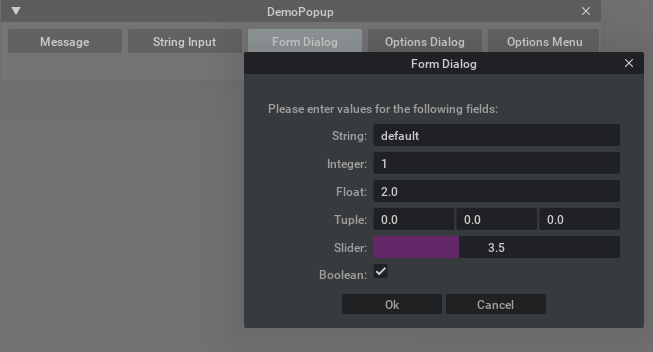
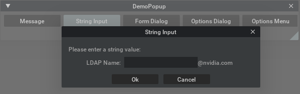
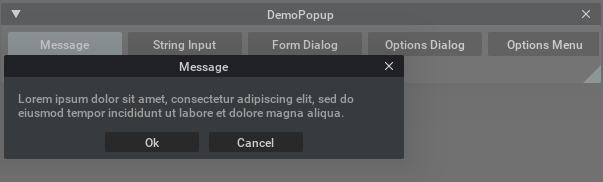
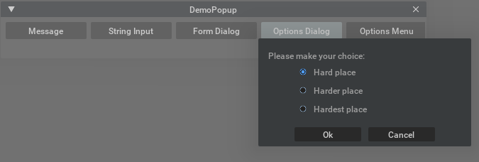
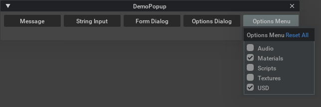

```{csv-table}
**Extension**: {{ extension_version }},**Documentation Generated**: {sub-ref}`today`
```

# Overview

A set of simple Popup Dialogs for passing user inputs. All of these dialogs subclass from the base PopupDialog, 
which provides OK and Cancel buttons. The user is able to re-label these buttons as well as associate callbacks 
that execute upon being clicked.

Why you should use the dialogs in this extension:

* Avoid duplicating UI code that you then have to maintain.
* Re-use dialogs that have standard look and feel to keep a consistent experience across the app.
* Inherit future improvements.

## Form Dialog

A form dialog can display a mixed set of input types.



Code for above:

```{literalinclude} ../../../../source/extensions/omni.kit.window.popup_dialog/scripts/demo_popup_dialog.py
---
language: python
start-after: BEGIN-DOC-form-dialog
end-before: END-DOC-form-dialog
dedent: 8
---
```

## Input Dialog

An input dialog allows one input field.



Code for above:

```{literalinclude} ../../../../source/extensions/omni.kit.window.popup_dialog/scripts/demo_popup_dialog.py
---
language: python
start-after: BEGIN-DOC-input-dialog
end-before: END-DOC-input-dialog
dedent: 8
---
```

## Message Dialog

A message dialog is the simplest of all popup dialogs; it displays a confirmation message before executing some action.



Code for above:

```{literalinclude} ../../../../source/extensions/omni.kit.window.popup_dialog/scripts/demo_popup_dialog.py
---
language: python
start-after: BEGIN-DOC-message-dialog
end-before: END-DOC-message-dialog
dedent: 8
---
```

## Options Dialog

An options dialog displays a set of checkboxes; the choices optionally belong to a radio group - meaning only one
choice is active at a given time.



Code for above:

```{literalinclude} ../../../../source/extensions/omni.kit.window.popup_dialog/scripts/demo_popup_dialog.py
---
language: python
start-after: BEGIN-DOC-options-dialog
end-before: END-DOC-options-dialog
dedent: 8
---
```

## Options Menu

Similar to the options dialog, but displayed in menu form.



Code for above:

```{literalinclude} ../../../../source/extensions/omni.kit.window.popup_dialog/scripts/demo_popup_dialog.py
---
language: python
start-after: BEGIN-DOC-options-menu
end-before: END-DOC-options-menu
dedent: 8
---
```

## Demo app

A complete demo, that includes the code snippets above, is included with this extension at "scripts/demo_popup_dialog.py".