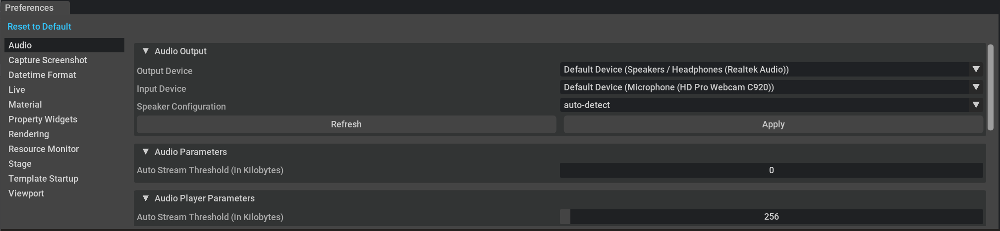
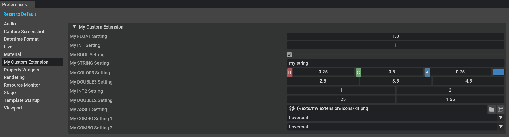

```{csv-table}
**Extension**: {{ extension_version }},**Documentation Generated**: {sub-ref}`today`
```

# Overview

omni.kit.window.preferences has a window where users customize settings.



NOTE: This document is going to refer to pages, a page is a `PreferenceBuilder` subclass and has name and builds UI. See `MyExtension` below

# Adding preferences to your extension

To create your own preference's pane follow the steps below:

## 1. Register hooks/callbacks so page can be added/remove from omni.kit.window.preferences as required
```
def on_startup(self):
    ....
    manager = omni.kit.app.get_app().get_extension_manager()
    self._preferences_page = None
    self._hooks = []
    # Register hooks/callbacks so page can be added/remove from omni.kit.window.preferences as required
    # keep copy of manager.subscribe_to_extension_enable so it doesn't get garbage collected
    self._hooks.append(
        manager.subscribe_to_extension_enable(
            on_enable_fn=lambda _: self._register_page(),
            on_disable_fn=lambda _: self._unregister_page(),
            ext_name="omni.kit.window.preferences",
            hook_name="my.extension omni.kit.window.preferences listener",
        )
    )
    ....

def on_shutdown(self):
    ....
    self._unregister_page()
    ....

def _register_page(self):
    try:
        from omni.kit.window.preferences import register_page
        from .my_extension_page import MyExtensionPreferences

        self._preferences_page = register_page(MyExtensionPreferences())
    except ModuleNotFoundError:
        pass

def _unregister_page(self):
    if self._preferences_page:
        try:
            import omni.kit.window.preferences

            omni.kit.window.preferences.unregister_page(self._preferences_page)
            self._preferences_page = None
        except ModuleNotFoundError:
            pass
```
## 2.Define settings in toml
extension.toml
```
[settings]
persistent.exts."my.extension".mySettingFLOAT = 1.0
persistent.exts."my.extension".mySettingINT = 1
persistent.exts."my.extension".mySettingBOOL = true
persistent.exts."my.extension".mySettingSTRING = "my string"
persistent.exts."my.extension".mySettingCOLOR3 = [0.25, 0.5, 0.75]
persistent.exts."my.extension".mySettingDOUBLE3 = [2.5, 3.5, 4.5]
persistent.exts."my.extension".mySettingINT2 = [1, 2]
persistent.exts."my.extension".mySettingDOUBLE2 = [1.25, 1.65]
persistent.exts."my.extension".mySettingASSET = "${kit}/exts/my.extension/icons/kit.png"
persistent.exts."my.extension".mySettingCombo1 = "hovercraft"
persistent.exts."my.extension".mySettingCombo2 = 1

```
## 3.Subclass PreferenceBuilder to customize the UI
my_extension_page.py
```
import carb.settings
import omni.kit.app
import omni.ui as ui
from omni.kit.window.preferences import PreferenceBuilder, show_file_importer, SettingType, PERSISTENT_SETTINGS_PREFIX


class MyExtensionPreferences(PreferenceBuilder):
    def __init__(self):
        super().__init__("My Custom Extension")

        # update on setting change, this is required as setting could be changed via script or other extension
        def on_change(item, event_type):
            if event_type == carb.settings.ChangeEventType.CHANGED:
                omni.kit.window.preferences.rebuild_pages()

        self._update_setting = omni.kit.app.SettingChangeSubscription(PERSISTENT_SETTINGS_PREFIX + "/exts/my.extension/mySettingBOOL", on_change)

    def build(self):
        combo_list = ["my", "hovercraft", "is", "full", "of", "eels"]

        with ui.VStack(height=0):
            with self.add_frame("My Custom Extension"):
                with ui.VStack():
                    self.create_setting_widget("My FLOAT Setting", PERSISTENT_SETTINGS_PREFIX + "/exts/my.extension/mySettingFLOAT", SettingType.FLOAT)
                    self.create_setting_widget("My INT Setting", PERSISTENT_SETTINGS_PREFIX + "/exts/my.extension/mySettingINT", SettingType.INT)
                    self.create_setting_widget("My BOOL Setting", PERSISTENT_SETTINGS_PREFIX + "/exts/my.extension/mySettingBOOL", SettingType.BOOL)
                    self.create_setting_widget("My STRING Setting", PERSISTENT_SETTINGS_PREFIX + "/exts/my.extension/mySettingSTRING", SettingType.STRING)
                    self.create_setting_widget("My COLOR3 Setting", PERSISTENT_SETTINGS_PREFIX + "/exts/my.extension/mySettingCOLOR3", SettingType.COLOR3)
                    self.create_setting_widget("My DOUBLE3 Setting", PERSISTENT_SETTINGS_PREFIX + "/exts/my.extension/mySettingDOUBLE3", SettingType.DOUBLE3)
                    self.create_setting_widget("My INT2 Setting", PERSISTENT_SETTINGS_PREFIX + "/exts/my.extension/mySettingINT2", SettingType.INT2)
                    self.create_setting_widget("My DOUBLE2 Setting", PERSISTENT_SETTINGS_PREFIX + "/exts/my.extension/mySettingDOUBLE2", SettingType.DOUBLE2)
                    self.create_setting_widget("My ASSET Setting", PERSISTENT_SETTINGS_PREFIX + "/exts/my.extension/mySettingASSET", SettingType.ASSET)
                    self.create_setting_widget_combo("My COMBO Setting 1", PERSISTENT_SETTINGS_PREFIX + "/exts/my.extension/mySettingCombo1", combo_list)
                    self.create_setting_widget_combo("My COMBO Setting 2", PERSISTENT_SETTINGS_PREFIX + "/exts/my.extension/mySettingCombo2", combo_list, setting_is_index=True)
```

What does this do?
- `subscribe_to_extension_enable` adds a callback for `on_enable_fn` / `on_disable_fn`. `on_enable_fn` will trigger on running kit or even enabling/disabling omni.kit.window.preferences from extension manager will trigger `on_enable_fn` / `on_disable_fn`
- `_register_page` registers new page to omni.kit.window.preferences
- `_unregister_page` removes new page from omni.kit.window.preferences
- `MyExtension` is definition of new page name "My Custom Extension" will appear in list of names on left hand side of omni.kit.window.preferences window

NOTES:
- Multiple extensions can add same page name like "My Custom Extension" and only one "My Custom Extension" will appear in list of names on left hand side of omni.kit.window.preferences window but all pages will be shown when selecting page
- build function can build any UI wanted and isn't restricted to `self.create_xxx` functions
- mySettingCombo1 uses combobox with settings as string 
- mySettingCombo1 uses combobox with settings as integer

My Custom Extension page will look like this


