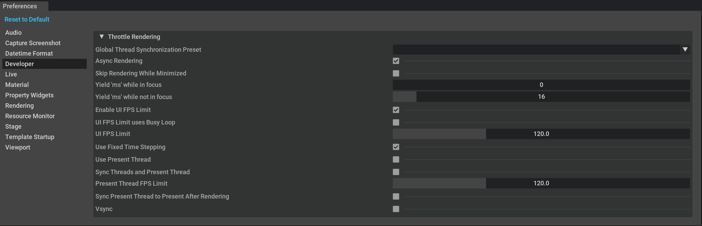

```{csv-table}
**Extension**: {{ extension_version }},**Documentation Generated**: {sub-ref}`today`
```

# Settings

## /exts/omni.kit.window.preferences/show_globals
- default is true
- shows/hides the "globals" page when true/false. These are things like "Reset to Default" button

## /exts/omni.kit.window.preferences/show_rendering
- default is true
- shows/hides the "Rendering" page when true/false

## /exts/omni.kit.window.preferences/show_audio
- default is true
- as the AudioPreferences page was moved to omni.kit.audiodeviceenum extension, so this may not be used anymore
- shows/hides the "Audio" page when true/false

## /exts/omni.kit.window.preferences/show_resource_monitor
- default is true
- as the ResourceMonitorPreferences page was moved to omni.resourcemonitor extension, so this may not be used anymore
- show/hides the "Resource Monitor" page when true/false

## /exts/omni.kit.window.preferences/show_tagging
- default is true
- as the TaggingPreferences page was moved to omni.kit.property.tagging extension, so this may not be used anymore
- show/hides the "Tagging" page when true/false

## /exts/omni.kit.window.preferences/show_thumbnail_generation_mdl
- default is true
- as the ThumbnailGenerationPreferences page was moved to omni.kit.thumbnails.usd extension, so this may not be used anymore
- show/hides the "Thumbnail Generation" page when true/false

## /app/show_developer_preference_section
- default is false
- shows/hides the "Developer" page when true/false


