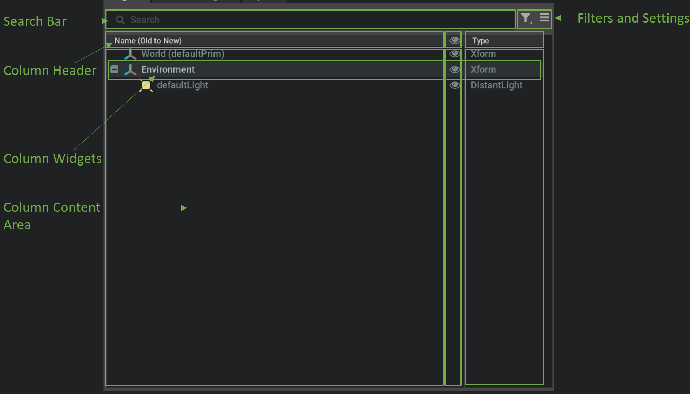

```{csv-table}
**Extension**: {{ extension_version }},**Documentation Generated**: {sub-ref}`today`
```

# Overview

## Introduction

Stage window is the frontend UI that presents the hierarchy of the stage in the default {py:class}`omni.usd.UsdContext`. And it dynamically tracks the changes to the stage and updates the hierarchy in an effient way. User can also adjust the hierarchy of the stage through the UX. Stage window is built on top of the core widget {py:mod}`omni.kit.widget.stage` with
customized settings.

## Layout

Following is an image of the stage window, which presents the default layout with 3 default columns: name, visibility, and type.



For each prim in the stage, it's presented as a row in the window with several columns, and the hierarchy of the stage is presented as a collapsible tree. The columns are customizable except the default name column through the settings button. Developers can
implement new column delegate to add a new column for each row also. You can refer to {py:mod}`omni.kit.widget.stage` for reference.
