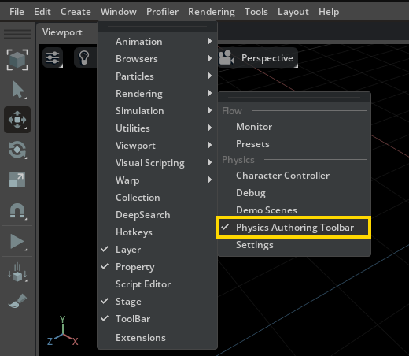
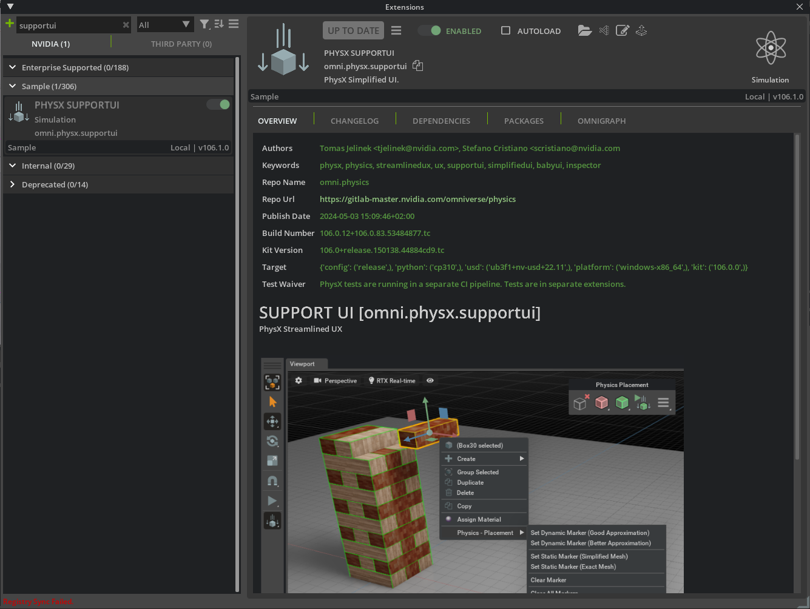
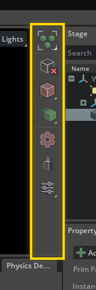
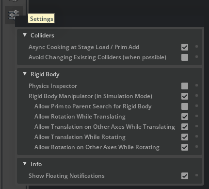
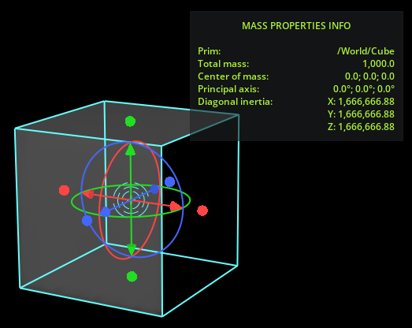
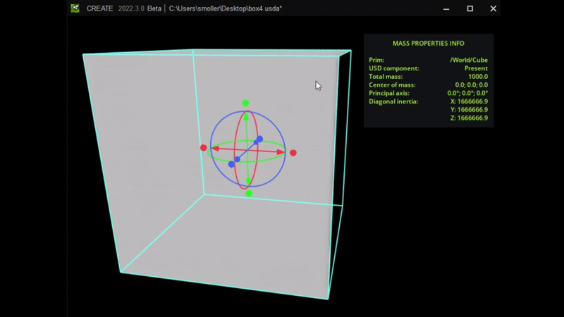
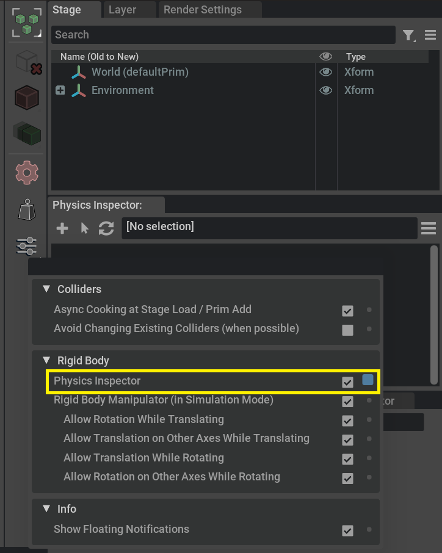
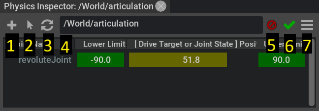
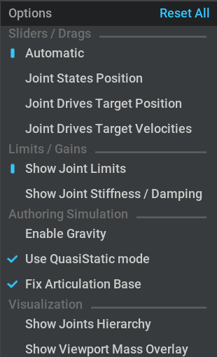

.. include:: ../../../../../../dev_guide/_links.rst

.. _Physics Authoring Toolbar:

============================================
Physics Authoring Toolbar
============================================

The **Physics Authoring Toolbar** is designed to streamline the user experience in physics authoring by making it more accessible and automated.

It is part of the :ref:`Omni PhysX Support UI` extension.

Verify that the Extension is Enabled
#####################################

To verify that the extension is loaded, check for the **Physics Authoring Toolbar** menu item. If it's missing, the extension is not loaded.

Enable the Extension
####################

To enable the extension:

#. Navigate to **Window > Extensions**.
#. Enter "supportui" in the search bar.
#. Locate and select the **Support UI** extension.
#. Toggle **Enabled** to activate the extension.
#. Select the **Check Mark** for auto-load to load the extension automatically on app start if desired.
#. Close the **Extensions Panel**.
#. Click **Window > Simulation > Physics Authoring Toolbar** and verify that you can see the physics authoring toolbar docked on the right of the viewport.

Physics Authoring Toolbar
-------------------------

The toolbar allows for:

- Creating static and dynamic colliders with rigid bodies.
- Enabling automated creation of colliders.
- Removing all physics components on selected assets.
- Enabling rigid body manipulator and selection mode.
- Enabling the Mass Distribution Manipulator. 
- Enabling the Physics Inspector.

==================================== =====================================================================================================
Action                               Description
==================================== =====================================================================================================
Rigid Body Selection Mode            Toggles selection mode, which always tries to select an asset that contains a rigid body component.
Remove Physics Components            Removes all physics components on selected assets.
Create Static Colliders              Creates static collider types on selected assets.
Create Dynamic Colliders             Creates dynamic collider types on selected assets.
Automatic Creation of Colliders      Toggles automated creation of colliders.
Mass Distribution Manipulator        Toggles the :ref:`Mass Distribution Manipulator<Mass Distribution Manipulator>`.
Settings                             Configures additional options, including the :ref:`Physics Inspector<Physics Inspector>`
==================================== =====================================================================================================

Rigid Body Selection Mode
#########################

*Rigid Body Selection Mode* is a special selection mode.
When enabled, it will change the viewport selection behavior according to the following procedure:

- If the clicked asset contains a rigid Body component it will get selected.
- If the current selection does not have any rigid boy component, it finds and selects the closest parent node of the selected one.
- If there is no rigid body found, the current selection is preserved.

.. image:: images/rigid_body_selection_mode.gif

Rigid Body Manipulator
######################

The extension brings a custom version of the viewport gizmo manipulator called the *Rigid Body Manipulator*.  
This tool works when you try to change position and rotation of objects in the viewport during simulation.
When active during simulation, the transform gizmo translates and rotates objects using physics forces, that will cause 
physics actors to properly collide with each other.

.. note:: The *Rigid Body Manipulator* is enabled by default, but works only in *Simulation Mode* and only with physics-ready assets that have a rigid body component in their hierarchy.

.. image:: images/rigid_body_manipulator.gif

.. note:: Scaling is not supported.

Remove Physics Components
#########################

Removes all physics components (USD Physics related API) from selected assets, for example:

- Collision API
- Rigid Body API
- Mass API
- ...

Create Static Colliders
#######################

Creates non-moveable colliders on all selected geometric assets and on their geometric children.

.. note:: While set to Static, objects cannot be moved with the transform gizmo.

Collider type can be selected using the **Mass Distribution Manipulator** button’s drop-down menu.  
Hold left mouse button for a bit to open it.

Supported collider types:
    - **Triangle Mesh** = Exact Mesh, no approximation
    - **Mesh Simplification Approximation** = Simplified Mesh

.. note:: All existing rigid body components will be removed.

Create Dynamic Colliders
########################

Creates moveable colliders with rigid bodies on all selected geometric assets and on their geometric children.

More details on how the rigid body creation algorithm works:

- If selected assets have their Kind set to ``component``, rigid bodies are created on the component level. In this case, you are supposed to select just the parent asset. If there is no component kind, the top most node from each selected asset gets a rigid body created.
- If selected assets have an already existing rigid body component, there is no change.
- If selected assets have an already existing rigid body component on some parent node, no change happens and a warning is produced.

The collider type can be selected using the collider drop-down menu (hold left mouse button for a bit to open it).

Supported types:
    - **Convex Hull Approximation**
    - **Convex Decomposition Approximation**

Automatic Creation of Colliders
###############################

When enabled, colliders are automatically generated as soon as:

- Assets are added to a stage.
- Any missing colliders are created, typically right after a stage is loaded.

.. _authoringToolbarSettings:

Settings
#########################

**Colliders** section
    - **Async Cooking at Stage Load / Prim Add** 
        - Enabled by default
        - Async :ref:`Cooking<meshCooking>` is triggered each time an asset is added to the stage
        - Async :ref:`Cooking<meshCooking>` is triggered each time a stage is loaded
        - A progress bar will be shown in the viewport to signal that the background cooking process is executing

    - **Avoid Changing Existing Colliders (when possible)** 
        - Disabled by default
        - Prevents changing existing collider types when creating new ones

**Rigid Body** section
    - **Physics Inspector**
        - This option toggles the :ref:`Physics Inspector<Physics Inspector>` panel

    - **Rigid Body Manipulator (in Simulation Mode)** 
        - Enabled by default
        - If enabled, the transform gizmo in simulation mode is moving and rotating objects that contain a rigid body using physics force, therefore objects properly collide with each other, links are used etc. Scaling is not supported
        - Refer to the toolbar section for more details

    - There are additional options available.
        - **Allow Prim to Parent Search for Rigid Body** 
            - Disabled by default
            - If activated and the selected prim lacks a rigid body, the manipulator can traverse up the hierarchy to find a parent with a rigid body, allowing for manipulation through physics forces.
        - **Allow Rotation While Translating** 
            - Enabled by default
            - Allows manipulated object to rotate when translating in a selected gizmo direction
        - **Allow Translation on Other Axes While Translating** 
            - Enabled by default
            - Allows translated object to be translated also on other axes than ones that were selected via the gizmo.
        - **Allow Translation While Rotating** 
            - Enabled by default
            - Allows manipulated object to translate when rotating in a selected gizmo direction
        - **Allow Rotation on Other Axes While Rotating** 
            - Enabled by default
            - Allows rotated object to be rotated also on other axes than ones that were selected via the gizmo

Info section:
    - **Show Floating Notifications** 
        - Enabled by default
        - You can turn off notifications if you find them too distracting. They are normally shown each time a collider is created or when physics components are removed

.. _Mass Distribution Manipulator:

Mass Distribution Manipulator
-----------------------------

For realistic interaction between a rigid body and various forces as well as other bodies, it is important that the total mass is right, and also that the internal mass *distribution* properties are properly configured. By default, these are computed automatically based on the geometry of the collider of the rigid body, under the assumption that there is uniform distribution throughout the provided geometry. However, in some cases, you might want attributes that reflect a non-uniform distribution. For example, when you have a car with a heavy base, which results in a lower center of mass. With the Mass Distribution Manipulator tool you can edit these attributes visually.

.. note:: To set the *total mass* of the rigid body, you have to add the Mass component to the object and edit the value in the corresponding section in the `property panel <https://docs.omniverse.nvidia.com/extensions/latest/ext_core/ext_property-panel.html>`_

**To enable the tool:**

1. Select a rigid body object.
2. Click the **Mass Distribution Manipulator** button on the toolbar.

The stippled cyan circles show the current location of the center of mass. 

**To manipulate the location**, pull the arrows of the main gizmo:

The outer cyan box indicates the distribution of the mass relative to the center. It displays the dimensions of a rectangular cuboid body with evenly distributed mass that corresponds to the current set attributes. 

Even if your rigid body is not shaped like a cube, you can still use this to approximate the proper values. For example, if your rigid body is solid, try to make the cube roughly match the average extents on each dimension. If your rigid body has a lot of empty space inside (like a barrel or a car) and the mass is concentrated at the edges, the cyan cube should be scaled to be bigger than the body (up to twice the size for a thin walled body).

You can manipulate the shape of the box in two ways: 

* by using the circular handles:

   .. image:: images/mass_dist_scale_handle.png
      :alt: Tweak the distribution with the gizmo.

* by rotating the shape by using the circles around the gizmo center. Setting this allows you to better fit the diagonal inertia to your concrete body:

   .. image:: images/mass_dist_man_rotate.gif
      :alt: Manipulate the principal axes with the gizmo.

.. _Physics Inspector:

Physics Inspector
-----------------

Physics Inspector enables authoring single articulations and joints (or a selection) isolated from the rest of a larger simulation.

Authoring means, for example:
- Changing the value of a joint drive in a single articulation.
- Simulating all the rigid bodies of that articulation, moving the articulation to the desired position / state.

Features:
############################
- Supported Joint Types:
   - Revolute Joints
   - Prismatic Joints
- Supported Joint API:
   - Joint States API (|PhysxJointStateAPI|)
      - Position attribute (state:position)
   - Joint Drives API (|UsdDriveAPI|)
      - Drive Target attribute (drive:target)
      - Drive Velocity attribute (drive:velocity)
- Supported Joint Attributes:
   - Joint Gains Attributes
      - Stiffness (physics:stiffness)
      - Damping (physics:damping)
   - Joint Limits Attributes
      - Upper Limit (physics:upperLimit)
      - Lower Limit (physics:lowerlimit)
- User Interface
   - Multiple Panels to edit multiple articulations
   - Commit / Discard simulation changes
- Supports authoring:
   - During Simulation
   - Outside of Simulation
- Advanced Options:
   - Simulation Options
      - Enable / Disable  Gravity
      - Enable / Disable Fixed articulation base
      - Enable / Disable QuasiStatic mode
   - Visualization Options
      - Show Joints Hierarchy
   - Selection Helpers
      - Quick select all Colliders connected to a Joint
      - Quick select all Bodies connected to a Joint
      - Quick select all Joints connected to a Body
      - Quick select all Colliders connected to a Body

Enable the Physics Inspector
############################

Click the **Physics Inspector** checkbox under the settings of the physics authoring toolbar:

A new window named **Physics Inspector** appears below the stage panel.

Basic Usage Tutorial
################################
To create a basic revolute joint, with two colliders and a rigid body, load the *Joint State* demo.

#. Navigate to **Window > Simulation > Demo Scenes**.
#. In the **Physics Demo Scenes** tab, search for *Joint State* demo and select it.
#. Click the **Load Scene** button.

   .. image:: images/inspector_basic_usage-1.png
      :alt: Load Demo scene

After enabling **Physics Inspector**, as shown in the previous paragraph:

#. Click **Select Articulation** in the Physics Inspector toolbar.
#. Select the articulation at */World/articulation* from the newly shown modal window.
#. Press **Select**.

   .. image:: images/inspector_basic_usage-2.png
      :alt: Select Articulation

#. Modify the *[Drive Target or Joint State Position]* slider.
#. Click the **Commit Changes** button (green checkmark).
#. The position of the blue box is now permanently modified in the stage.

   .. image:: images/inspector_basic_usage-3.png
      :alt: Change Joint State Position

Toolbar
################################

#. **New Inspector Panel**: Creates a new **Inspector** panel that can be later associated with an articulation or a stage selection
#. **Select Articulation**: Shows a modal popup window filtering only articulations (|UsdArticulationRootAPI|) to select one for the inspector panel
#. **Use Selection**: Associates current stage selection with the inspector panel
#. **Current Selection**: Displays the articulation or selection currently associated with the inspector panel
#. **Discard Changes**: Discards any change done by current inspector panel *[Only shown if there are actual changes]*
#. **Commit Changes**: Commits permanently to USD any change done by current inspector panel *[Only shown if there are actual changes]*
#. **Options**: Shows some advanced visualization and simulation options

Advanced Options
################################

Pressing the **Options** button shows a child menu with some more advanced entries:

#. **Sliders / Drags**

   #. **Automatic**: Inspector will map the sliders to Joint Drive Target or Joint State Position
   #. **Joint States Position**: Inspector will map the sliders to Joint State Position (instantly moves the joint to that location)
   #. **Joint Drives Target Position**: Inspector will map the sliders to Joint Drives Target Position (simulates the joint from current position to target drive position)
   #. **Joint Drives Target Velocities**: Inspector will map the sliders to Joint Drives Target Velocities (constant velocity of Joint Drive)

#. **Limits / Gains**

   #. **Show Joint Limits**: Two columns of the inspector modify Joints Lower and Upper limits
   #. **Show Joint Stiffness / Damping**: Two columns of the inspector modify Joints Gains (stiffness / damping)

#. **Authoring Simulation**

   #. **Enable Gravity**: Controls if gravity should be enabled when running the isolated authoring simulation
   #. **Use QuasiStatic Mode**: Enables the QuasiStatic mode on the Scene used for the isolated authoring simulation
   #. **Fix Articulation Base**: Controls if the root node of an articulation should be fixed when authoring it (useful to avoid effects of gravity and reaction forces when using drives for non-fixed articulations)

#. **Visualization**

   #. **Show Joints Hierarchy**: Shows a Tree View with the constructed joint hierarchy from parsing the |UsdArticulationRootAPI| inside ``omni.physx``
   #. **Show Viewport Mass Overlay**: Shows an overlay on the main viewport for each body part of the authoring simulation, displaying mass / intertia information

Selection
################################
Physics inspector simulates only USD prims that have been associated with a window using one of the **Select Articulation** or **Use Selection** buttons.
Any other prim in the scene will be excluded from the authoring simulation run by inspector.

Example:

#. Create or load a stage with multiple articulations:

   #. On Isaac Sim you can use any of the provided assets with **Create** > **Isaac** > **Robots**.
#. Select one articulation by pressing the **Select Articulation** button and choosing the first one from the modal dialog.
#. Change the Joint position value using the *[Drive Target or Joint State Position]* sliders.
   The first articulation will be modified.
#. Select a different articulation by pressing **Select Articulation** and choosing a different articulation from the modal dialog.
#. Change joints using the *[Drive Target or Joint State Position]* sliders.
   The second articulation will be modified.

.. note:: Selecting any USD node under **ArticulationRootAPI** will extend the selection to the entire articulation in the inspector. For everything else you will have to select all joints and bodies / colliders meant to be inspected (or a common parent containing them).

.. raw:: html

   

      

      

      

      
      
      

   

Commit or Discard Inspector Changes
############################################

Every time some value is modified inside the inspector, simulation is run to update the impacted physics bodies. If this is being done outside of a regular full stage simulation, the inspector gives an option to commit (accept) or discard (cancel) simulation results.

If not explicitly committed, the simulation results are automatically discarded when the simulation is entered or if the inspector panel gets closed. In this case, a message is printed on the main viewport to inform you of authoring simulation results.

.. raw:: html

   

      

      

      

      
      
      

   

.. note:: Discarding inspector changes restores the body's position to its initial pose. Changes done to any attribute, for example joint state position / joint state drive target or to the limits, are not undone.

Joint State or Drive
################################
The inspector can author joints that have a **Joint State** or a **Joint Drive** component applied.

Authoring using **Joint State** position has the advantage of instantaneously setting the joint to the wanted value, accordingly positioning all bodies connected to it.
Joint State is better when joint gains are still not properly tuned because they define the starting joint pose for the simulation.

Joint Drive Target requires the gains for articulations to be set to a reasonable value.
Authoring using **Joint Drive** makes it easier to fine tune gains to achieve the wanted behavior.
If joint gains are wrong, the bodies connected to a joint will not move or can quickly make the simulation explode.
In either case, nothing gets lost because any change done by the authoring simulation can be discarded.

In the following video, you see:

#. Trying to modifying a complex articulation with **Joint Drives**, that doesn't work.
#. Adjusting gains to make **Joint Drives** work.
#. Modifying the articulation again using **Joint Drives**. Other parts of the articulation exhibit dynamic behavior / inertia.
#. Bulk adding the **Joint State API**.
#. Modifying the articulation again using **Joint State**. 
#. The absence of dynamic behavior / inertia of other parts that are not being manipulated.

.. raw:: html

   

      

      

      

      
      
      

   

.. note:: The behavior of the authored joint with **Drive** components depends on the drive of damping and stiffness. If these values are not set properly, the joint may not move at all or it may oscillate indefinitely. Joint State is only supported on articulations.

Multiple Panels
################################

To create multiple inspector panels:

#. Click the Plus icon with tooltip **Create new Inspector Panel**.
#. Associate the panel with any articulation or stage selection (as shown in the **Selection** paragraph).
#. Close the new inspector panel by clicking the 'x' at the top right corner.

.. raw:: html

   

      

      

      

      
      
      

   

.. note:: All prims loaded in the inspector panels will be interacting (colliding) with each other.

Selection Sync with Stage Widget
##################################

Selection in the inspector panel is always in sync with stage selection and property widgets.
For example you can select some joints in the inspector and the property widget will show all properties belonging to both of them, the same way as if they were selected in the stage widget.

.. raw:: html

   

      

      

      

      
      
      

   

