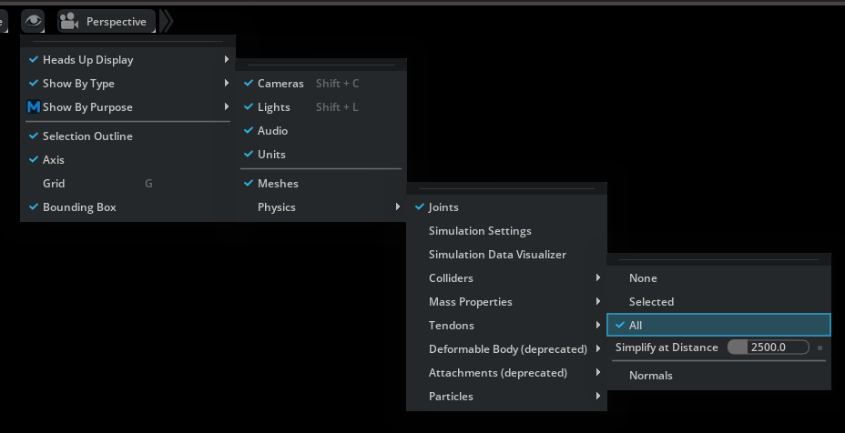

.. _Physics Collision Visualization:

Physics Collision Visualization
====================================

To help you visualize the collision shapes of physics bodies, the :ref:`Omni Physx UI` extension provides a way to draw the collision shapes in the viewport.

This can be enabled through the Physics section of the *Show/Hide* (Eye) menu in the viewport:

Here you can toggle the visualization of collision shapes for physics bodies. 

Its possible to enable the visualization for all the bodies or only for selection.

The visualization uses color coding to indicate if the collision shape belongs to a dynamic or static body.

   * Collision shapes for dynamic bodies are colored in **Green**
   * Collision shapes for static bodies are colored in **Magenta**
   * Collision shapes that have a fallback in the physics engine are colored in **Dark Red**

.. note::
   The collision visualization does represent the UsdPhysics collision shapes. 
   The representation in a physics engine might differ if a fallback happened, because the collision representation in the physics engine is not supported.
   Use the validation tool to check for potential issues and fixes.

