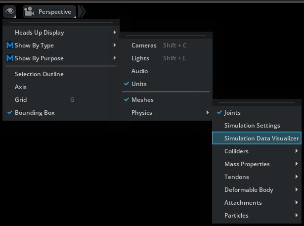
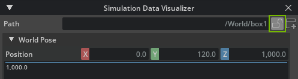
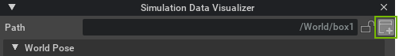
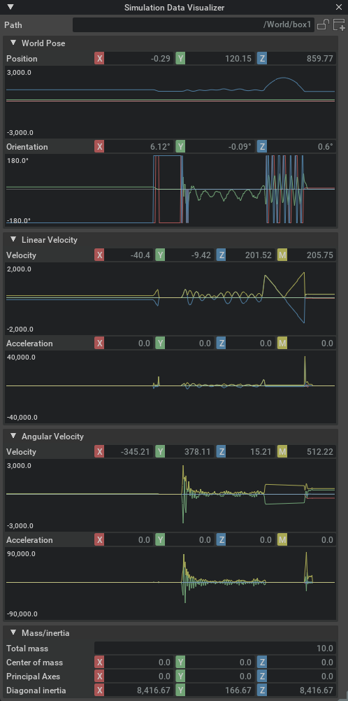
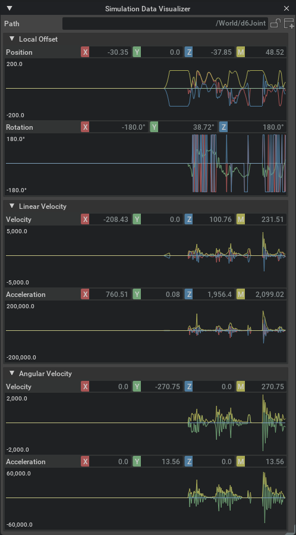
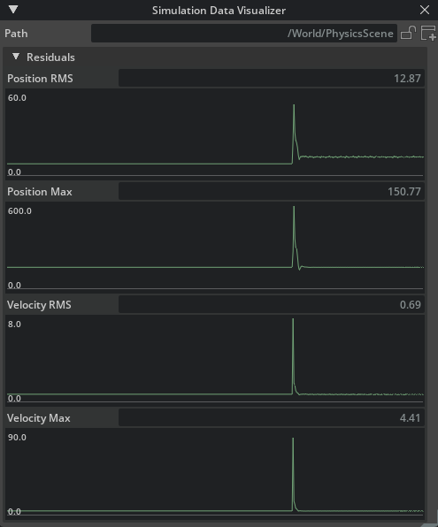
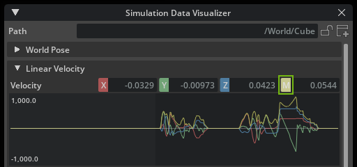
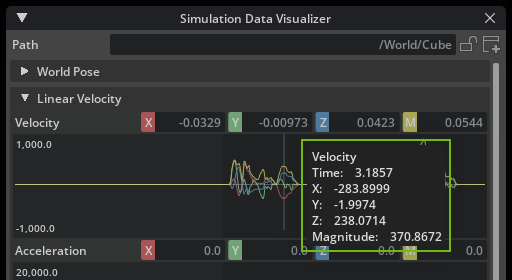

.. _Simulation Data Visualizer Window:

=================================
Simulation Data Visualizer Window
=================================

Understanding how data changes overtime is important to fully analyze data and identify issues. 
By `enabling <https://docs.omniverse.nvidia.com/extensions/latest/ext_core/ext_extension-manager.html#load-an-extension>`_ the :ref:`Omni Physx UI` extension, you get access to the **Simulation Data Visualizer** window, which allows you to visualize the data by plotting graphs of a physics object's properties during simulation. 

The feature is toggled through the viewport eye menu, for example:

When enabled, a **Simulation Data Visualizer** window will appear docked in the bottom window group section.

By default, the window targets the currently selected prim or, if multiple prims are selected, the prim most recently added to the selection. However, it is possible to lock the window to a given prim by pressing the **lock** button:

When the window is locked, it will keep targeting the same prim even as the current selection changes.

You can also create new **Simulation Data Visualizer** windows by pressing the **new** button:

Combined with the ability to lock windows, this enables you to monitor several prims at the same time by having multiple **Simulation Data Visualizer** windows open.

.. note:: When creating a new window, it will automatically set the old window to the *locked* state.

The contents of the individual windows will change based on what prim they are targeting. For example, a rigid body, joint, or residuals.

Rigid Bodies
############

If the target is a *rigid body*, the window will show the following information:

In the **Velocity** section, the **M** field (yellow) shows the magnitude of the velocity vector. That is, the current speed. 

Also notice that the window provides some other simulation information that may not be observable through the regular property windows, for example current world pose and accelerations. 

.. note:: Accelerations are derived from comparing the velocity between two discrete data samples, which yields the mean acceleration of the time delta rather than the current. However, given the high sample rate, the difference is usually negligible.

You can also inspect the mass and inertia properties of the rigid body, which is particularly useful if you have not set them explicitly and want to know the generated values (given that these are static throughout the simulation, they are not accompanied by graphs.)

Joints
######

When the window is targeting a *joint* prim, it will provide information about the current offsets, velocities, and accelerations in the local frame of the joint, that is, the values of the second attachment relative to the first:

The exact values shown will change depending on the type of joint targeted.

.. note:: For joints, both velocities and accelerations are derived from comparing two discrete data samples, which yields the mean velocity and acceleration of the time delta. See the note above.

Residuals
#########

The window will also visualize :ref:`solver residuals<Solver Residual Reporting>` if the targeted prim has the *Residuals API* applied:

These values provide an error metric that indicates the solver convergence in the respective part of the simulation (either the entire scene, an articulation root, or a single joint). When the values are zero, the solver converges perfectly.

.. note::
    For joints, the **RMS** and **Max** values are always identical and therefore do not appear as separate properties and graphs.

Inspecting and Exporting Graph Data
###################################

Whenever a type of sampled data contains multiple components (for example, XYZ coordinates), you can toggle each of the subcomponents by left-clicking their label button:

In addition, you may also right-click a component, which will enable display of that specific component and hide all the others.

After the visualizer has plotted data in a graph, you can inspect the values at a specific data point by pressing the left mouse button while hovering it. 

Further, if you right click the graph, all the samples for that plot will be copied to the clipboard in comma separated values format (CSV) that allows you to paste it into other database programs.
